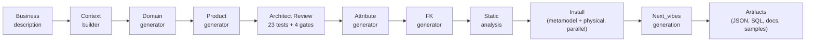
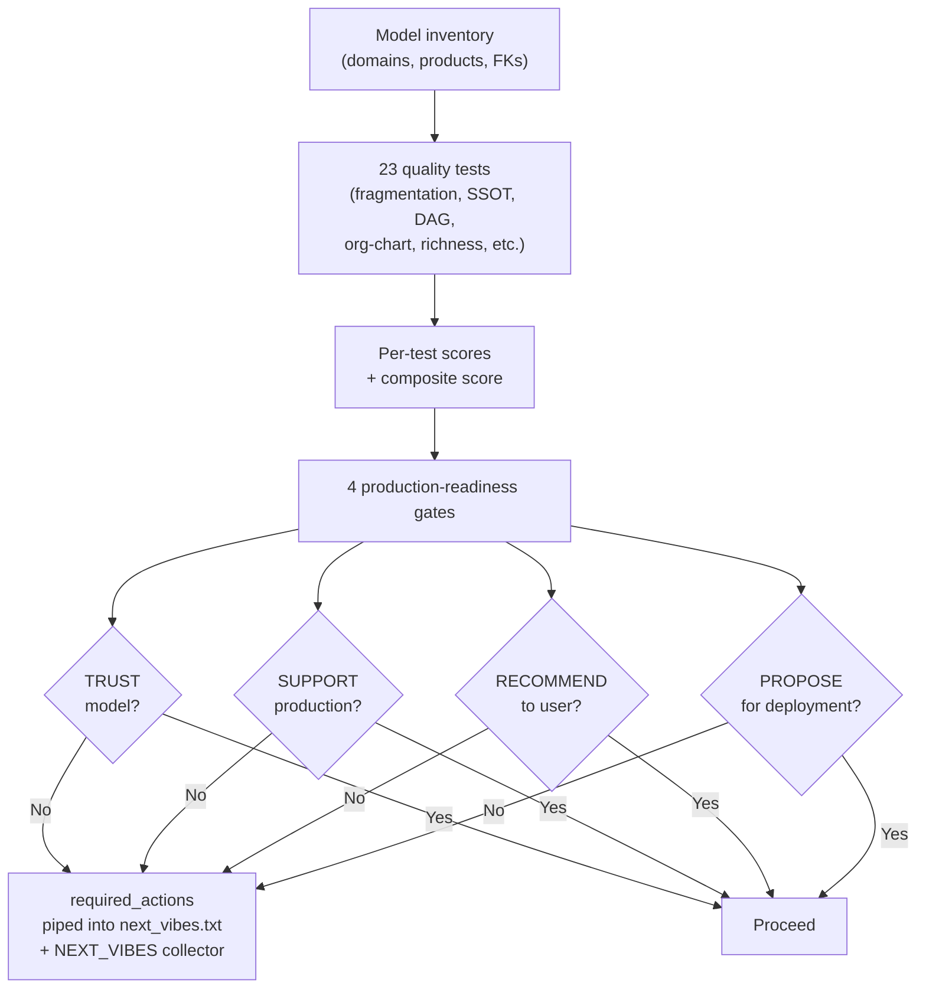
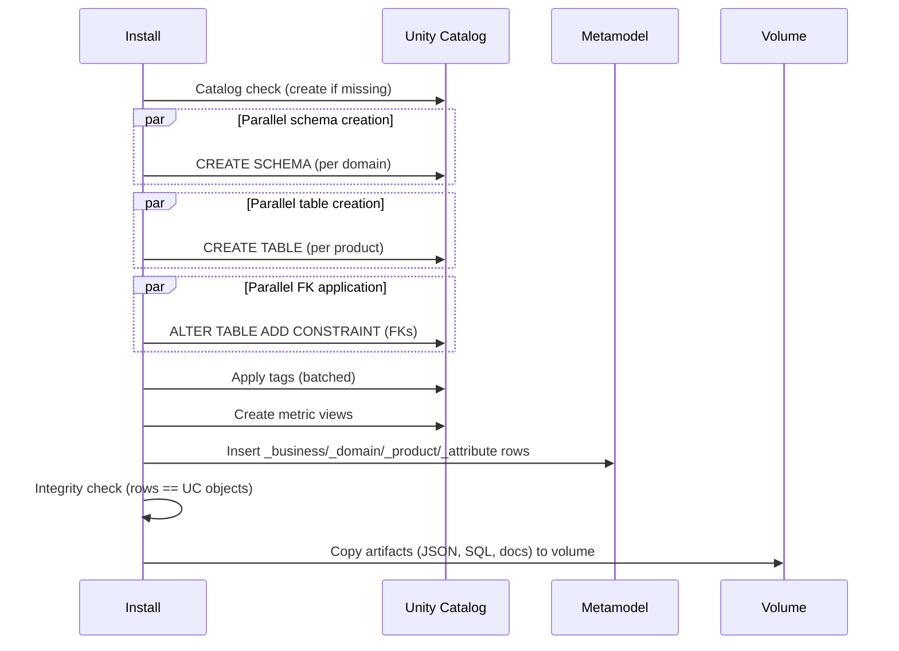
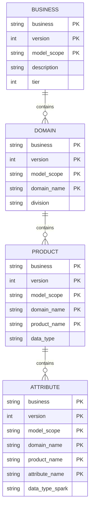
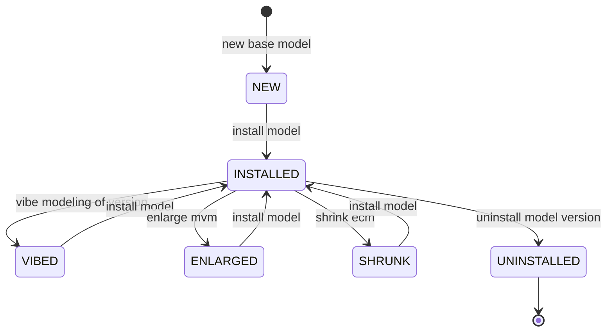
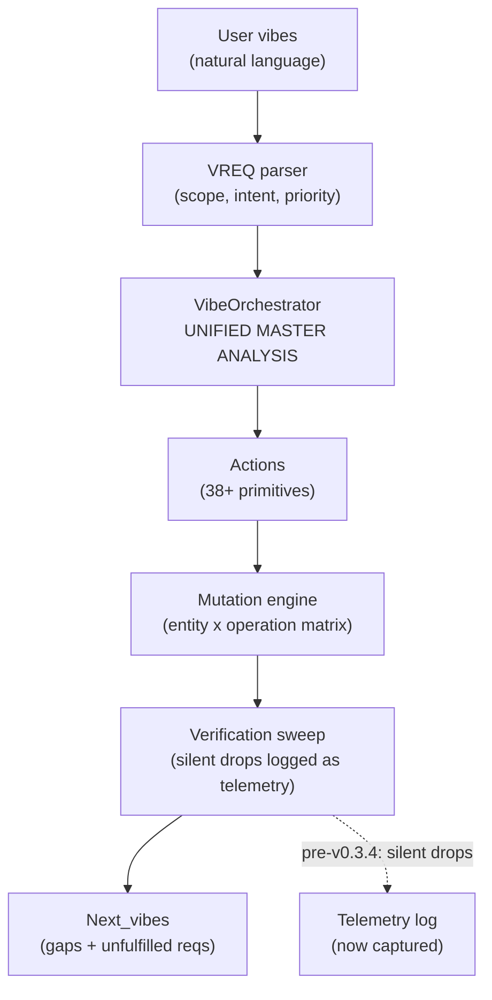
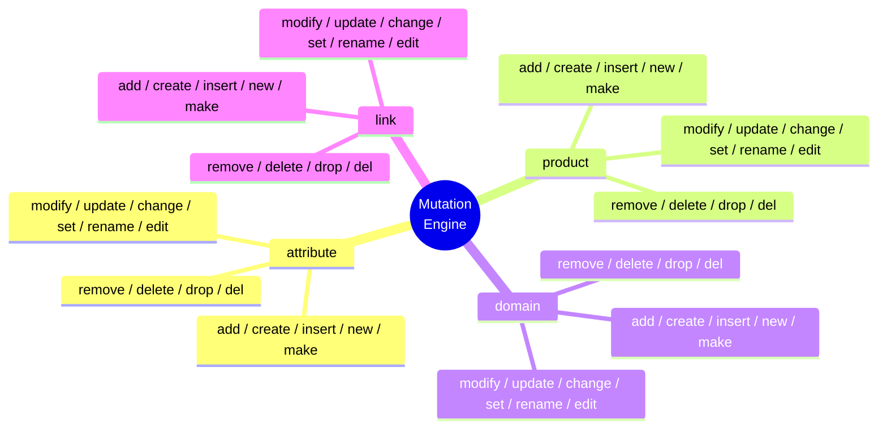
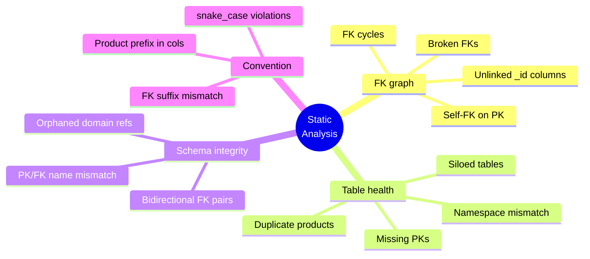
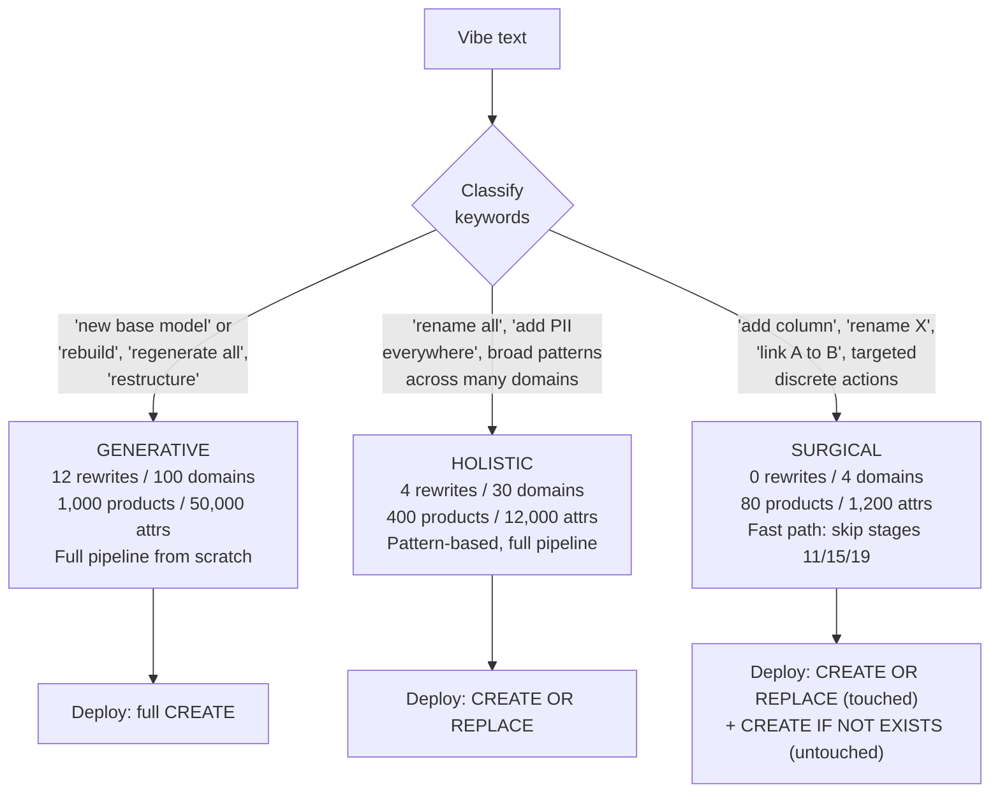
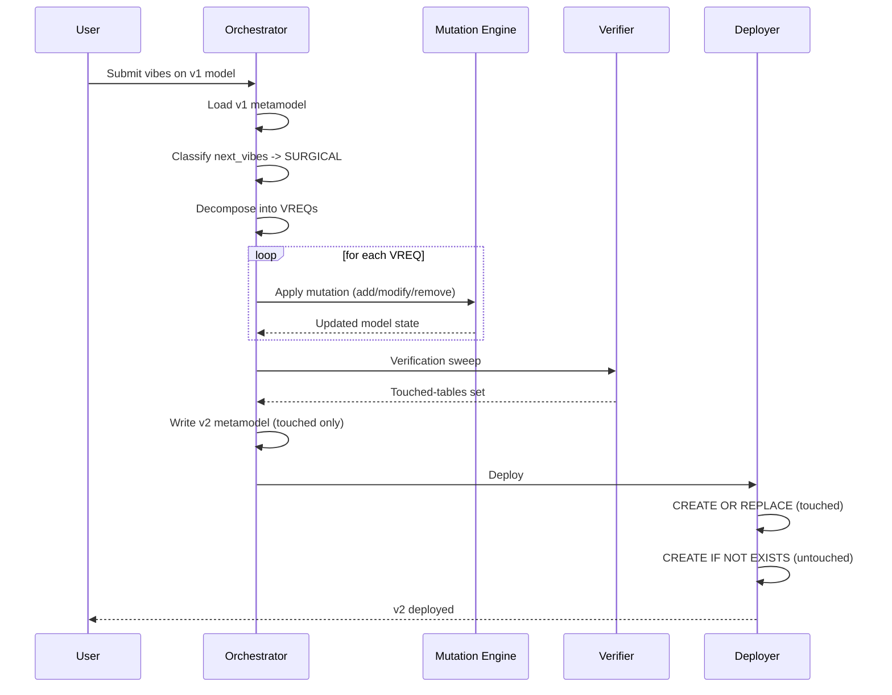

# Vibe Modelling Agent Design Guide

> Technical design reference for the Vibe Modelling Agent: architecture, pipeline stages, quality rules, LLM ensemble, sizing, widgets, artifacts, and error-handling patterns.

[← Back to project root](../readme.md) · [Integration guide](integration-guide.md) · [Whitepaper](whitepaper.md)

---

## Table of Contents

- [1. Philosophy: Industry Data Models vs. Business Data Models](#1-philosophy-industry-data-models-vs-business-data-models)
- [2. Architecture Overview](#2-architecture-overview)
- [3. How Vibe Modelling Works — Pipeline Stages](#3-how-vibe-modelling-works--pipeline-stages)
- [4. Core Principles and Governance](#4-core-principles-and-governance)
- [5. Quality Assurance Rules Reference](#5-quality-assurance-rules-reference)
- [6. LLM Architecture](#6-llm-architecture)
- [7. Sizing and Configuration Constants](#7-sizing-and-configuration-constants)
- [8. Operations Reference](#8-operations-reference)
- [9. Metric Views](#9-metric-views)
- [10. Sample Data Generation Rules](#10-sample-data-generation-rules)
- [11. Column Templates](#11-column-templates)
- [12. Semantic Distinction Rules (What Is NOT a Duplicate)](#12-semantic-distinction-rules-what-is-not-a-duplicate)
- [13. Complete Prompt Reference (49 Prompts)](#13-complete-prompt-reference-49-prompts)
- [14. Architecture Design Patterns](#14-architecture-design-patterns)
- [15. Vibe System Architecture](#15-vibe-system-architecture)
- [16. DAG Enforcement Deep Dive](#16-dag-enforcement-deep-dive)
- [17. Static Analysis Checks](#17-static-analysis-checks)
- [18. Complete Widget Reference (28 Widgets)](#18-complete-widget-reference-28-widgets)
- [19. Output Artifacts (Complete Reference)](#19-output-artifacts-complete-reference)
- [20. Error Handling Patterns](#20-error-handling-patterns)
- [22. Surgical Mode Architecture (v0.4.0 — v0.5.1)](#22-surgical-mode-architecture-v040--v051)

---

## 1. Philosophy: Industry Data Models vs. Business Data Models

### What is an Industry Data Model?
An industry data model is a generic, one-size-fits-all template designed for an entire vertical -- retail, banking, healthcare, telecoms, etc. Organizations like the TM Forum (telecoms), ARTS (retail), ACORD (insurance), HL7 (healthcare), and BIAN (banking) publish canonical schemas attempting to cover every conceivable entity and relationship across an industry.

Problems with industry data models:
- They contain 60-80% of tables your business will never use
- Months of manual pruning, renaming, and reshaping needed
- Committee-standard naming rarely matches your terminology
- Version upgrades mean re-adoption pain
- License fees + adaptation labor costs
- Static and rigid - don't evolve with your business

### What is a Business Data Model?
A business data model is tailored, contextualized, and specific to YOUR organization. It reflects your actual business processes, product lines, org structure, regulatory environment, terminology, and governance requirements.

Key differences table:
| Aspect | Industry Data Model | Business Data Model (Vibe) |
|---|---|---|
| Scope | Entire industry vertical | Your specific business |
| Customization | Post-delivery (manual pruning) | Built-in (LLM-driven from your context) |
| Relevance | 20-40% directly applicable | 90-100% directly applicable |
| Time to production | Months of adaptation | Hours with iterative vibing |
| Naming | Committee-standard naming | Your business terminology |
| Evolution | New version = re-adoption | Vibe the next version |
| Cost | License fees + adaptation labor | Compute cost of LLM generation |

### How Vibe Modelling Bridges the Gap
Vibe Modelling takes the BEST of both worlds:
- It understands your industry deeply (via the 5-tier complexity classification system that evaluates 7 scoring dimensions)
- But the model it produces is shaped entirely by YOUR context
- The LLM has knowledge of industry standards (TM Forum SID, ARTS, HL7, etc.) and uses them as INSPIRATION, not as rigid templates
- Every domain, product, attribute, and relationship is justified by YOUR business processes
- The result: an industry-aware business data model that's 90-100% relevant on day one

### The Vibe Philosophy
```
1. GENERATE  ->  Describe your business, get a base model
2. VIBE IT   ->  Review output, provide natural-language refinements
3. REPEAT    ->  Each iteration = new version; agent auto-suggests next vibes
4. DEPLOY    ->  Physical Unity Catalog schemas, tables, FKs, tags, sample data
```

Every organization can "vibe its own model" -- no two outputs are the same because no two businesses are the same, even within the same industry. A telecommunications company in the Middle East will get a fundamentally different model than a telecommunications company in Scandinavia, because their regulatory environments, product lines, organizational structures, and business processes differ.

---

## 2. Architecture Overview

### Diagram: End-to-End Architecture



### The Four-Level Hierarchy
Every Vibe model follows a strict four-level hierarchy: Divisions -> Domains -> Products (Tables) -> Attributes (Columns).

**Level 1: Divisions** -- Top-level organizational grouping
| Division | Purpose | Typical Share |
|---|---|---|
| Operations | Core operational backbone -- HOW things get made/delivered/maintained | Combined >=80% |
| Business | Revenue-generating and customer-facing functions | Combined >=80% |
| Corporate | Supporting functions for governance (NOT directly revenue-generating) | <=20% |

Division Balance Rules:
- Operations + Business MUST be >=80% of all domains
- Corporate is capped at <=20% of total domains
- No Corporate domain allowed until Operations AND Business each have >=2 domains
- Interleaved filling: alternate Operations and Business domains when building

**Level 2: Domains** -- Logical grouping of related tables (maps 1:1 to Unity Catalog schema)
- Named in snake_case, exactly 1 word, lowercase, max 20 characters
- Must be singular form (exceptions: logistics, sales, operations)
- The `shared` domain is RESERVED -- auto-created during SSOT consolidation only
- Forbidden generic names: utilities, infrastructure, services, support, platform, shared, common, core, base, general, misc, other, admin, auxiliary, analytics, reporting, intelligence, insights

**Level 3: Products (Tables)** -- First-class business entities
- Every product gets a PK column: `<product_name>_<pk_suffix>` (default: `_id`)
- Must pass the First-Class Entity Test (5 criteria)
- Classified by data_type: master_data, reference_data, transactional_data, association_data
- Classified by function: core or helper
- Named 1-3 words, max 30 characters, no domain prefix

**Level 4: Attributes (Columns)** -- Properties of each product
- Named in snake_case, max 50 characters
- No product name prefix (except PK)
- Typed using Spark SQL types: STRING, BIGINT, INT, DECIMAL(p,s), TIMESTAMP, DATE, BOOLEAN
- No complex types (ARRAY, STRUCT, MAP)
- Tagged with classification (restricted, confidential, internal, public) and PII tags when applicable

### Model Scopes: MVM vs ECM
| | MVM (Minimum Viable Model) | ECM (Expanded Coverage Model) |
|---|---|---|
| Size | 30-50% of ECM table count | Full coverage |
| Attribute depth | SAME as ECM -- full production-grade | Full production-grade |
| Domains | Essential business functions only | All functions including corporate |
| Ideal for | SMBs, rapid deployments, POCs | Fortune 100, multinational enterprises |

MVM is NOT a skeleton or demo. It is a production-ready subset where every delivered table is fully-featured. MVM lightness comes from fewer domains and fewer tables per domain ONLY -- never from thinner attributes.

### Industry Complexity Tiers (5 tiers)

The agent auto-classifies your business into one of five tiers based on 7 scoring dimensions:
1. Regulatory density: 3+ distinct regulatory bodies
2. Party complexity: 3+ distinct party types
3. Product hierarchy depth: 50+ variants with complex bundling
4. Infrastructure/network management: owns physical or digital infrastructure
5. Industry canonical data model: 200+ entity types by standards body
6. Transaction complexity: 10+ distinct transaction types
7. Operational system landscape: 5+ major systems of record

**ECM Tier Sizing:**
| Tier | Label | Domains | Products/Domain | Attrs/Product | Subdomains/Domain |
|---|---|---|---|---|---|
| tier_1 | Ultra-Complex | 15-22 | 14-28 | 15-50 | 3-6 |
| tier_2 | Complex | 12-18 | 14-26 | 12-50 | 2-5 |
| tier_3 | Moderate | 10-15 | 12-24 | 10-45 | 2-5 |
| tier_4 | Standard | 8-12 | 10-20 | 10-40 | 2-4 |
| tier_5 | Simple | 5-8 | 8-18 | 8-35 | 2-4 |

**MVM Tier Sizing:**
| Tier | Domains | Products/Domain | Attrs/Product | Subdomains/Domain |
|---|---|---|---|---|
| tier_1 | 9-14 | 8-16 | 15-50 | 2-4 |
| tier_2 | 8-12 | 8-14 | 12-50 | 2-4 |
| tier_3 | 6-10 | 7-13 | 10-45 | 2-4 |
| tier_4 | 5-8 | 6-11 | 10-40 | 2-3 |
| tier_5 | 3-6 | 5-10 | 8-35 | 2-3 |

Note: Attribute depth (min/max) is the SAME for both MVM and ECM within each tier. Association table uplift factor: 1.2x (applied to base table count). Max attributes buffer factor: 1.2x (allowing exceptional overflow). Max attributes hard reject factor: 1.4x.

---

## 3. How Vibe Modelling Works — Pipeline Stages

The pipeline executes a series of stages, each with a specific purpose, quality checks, and output. Here is the complete stage reference:

### Stage 1: Setup and Configuration
- **Purpose:** Validate inputs, create metamodel tables, initialize session
- **Duration:** 2-10 seconds
- **What happens:** Widget parameters are read, metamodel tables (_business, _vibe_progress) are created/verified, session row is inserted
- **Quality check:** Input validation (required fields, valid operation, valid scope)
- **Progress budget:** 1.0%

### Stage 2: Interpreting Instructions (Vibe mode only)
- **Purpose:** Parse natural-language vibes into structured action plan
- **Duration:** 10-30 seconds
- **What happens:** The vibe text is analyzed and translated into 190+ specific actions. Hard constraints are extracted ("do not", "must not", "never" -> forbidden operations). Mode is classified (surgical/holistic/generative) based on keywords.
- **Quality check:** Constraint extraction, requirement parsing
- **Progress budget:** 1.0%

### Stage 3: Collecting Business Context
- **Purpose:** Enrich the business description across 7 classification dimensions
- **Duration:** 10-30 seconds
- **What happens:** LLM enriches the business context with industry alignment, complexity tier classification, organization divisions, domain hints, common business jargon (30+ items), operational systems of record, and industry governing bodies. Empty fields are filled with exactly 10 distinct items each.
- **Quality check:** Tier classification validation, minimum jargon count (30+), domain count within tier range
- **Progress budget:** 1.0%

### Stage 4: Designing Domains
- **Purpose:** Generate domains following division model + SSOT
- **Duration:** 15-60 seconds
- **What happens:** LLM generates domains within the tier range. Each domain must pass the Org Chart Test ("Would I find a department named this?"). Fragmentation Test checks for 30%+ product overlap between domain pairs. Division balance is enforced.
- **Quality check:** Division balance (Ops+Business >=80%), forbidden name check, fragmentation test, SSOT pre-check, naming validation (1 word, lowercase, singular, max 20 chars)
- **Progress budget:** 2.0%

### Diagram: Architect Review Flow



### Stage 5: Creating Data Products
- **Purpose:** Generate products per domain with architect review
- **Duration:** 1-10 minutes
- **What happens:** Products generated per domain in parallel batches. Each product must pass the 5-point First-Class Entity Test. 3-tier entity selection (Core -> Supporting -> Reference). After generation, a Model Architect Review runs 15 holistic tests and scores the model.
- **Quality check:** First-Class Entity Test, Anti-Bloat Self-Check, product count within tier range, forbidden product check, naming validation, architect review (score-based action thresholds)
- **Progress budget:** 5.0%

### Stage 6: Enriching Data Products with Attributes
- **Purpose:** Generate all columns for every product
- **Duration:** 5-40 minutes
- **What happens:** Attributes generated per product in parallel. Each attribute has name, type, tags, value_regex, business_glossary_term, description, reference. Mandatory attributes enforced by product type. Semantic distinction rules prevent false-positive dedup. Attribute dedup runs per product (>80% confidence threshold).
- **Quality check:** Attribute count within tier range (with 1.2x buffer max, 1.4x hard reject), PK present, no product name prefix, tag classification validation, PII classification matrix, data type validation, semantic distinction rules
- **Progress budget:** 25.0%

### Stage 7: Cross-Domain Linking
- **Purpose:** Establish FK relationships forming a DAG
- **Duration:** 1-5 minutes
- **What happens:** Three-phase linking: (1) In-domain linking within each domain, (2) Global cross-domain sweep, (3) Pairwise domain comparison. M:N detection with 3-indicator confidence framework. MVM mode forbids cross-domain M:N.
- **Quality check:** DAG enforcement (no cycles), no bidirectional FKs, no self-referencing FKs, FK naming (must end with target PK), zero siloed tables, each domain >=2 cross-domain connections, M:N confidence (>=2 of 3 strong indicators), association ratio limits (ECM <=15%, MVM <=5%)
- **Progress budget:** 8.0%

### Stage 8: Quality Assurance
- **Purpose:** Comprehensive model validation and auto-remediation
- **Duration:** 30 seconds - 3 minutes
- **What happens:** 9+ sub-checks run sequentially:
  1. Core Product Identification (1-3 per domain, protected from removal)
  2. Empty Domain Removal
  3. Naming & Schema Validation (enforce naming conventions)
  4. PK & Data Type Validation (auto-insert missing PKs, fix types)
  5. Name Overlap Detection (cross-domain duplicate names -> prefix-based rename)
  6. Graph Topology Analysis (cycle detection via DFS, siloed table detection)
  7. Auto-Remediation (cycle breaking, consolidation, FK ref updates)
  8. QA Checks Summary
  9. FK Reference Validation (broken/ambiguous FK resolution)
  10. Post-Linking Validation (complete model snapshot)
- **Quality check:** All rules enforced, auto-fixes applied, cycle-free DAG verified
- **Progress budget:** 5.0%

### Stage 9: Applying Naming Conventions
- **Purpose:** Final consistency pass on all names
- **Duration:** 10-30 seconds
- **Progress budget:** 1.0%

### Stage 10: Model Finalization
- **Purpose:** Finalize the logical model, generate next vibes
- **Duration:** 10-30 seconds
- **What happens:** Final model state captured with complete products_by_domain and fk_links. Product count may increase vs QA (parent/bridge tables added). Next vibes and model JSON files generated.
- **Progress budget:** 1.0%

### Stage 11: Subdomain Allocation
- **Purpose:** Group products within each domain into semantic subdomains
- **Duration:** 10-30 seconds
- **What happens:** LLM allocates products to subdomains. Rules: exactly 2 words per subdomain name, min products per subdomain enforced per tier, no overlapping words between subdomain names, no placeholder names, balanced distribution.
- **Quality check:** Subdomain count within tier range, naming rules, balanced distribution
- **Progress budget:** 1.0%
- **Note:** Can emit stage_warning on non-critical failure

### Stage 12: Physical Schema Construction (when catalog is set)
- **Purpose:** Create Unity Catalog schemas + Delta tables
- **Duration:** 1-10 minutes
- **Progress budget:** 10.0%

#### Diagram: Install Pipeline Phases



> The final **integrity check** is a post-install verification (new in v0.5.x) that reconciles metamodel row counts against Unity Catalog objects before marking the install successful.

### Stage 13: Applying Foreign Keys
- **Purpose:** Create physical FK constraints on tables
- **Duration:** 30 seconds - 2 minutes
- **Progress budget:** 3.0%

### Stage 14: Applying Tags
- **Purpose:** Apply Unity Catalog tags on schemas, tables, and columns
- **Duration:** 2-15 minutes
- **What happens:** Classification tags (division, data_type) applied to schemas and tables. PII tags applied to columns. Custom user tags applied.
- **Progress budget:** 18.0%

### Stage 15: Applying Metric Views
- **Purpose:** Create Databricks metric views for KPI tracking
- **Duration:** 30 seconds - 5 minutes
- **Quality check:** No nested aggregates, max 16 dimensions, max 12 numeric measures, ineligible column filtering
- **Progress budget:** 2.0%
- **Note:** Can emit stage_warning on partial failure

### Stage 16: Generating Sample Data (when configured)
- **Purpose:** Generate synthetic records respecting FK relationships
- **Duration:** 1-15 minutes
- **Quality check:** Exact record count, sequential PK from 10001, FK random from [10001, 10001+N-1], regex compliance, 3-letter country codes, no Lorem Ipsum, realistic business data
- **Progress budget:** 8.0%

### Stage 17: Generating Artifacts
- **Purpose:** Generate documentation and export files
- **Duration:** 30 seconds - 2 minutes
- **What happens:** Core artifacts are generated in parallel (README, Excel/CSV export, model JSON, data dictionary, model report). Depending on queued actions, additional artifacts can also be produced (for example ontology, DBML, release notes, and test cases).
- **Progress budget:** 5.0%

### Stage 18: Consolidation and Cleanup
- **Purpose:** Merge temporary artifacts, cleanup
- **Duration:** 10-30 seconds
- **Progress budget:** 2.0%

### Stage 19: Generating Metric View Artifacts
- **Purpose:** Export metric view definitions as SQL/YAML files
- **Duration:** 10-30 seconds
- **Progress budget:** 1.0%
- **Execution note:** In the current orchestrator, this stage is emitted during finalization before artifact generation and physical deployment, while keeping stage ID `19` for compatibility.

Total progress through stages: 99.0%. The final Vibe Session / Session Ended event adds 1.0% to reach 100.0%.

---

## 4. Core Principles and Governance

### Single Source of Truth (SSOT)
Each core business concept has exactly ONE authoritative domain and ONE authoritative product that owns it. No concept is duplicated across domains.

Enforcement:
- Generation: LLM places each entity in its authoritative domain
- QA Deduplication: Global pass detects same-name products + synonym pairs with 60%+ attribute overlap
- Consolidation: Overlapping products merged into shared domain with discriminator column
- Cross-Domain References: Other domains use FK columns -- no duplication

### DAG Enforcement
FK relationships MUST form a Directed Acyclic Graph (DAG):
- Detect: Python DFS cycle detection during QA
- Break: LLM Cycle Break specialist determines which FK to remove (weakest link)
- Verify: Re-run DFS to confirm DAG
- Iterate: Up to 5 rounds for all cycles
- Exception: Hierarchical self-referencing FKs are permitted (parent_*, manager_*, reporting_*, supervisor_*, alternate_*, original_*, superseded_*)

Cycle breaking priority: computed references broken first (latest_*, current_*, primary_*, active_*, default_*, first_*, last_*, preferred_*). Parent-child FKs are NEVER broken.

### First-Class Entity Test (5 criteria)
Every product must pass ALL:
1. Identity Test: Own primary key and distinct identity
2. Lifecycle Test: Own lifecycle independent of parent
3. Richness Test: 5+ unique business attributes beyond id/name/code/description/status
4. Ownership Test: This domain is the natural business owner
5. Uniqueness Test: Semantically distinct from every other product in the domain

### The Org Chart Test
For every domain: "If I walked into the business headquarters, would I find a department named this?" If NO -> domain is generic and must be renamed.

### The Fragmentation Test
Before creating two similar domains, ask:
1. Will they have 30%+ of the same product types? -> MERGE
2. Would a data consumer be confused about which owns a concept? -> MERGE
3. Does the industry treat these as one function? -> MERGE

---

## 5. Quality Assurance Rules Reference

### Published Catalog: G-Series Rules (G01-G12)

The G-series rules are the published governance catalog derived from the whitepaper. There are 162 rules in total across 12 rule groups. The key groups documented below are the most commonly enforced.

#### Naming Convention Rules (G01)
- G01-R001: All names must use snake_case by default
- G01-R002: Domain names -- exactly 1 word, lowercase, max 20 chars
- G01-R003: Domain names -- singular (exceptions: logistics, sales, operations)
- G01-R004: Table names -- 1-3 words, max 30 chars
- G01-R005: Table names -- MUST NOT repeat domain name as prefix
- G01-R006: Column names -- MUST NOT repeat table name as prefix (except PK)
- G01-R007: PK names -- pattern: table_name + suffix (e.g., customer_id)
- G01-R008: FK column names -- MUST END WITH target table's PK name
- G01-R009: Column names -- max 50 characters
- G01-R010: All names -- lowercase, letters/numbers/underscores only, no digit start
- G01-R011: Association table names -- no domain prefix
- G01-R012: Merged table names -- most generic, domain-agnostic name
- G01-R013: Column names -- clear, semantic, human-readable
- G01-R014: Preserve unit qualifiers (kg, mwh, per_min)
- G01-R015: Industry jargon -- only universally recognized abbreviations

#### FK Rules (G03)
- G03-R001: FK target must exist in the model
- G03-R002: No bidirectional FKs between same tables
- G03-R003: No circular dependencies (DAG required)
- G03-R004: FK type compatibility (numeric->numeric, string->string)
- G03-R005: FK attribute must exist in source product
- G03-R006: FK must reference PK of target product
- G03-R007: System identifier columns are NOT FK columns (external_reference, legacy_*, integration_*, *_ref, *_code, *_number, *_hash, *_token)
- G03-R010: No self-referencing FKs unless hierarchical
- G03-R015: Parent-child FKs NEVER broken during cycle resolution

#### PK Rules (G04)
- G04-R001: Every product has exactly one PK
- G04-R002: PK naming: {product_name}_{suffix}
- G04-R003: PK data type must be configured type (default BIGINT)
- G04-R008: PK exempt from product prefix stripping

#### Tag Rules (G08)
- G08-R001: Classification in tags only, NOT in attribute names
- G08-R002: Must include PII tags when applicable (pii_email, pii_phone, pii_identifier, pii_address, pii_financial, pii_health, pii_biometric, pii_name, pii_dob, pii_national_id, pii_passport, pii_ip, pii_device)
- G08-R003: No primary_key or foreign_key tags
- G08-R004: PII = RESTRICTED classification
- G08-R005: PHI = RESTRICTED
- G08-R006: PCI = RESTRICTED
- G08-R007: CONFIDENTIAL for non-PII sensitive business data
- G08-R008: Empty tags for regular operational data

#### M:N Rules (G12)
- G12-R001: M:N valid only when: (1) bidirectional reality, (2) >=2 relationship attributes, (3) business has name for relationship
- G12-R010: Association ratio limits: ECM <=15%, MVM <=5%
- G12-R012: Only HIGH confidence M:N accepted
- G12-R013: HIGH confidence requires >=2 of 3 strong indicators (reciprocity_confirmed, relationship_data_confirmed, semantic_name_found)
- G12-R021: MVM forbids cross-domain M:N

#### Subdomain Rules
- SUB-R001: Min/max subdomains per domain per tier. Never exactly 1 subdomain.
- SUB-R002: Exactly 2 words per subdomain name
- SUB-R003: Min products per subdomain enforced per tier
- SUB-R004: No overlapping words between subdomains in same domain
- SUB-R005: Business-focused names, not technical terms
- SUB-R006: Balanced product distribution across subdomains
- SUB-R007: No placeholder names (Sub Domain1, Category 1, Group A, N/A, Other, General, Miscellaneous)
- SUB-R008: Each subdomain belongs to exactly one parent domain

### Internal Enforcement Rules

The code enforces additional internal rule series beyond the published G-series catalog. These are referenced in LLM prompts, validators, and post-processing logic.

#### DOM-RUL: Domain Rules (001-030)
Rules governing domain generation, selection, and governance.
- DOM-RUL-001 through DOM-RUL-010: Domain naming (1 word, singular, snake_case, max 20 chars, no forbidden names)
- DOM-RUL-011 through DOM-RUL-020: Division balance enforcement (Ops+Business >=80%, Corporate <=20%, interleaved filling, no Corporate before Ops and Business each have >=2)
- DOM-RUL-021 through DOM-RUL-025: SSOT domain placement (each entity in authoritative domain, no duplication)
- DOM-RUL-026 through DOM-RUL-030: Domain count enforcement within tier ranges, fragmentation test, Org Chart Test

#### PRD-RUL: Product Rules (001-045)
Rules governing product generation, deduplication, and classification.
- PRD-RUL-001 through PRD-RUL-010: Product naming (1-3 words, max 30 chars, no domain prefix, snake_case)
- PRD-RUL-011 through PRD-RUL-020: First-Class Entity Test enforcement (identity, lifecycle, richness, ownership, uniqueness)
- PRD-RUL-021 through PRD-RUL-030: Product deduplication and merge rules (synonym detection, attribute overlap thresholds)
- PRD-RUL-031 through PRD-RUL-035: Core product identification (1-3 per domain, protected from removal)
- PRD-RUL-036 through PRD-RUL-040: M:N association table rules (uplift factor, naming, ratio limits)
- PRD-RUL-041 through PRD-RUL-045: Product count enforcement within tier ranges, anti-bloat checks

#### ATT-RUL: Attribute Rules (001-057)
Rules governing attribute generation, typing, deduplication, and tagging.
- ATT-RUL-001 through ATT-RUL-010: Attribute naming (snake_case, max 50 chars, no product prefix except PK, clear semantic names)
- ATT-RUL-011 through ATT-RUL-020: Data type validation (Spark SQL types only, no complex types, PK type enforcement)
- ATT-RUL-021 through ATT-RUL-030: PK/FK suffix rules (PK = product_name + suffix, FK = must end with target PK name)
- ATT-RUL-031 through ATT-RUL-040: Attribute deduplication (semantic distinction rules, >80% confidence threshold, false-positive prevention)
- ATT-RUL-041 through ATT-RUL-050: Tag and classification rules (PII matrix, classification levels, no primary_key/foreign_key tags)
- ATT-RUL-051 through ATT-RUL-057: Attribute count enforcement (tier range, 1.2x buffer max, 1.4x hard reject factor)

#### REL-RUL: Relationship Rules (001-026)
Rules governing FK validation, cycle detection, and DAG enforcement.
- REL-RUL-001 through REL-RUL-005: FK target existence and reference validation
- REL-RUL-006 through REL-RUL-010: FK type compatibility (numeric->numeric, string->string)
- REL-RUL-011 through REL-RUL-012: Protected parent-child FKs (hierarchical self-references permitted, parent-child NEVER broken)
- REL-RUL-013 through REL-RUL-018: Cycle detection via DFS, cycle breaking priority (computed references first)
- REL-RUL-019 through REL-RUL-020: Protected relationship enforcement during cycle resolution
- REL-RUL-021 through REL-RUL-026: Cross-domain connection minimums (>=2 per domain), siloed table detection, bidirectional FK prohibition

#### GEN-RUL: General Rules (003-005)
Cross-cutting naming conventions.
- GEN-RUL-003: snake_case enforcement across all entity types
- GEN-RUL-004: No digits at start of names
- GEN-RUL-005: Only lowercase letters, numbers, and underscores

#### NMG-RUL: Naming Governance
Overarching naming governance rules that apply naming conventions configured via widgets (naming_convention, primary_key_suffix, schema_prefix, schema_suffix, tag_prefix, tag_suffix).

---

## 6. LLM Architecture

### Model Configurations (6 LLMs)

| Order | Name | Type | Size | Endpoint | Input Tokens | Output Tokens |
|---|---|---|---|---|---|---|
| 10 | claude-opus-4-6 | thinker | large | databricks-claude-opus-4-6 | 200,000 | 128,000 |
| 20 | claude-sonnet-4-6 | worker | large | databricks-claude-sonnet-4-6 | 200,000 | 64,000 |
| 30 | claude-opus-4-5 | thinker | large | databricks-claude-opus-4-5 | 200,000 | 64,000 |
| 40 | claude-sonnet-4-5 | worker | large | databricks-claude-sonnet-4-5 | 200,000 | 64,000 |
| 50 | gpt-oss-120b | worker | small | databricks-gpt-oss-120b | 131,072 | 25,000 |
| 60 | gpt-oss-20b | worker | tiny | databricks-gpt-oss-20b | 131,072 | 25,000 |

### Multi-Model Ensemble
| Role | Purpose | Models |
|---|---|---|
| Thinker | Complex reasoning, architecture reviews, QA decisions | Claude Opus 4.6, Claude Opus 4.5 |
| Worker (large) | High-volume: products, attributes, FKs, dedup | Claude Sonnet 4.6, Claude Sonnet 4.5 |
| Worker (small) | Simpler: domain generation, tag classification | GPT-OSS 120B |
| Worker (tiny) | Sample data generation | GPT-OSS 20B |

### Automatic Model Demotion and Recovery

The agent implements a sophisticated fallback cascade for resilience.

**Thinker cascade:** thinker/large -> thinker/small -> worker/large -> worker/small -> thinker/tiny -> worker/tiny

**Worker cascade:** worker/large -> worker/small -> worker/tiny

**Demotion:** After 3 cumulative failures on a model, the entire model order is demoted -- the failing model is pushed down in the priority list, and the next model in the cascade takes its place. This ensures the pipeline keeps progressing even when a preferred model is degraded.

**Recovery:** After 5 consecutive successes following a demotion event, the original model order is restored. This allows temporary outages to self-heal without permanent degradation of model quality.

**Broken state:** After 3 consecutive timeouts on a single model, that model is marked as broken and skipped entirely for the remainder of the session. This prevents repeated timeout delays from stalling the pipeline.

### Honesty Scoring System
Every LLM response includes a self-assessed honesty_score (0-100):
- 90-100: Rules followed, output complete, no gaps
- 80-89: Minor issues
- 70-79: Notable gaps
- 50-69: Significant issues
- Below 50: Major problems

Enforcement:
- Below 55: PERMANENTLY DISCARDED (no retries)
- 55-70: Borderline -- triggers retry logic
- Above 90: Accepted (configurable threshold)

The minimum acceptable honesty score threshold is 65 (configurable). A contradiction penalty is applied when LLM responses contain internally inconsistent statements.

### Prompt Architecture
49 specialized prompts, each mapped to a specific model role and temperature:
- Thinker prompts: temperature 0 (deterministic reasoning)
- Worker prompts: temperature 0-0.3 (controlled generation)
- Sample generation: temperature 0.5 (creative variety)

See Section 13 for the complete prompt reference.

---

## 7. Sizing and Configuration Constants

### Technical Configuration (TECHNICAL_CONTEXT)

| Constant | Default | Purpose |
|---|---|---|
| max_concurrent_batches | 20 | Max parallel LLM calls |
| batch_size | 20 | Items per LLM batch |
| max_retries | 3 | LLM retry count |
| product_attributes_dedupe_threshold | 40 | Attribute overlap % for dedup |
| min_honesty_score_threshold | 65 | Min acceptable honesty score |
| ai_query_timeout_seconds | 120 (MVM) / 240 (ECM) | LLM call timeout (some parallel workers use 480s) |
| domain_metrics_timeout_seconds | 720 | Metric view generation timeout |
| model_demotion_after_n_failures | 3 | Failures before model demotion |
| product_sample_records | 10 | Records per table for sample data |
| association_table_uplift | 1.2 | Factor for junction tables |
| max_attributes_buffer_factor | 1.2 | Attribute overflow buffer |
| max_attributes_hard_reject_factor | 1.4 | Hard reject if attributes exceed this factor |
| domain_hard_ceiling_factor | 1.5 | Domain count hard ceiling |
| resize_tolerance_pct | 15 | +/-% for resize targets |

### Vibe Constraints
| Constraint | Default | Purpose |
|---|---|---|
| dedup_min_overlap | 85% | Min overlap to consider duplicates |
| max_relocation_pct | 5% | Max products relocated in one pass |
| min_overlap_for_removal | 85% (95% in remediation) | Overlap to recommend removal |
| min_overlap_for_merge | 60% | Overlap to recommend merge |
| min_overlap_for_shared | 60% | Overlap to move to shared domain |
| normalization_confidence | 95% | Min confidence for normalization decisions |

### Mutation Budgets by Mode
| Mode | Global Rewrites | Domains | Products | Attributes |
|---|---|---|---|---|
| Surgical | 0 | 4 | 80 | 1,200 |
| Holistic | 4 | 30 | 400 | 12,000 |
| Generative | 12 | 100 | 1,000 | 50,000 |

---

## 8. Operations Reference

### Diagram: Version and Scope Model



> All four `_metamodel` tables share the composite key `(business, version, model_scope)` where `version` is a pure integer and `model_scope` is `ecm` or `mvm`.

### Diagram: Folder Layout

```
/Volumes/{catalog}/_metamodel/vol_root/
└── business/
    └── {business}/
        ├── mvm_v1/
        │   ├── model.json
        │   ├── domains/ products/ attributes/ fk_links/
        │   ├── artifacts/ (README, Excel, DBML, ontology)
        │   ├── samples/ (CSV per table)
        │   └── next_vibes.txt
        └── ecm_v1/
            ├── model.json
            ├── domains/ products/ attributes/ fk_links/
            ├── artifacts/ (README, Excel, DBML, ontology)
            ├── samples/ (CSV per table)
            └── next_vibes.txt
```

### Diagram: Operation State Machine



| Operation | Purpose | Key Requirements |
|---|---|---|
| new base model | Generate brand-new model | Business name + description |
| vibe modeling of version | Apply NL refinements | Version + vibes |
| shrink ecm | Convert ECM to MVM | Version + catalog |
| enlarge mvm | Expand MVM to ECM | Version + catalog |
| install model | Deploy to UC | Model JSON file (widget 11) + catalog |
| uninstall model version | Remove physical artifacts | Business + version + catalog |
| generate sample data | Generate synthetic records | Model JSON file (widget 11) + catalog |

### Resize Rules
**Shrink (ECM->MVM):**
1. Reduce corporate domains first
2. Reduce association tables
3. Reduce non-core tables
4. Consolidate domains
5. Verify within +/-tolerance%
- MUST NOT invent new domains or products

**Enlarge (MVM->ECM):**
- ALL existing domains MUST be retained
- ALL existing products MUST be retained
- Can only ADD new products and domains

---

## 9. Metric Views

The agent generates Databricks metric views -- reusable KPI definitions:
- Dimensions: Grouping columns (max 16 per view, max 2 temporal)
- Measures: Single-aggregate expressions (max 12 numeric)
- Filters: Row-level predicates

Safety rules:
- Nested aggregates auto-replaced with COUNT(1)
- Invalid token-cast fragments blocked (9 patterns)
- SUM/AVG/MEAN columns auto-wrapped with CAST(col AS DOUBLE)
- System/audit columns ineligible as dimensions
- PK and boolean columns ineligible as measures

---

## 10. Sample Data Generation Rules

- Exact N records per table (configurable)
- BIGINT PKs: sequential from 10001, never NULL
- STRING PKs: valid UUIDs
- FK values: random from [10001, 10001+N-1]
- A column is NEVER both PK and FK simultaneously
- All values comply with value_regex patterns
- Country codes: 3-letter uppercase (USA not United States)
- No Lorem Ipsum -- realistic, business-appropriate data
- If source systems specified, generate realistic data from those systems
- CSV column headers use column_name field (not attribute field)
- Boolean format follows widget configuration

---

## 11. Column Templates

Pre-built column sets that can be added to any table via vibe instructions:

| Template | Columns Added |
|---|---|
| SCD Type 2 | effective_from, effective_to, is_current, row_hash |
| Audit | created_at, updated_at, created_by, updated_by |
| Soft Delete | is_deleted, deleted_at, deleted_by |
| Temporal | valid_from, valid_to, system_from, system_to |
| Versioning | version_number, version_valid_from, version_valid_to, is_latest_version |
| Multi-tenancy | tenant_id |
| Lineage | source_system, source_table, ingestion_timestamp, etl_job_id |
| GDPR | consent_status, consent_date, data_subject_request_id, right_to_erasure_date |

---

## 12. Semantic Distinction Rules (What Is NOT a Duplicate)

These rules prevent false-positive dedup:
| Pattern | Example | Decision |
|---|---|---|
| Method vs Channel | payment_method vs payment_channel | KEEP BOTH |
| ID vs Name | customer_id vs customer_name | KEEP BOTH |
| Target vs Actual | sla_target_time vs sla_actual_time | KEEP BOTH |
| Lifecycle Timestamps | created_at, modified_at, approved_at | KEEP ALL |
| Different Granularity | scheduled_date (DATE) vs scheduled_start_time (TIMESTAMP) | KEEP BOTH |
| Design vs Regulatory | design_speed_mph vs speed_limit_mph | KEEP BOTH |
| Rated vs Actual | rated_capacity vs actual_capacity | KEEP BOTH |
| Book vs Market | book_value vs market_value | KEEP BOTH |

What IS a duplicate:
- creation_date vs created_at vs insert_date -> SAME CONCEPT
- modified_date vs updated_at vs last_update -> SAME CONCEPT
- status vs state vs condition -> SAME CONCEPT
- quantity vs qty vs count -> SAME CONCEPT

---

## 13. Complete Prompt Reference (49 Prompts)

The agent uses 49 specialized LLM prompt templates. Each prompt is mapped to a model type, size class, and temperature setting. The prompts are listed below in registry order, grouped by pipeline phase.

### Vibe Analysis and Business Context

| # | Prompt Name | Model Type | Size | Temp | Purpose |
|---|---|---|---|---|---|
| 1 | VIBE_MASTER_PROMPT | thinker | large | 0 | Single-pass vibe analysis: parses NL vibes into structured requirements, mode classification, scope extraction, and action routing |
| 2 | VIBE_AUDIT_PROMPT | thinker | large | 0 | Post-execution vibe audit: verifies requirement fulfillment, scores outcomes, identifies gaps |
| 3 | BUSINESS_CONTEXT_PROMPT | thinker | large | 0 | Business enrichment: industry alignment, complexity tier classification, division allocation, jargon extraction, governing bodies |
| 4 | MODEL_GENERATION_PARAMETER_PROMPT | thinker | large | 0 | Derive model generation parameters (tier sizing, domain counts, product targets) from enriched business context |

### Domain Generation

| # | Prompt Name | Model Type | Size | Temp | Purpose |
|---|---|---|---|---|---|
| 5 | DOMAIN_GENERATE_PROMPT | worker | small | 0.1 | Generate candidate domains within tier range, respecting division model and naming rules |
| 6 | DOMAIN_JUDGE_PROMPT | thinker | large | 0 | Multi-variant domain judging: evaluates multiple domain proposals and selects the best set |

### Product Generation and Deduplication

| # | Prompt Name | Model Type | Size | Temp | Purpose |
|---|---|---|---|---|---|
| 7 | MODEL_ARCHITECT_REVIEW_PROMPT | thinker | large | 0 | Holistic model review: runs 15 architecture tests, scores overall model, recommends structural changes |
| 8 | PRODUCT_GENERATE_PROMPT | worker | large | 0 | Generate products per domain with First-Class Entity Test compliance, data_type and function classification |
| 9 | PRODUCT_GLOBAL_DEDUP_PROMPT | thinker | large | 0 | Global deduplication: detect same-name and synonym products across all domains |
| 10 | PRODUCT_DUPLICATE_DETECT_PROMPT | worker | large | 0 | Pairwise duplicate detection: compare two products for semantic overlap and recommend merge/keep |
| 11 | PRODUCT_MERGE_SIMILAR_PROMPT | worker | large | 0 | Merge two similar products into one authoritative product with reconciled attributes |
| 12 | PRODUCT_IDENTIFY_CORE_PROMPT | worker | large | 0 | Identify 1-3 core products per domain for protection from removal during QA |

### Attribute Generation and Deduplication

| # | Prompt Name | Model Type | Size | Temp | Purpose |
|---|---|---|---|---|---|
| 13 | ATTRIBUTE_GENERATE_PROMPT | worker | large | 0 | Generate all columns for a product: name, type, tags, value_regex, glossary term, description |
| 14 | ATTRIBUTE_DEDUP_PROMPT | worker | large | 0 | Deduplicate attributes within a product: detect semantic duplicates with >80% confidence |

### Foreign Key Linking

| # | Prompt Name | Model Type | Size | Temp | Purpose |
|---|---|---|---|---|---|
| 15 | FK_IN_DOMAIN_LINK_PROMPT | worker | large | 0 | In-domain FK linking: identify relationships between tables within a single domain |
| 16 | FK_CROSS_DOMAIN_MESH_PROMPT | worker | large | 0 | Cross-domain sweep: global pass to identify FK links across all domain boundaries |
| 17 | FK_PAIRWISE_LINK_PROMPT | worker | large | 0 | Pairwise domain comparison: detailed FK analysis between two specific domains |
| 18 | FK_MANY_TO_MANY_PROMPT | worker | large | 0 | M:N detection: identify many-to-many relationships requiring junction/association tables |

### FK Quality and Resolution

| # | Prompt Name | Model Type | Size | Temp | Purpose |
|---|---|---|---|---|---|
| 19 | PRODUCT_MERGE_SMALL_PROMPT | worker | large | 0 | Evaluate small tables (< 5 attributes) for merge, keep, or drop decisions |
| 20 | FK_ANOMALY_DETECT_PROMPT | worker | large | 0 | Detect FK anomalies: broken references, type mismatches, orphaned columns |
| 21 | FK_AMBIGUOUS_RESOLVE_PROMPT | worker | large | 0 | Resolve ambiguous FKs: columns that could match multiple target tables |
| 22 | FK_BROKEN_RESOLVE_PROMPT | worker | large | 0 | Fix broken FK references: reconnect or remove FKs pointing to deleted/renamed tables |
| 23 | QUALITY_NORMALIZATION_PROMPT | thinker | large | 0 | Detect denormalization violations and orphaned FK columns across the model |
| 24 | FK_FIND_MISSING_PROMPT | thinker | large | 0 | Comprehensive scan: classify each unlinked _id column as LINK, CREATE, DROP, or KEEP_AS_IS |
| 25 | QUALITY_DOMAIN_FIT_PROMPT | worker | large | 0 | Product-domain location fit: determine if tables are in the correct domain |
| 26 | FK_BATCH_RESOLVE_PROMPT | worker | large | 0 | Batch-resolve multiple unlinked FK columns in a single LLM call |
| 27 | FK_COLUMN_RENAME_PROMPT | worker | large | 0 | Fix FK column names that don't match the target table's PK naming convention |
| 28 | FK_CYCLE_BREAK_PROMPT | thinker | large | 0 | Cycle breaking specialist: determine which FK in a cycle to remove (weakest link analysis) |

### Classification, Metrics, and Allocation

| # | Prompt Name | Model Type | Size | Temp | Purpose |
|---|---|---|---|---|---|
| 29 | TAG_CLASSIFY_PROMPT | worker | small | 0 | Classify attributes with PII tags and data classification levels |
| 30 | SAMPLE_GENERATE_PROMPT | worker | tiny | 0.5 | Generate synthetic sample records per table, respecting FK relationships and regex patterns |
| 31 | DOMAIN_METRICS_PROMPT | worker | large | 0 | Generate Databricks metric view definitions (dimensions, measures, filters) per domain |
| 32 | SUBDOMAIN_ALLOCATE_PROMPT | worker | large | 0 | Group products within each domain into semantic subdomains |
| 33 | VIBE_CREATE_NEXT_PROMPT | thinker | large | 0.3 | Generate next-vibe recommendations based on static analysis findings and model health |

### Resize Operations

| # | Prompt Name | Model Type | Size | Temp | Purpose |
|---|---|---|---|---|---|
| 34 | RESIZE_SHRINK_DOMAIN_PROMPT | thinker | large | 0 | Shrink ECM to MVM: select domains and products to remove, prioritize corporate and non-core |
| 35 | RESIZE_ENLARGE_DOMAIN_PROMPT | thinker | large | 0 | Enlarge MVM to ECM: identify new domains and products to add while retaining all existing |

### Quality Assurance and Advanced Operations

| # | Prompt Name | Model Type | Size | Temp | Purpose |
|---|---|---|---|---|---|
| 36 | QA_ESTIMATE_ROWS_PROMPT | worker | small | 0 | Estimate expected row counts for tables (used in sample data sizing) |
| 37 | QA_NORMALIZE_3NF_PROMPT | thinker | large | 0 | Normalize model to 3NF: identify normalization violations and restructure tables |
| 38 | QA_DENORMALIZE_PROMPT | thinker | large | 0 | Denormalize tables for analytics use cases: create wide/star schema tables |
| 39 | QA_INDUSTRY_TEMPLATE_PROMPT | thinker | large | 0 | Apply industry-standard template patterns to enrich the model |
| 40 | QA_REVERSE_ENGINEER_PROMPT | worker | large | 0 | Reverse-engineer a model from an existing Unity Catalog schema |
| 41 | QA_GENERATE_DESCRIPTIONS_PROMPT | worker | small | 0 | Auto-generate business descriptions for entities missing descriptions |
| 42 | QA_SUGGEST_ATTRS_PROMPT | worker | large | 0 | Suggest additional attributes for tables that may be missing important columns |
| 43 | QA_SUGGEST_TABLES_PROMPT | worker | large | 0 | Suggest additional tables that may be missing from the model |

### Vibe Execution and Fallback

| # | Prompt Name | Model Type | Size | Temp | Purpose |
|---|---|---|---|---|---|
| 44 | VIBE_DROP_PROMPT | worker | large | 0 | Execute drop actions on domains, products, or attributes |
| 45 | IMPORT_CSV_PROMPT | worker | small | 0 | Import and parse CSV data to create or update model entities |
| 46 | LLM_FALLBACK_CLASSIFY_PROMPT | worker | small | 0 | Fallback classification: classify entities when primary classification fails |
| 47 | LLM_FALLBACK_QUERY_PROMPT | worker | large | 0 | Fallback query: reformulate failed queries for retry |
| 48 | LLM_FALLBACK_EXECUTE_PROMPT | worker | large | 0 | Fallback execution: execute operations when primary execution path fails |
| 49 | VIBE_PARSE_PROMPT | thinker | large | 0 | Parse and structure raw vibe text into actionable requirement objects |

---

## 14. Architecture Design Patterns

The agent is built around several deliberate architectural decisions. This section explains what each pattern achieves and why it was chosen.

### Catalog Resolution Strategy

The agent supports three catalog organization styles, each suited to different governance needs:

| Style | Behavior | Best For |
|---|---|---|
| **One Catalog** | All domain schemas under a single catalog | Small/medium teams, simple governance |
| **Catalog per Division** | One catalog per org division (operations, business, corporate) | Division-level access control |
| **Catalog per Domain** | One catalog per domain | Maximum isolation, large enterprises |

User-configured prefixes and suffixes are applied to both catalog and schema names, allowing alignment with existing naming standards (e.g., `dev_`, `prod_`, `_lakehouse`).

### LLM Resilience Architecture

Every LLM call goes through a multi-layer resilience stack:

1. **Model routing** — Each prompt specifies whether it needs a thinker (complex reasoning) or worker (high-volume generation), and the size class. The agent picks the best available model.
2. **Retry with feedback** — On transient failure, up to 3 retries with exponential backoff. Validation failures are formatted as specific feedback and sent back to the LLM.
3. **Fallback cascade** — On persistent failure, the agent cascades to the next model in the priority chain (see Section 6).
4. **Automatic demotion/recovery** — After 3 cumulative failures, a model is demoted in priority. After 5 consecutive successes, the original order is restored. After 3 consecutive timeouts, a model is skipped for the session.
5. **Honesty gating** — Every LLM response self-reports a quality score (0–100). Below 55 = permanently discarded; 55–70 = retry; above the threshold = accepted.

### Concurrency Control

The pipeline runs many LLM calls in parallel (product generation across domains, attribute generation across products). Two mechanisms prevent resource exhaustion:

- **Bounded concurrency** — A configurable limit (default: 20) caps the number of simultaneous LLM API requests, preventing endpoint overload.
- **Global thread ceiling** — A cross-stage coordinator ensures that even when multiple pipeline stages run parallel workloads, the total thread count never exceeds the system limit. Nested parallelism is detected and prevented to avoid deadlocks.

### Vibe Orchestration Lifecycle

When a user provides natural-language vibes, the system follows a six-phase lifecycle:

1. **Parse** — Analyze the vibe text into structured requirements: each with an intent (drop, create, rename, merge, etc.), scope (model, domain, product, attribute), mode classification, and priority.
2. **Plan** — Route each requirement to an action primitive, build an execution plan respecting mutation budgets and hard constraints extracted from phrases like "do not", "must not", "never".
3. **Execute** — Apply mutations within the budget, respecting constraints. Each pipeline step is wrapped to pin requirements and track progress.
4. **Validate** — Run verification checks against the modified model to confirm each requirement was fulfilled.
5. **Remediate** — Auto-fix failed verifications where possible.
6. **Score** — Compute an overall fulfillment score and report any unfulfilled requirements.

### Validation Pipeline

LLM outputs are never trusted blindly. Every critical generation (products, attributes, FK links) goes through a validate-feedback-retry loop:

1. **Generate** — LLM produces output
2. **Validate** — Structural and semantic checks: JSON structure, naming conventions, count ranges, FK references, business rules
3. **Feedback** — Validation failures are formatted as specific feedback
4. **Retry** — LLM regenerates with the feedback context (up to max retries)

When user vibes are present, count enforcement is relaxed to warnings rather than hard failures — the user's intent takes priority over strict tier ranges.

### Real-Time Progress Tracking

The agent writes pipeline progress to a Delta table (`_vibe_progress`) enabling live monitoring. A producer-consumer handshake protocol prevents the agent from writing faster than the UI can consume. Events are buffered locally and flushed in batches every 10 seconds, with a configurable handshake timeout of 90 seconds.

### Audit Trail

Every LLM interaction is logged: prompt name, model used, latency, honesty score, and outcome. This observations log provides a complete audit trail of all AI decisions made during a session.

---

## 15. Vibe System Architecture

### Diagram: Vibe Execution Pipeline



### Vibe Parsing and Execution

The vibe system translates natural-language instructions into structured model modifications. A single vibe session can contain multiple requirements spanning different scopes and intent types.

### Rollout Modes

| Mode | Behavior | Use Case |
|---|---|---|
| cutover | Default. Mutations are applied directly to the model. | Standard vibe execution |
| shadow | Dry-run mode. Mutations are planned and validated but NOT applied. The plan is returned for review. | Pre-flight check before applying risky changes |
| canary | Probabilistic mode. Mutations are applied to a subset of targets. | Gradual rollout of broad changes |

### Fidelity Gates

Fidelity gates are quality thresholds that must be satisfied after vibe execution. If a gate is breached, remediation is triggered.

| Gate | New Model Default | Vibe Default | Description |
|---|---|---|---|
| min_precision | 0.85 | 0.99 | Minimum precision of requirement fulfillment |
| max_false_fulfilled | 0.10 | 0.01 | Maximum rate of falsely-reported-as-fulfilled requirements |
| max_scope_leakage_rate | 0.10 | 0.02 | Maximum rate of mutations outside the declared scope |

### Action Primitives — Complete Catalog

The vibe system exposes actions at three layers. Understanding all three is necessary to know exactly what a vibe can trigger.

#### Quick reference — every action name, scope, and what it does

Numbered catalog of every action name the vibe system accepts, with the entity types each action applies to. Applicable-to column uses: **D** = domain, **P** = product (table), **A** = attribute (column), **L** = link (FK), **M** = model-wide.

| # | Action name | Applicable to | What it does |
|---|---|---|---|
| 1 | `create` | D, P, A | Add a new domain, product, or attribute |
| 2 | `rename` | D, P, A | Rename a domain, product, or attribute |
| 3 | `drop` | D, P, A | Remove an entity (cascades to children) |
| 4 | `move` | P | Move a product to a different domain |
| 5 | `merge` | D, P | Merge two or more domains or products into one |
| 6 | `split` | D, P | Split one domain or product into multiple |
| 7 | `set_property` | D, P, A | Set any metadata property on an entity |
| 8 | `tag` | D, P, A | Apply, remove, or clear tags |
| 9 | `query` | M | Answer an analytical question about the model (read-only) |
| 10 | `create_table` | P | Alias of `create` on product |
| 11 | `create_attribute` | A | Add a new attribute |
| 12 | `create_link` | L | Add a new FK link between attributes |
| 13 | `move_product` | P | Alias of `move` |
| 14 | `alter_description` | D, P, A | Modify an entity's description |
| 15 | `ensure_user_terminology` | M | Replace generic terms with user's business terminology |
| 16 | `fix_user_specified_issues` | M | Address specific issues called out in vibe text |
| 17 | `transform_name` | M | Apply a naming pattern across many entities at once |
| 18 | `add_scd_columns` | P | Add SCD2 columns (effective_from, effective_to, current_flag) |
| 19 | `add_audit_columns` | P | Add audit columns (created_at, updated_at, created_by, updated_by) |
| 20 | `add_soft_delete_columns` | P | Add soft-delete column (is_deleted / deleted_at) |
| 21 | `add_temporal_columns` | P | Add valid_from / valid_to temporal columns |
| 22 | `add_versioning_columns` | P | Add version_number / version_is_current |
| 23 | `add_multitenancy_columns` | P | Add tenant_id for multi-tenant isolation |
| 24 | `add_lineage_columns` | P | Add source_system / source_record_id for lineage |
| 25 | `add_gdpr_columns` | P | Add GDPR columns (consent_given_at, data_retention_until) |
| 26 | `add_tag_to_product` | P | Add a tag to a product |
| 27 | `add_tag_to_domain` | D | Add a tag to a domain |
| 28 | `remove_tag_from_product` | P | Remove a specific tag from a product |
| 29 | `remove_tag_from_domain` | D | Remove a specific tag from a domain |
| 30 | `clear_tags` | D, P, A | Remove all tags from a target |
| 31 | `set_data_retention` | P | Set data retention metadata |
| 32 | `set_data_owner` | P | Set data owner |
| 33 | `set_update_frequency` | P | Set update frequency (hourly / daily / weekly / …) |
| 34 | `set_table_comment` | P | Set description on a product |
| 35 | `mark_as_pii` | A | Mark attribute as containing PII |
| 36 | `mark_as_sensitive` | A | Mark attribute as sensitive |
| 37 | `mark_as_encrypted` | A | Mark attribute as encrypted at rest |
| 38 | `mark_as_deprecated` | D, P, A | Mark entity deprecated |
| 39 | `set_fk_cardinality` | L | Set FK cardinality metadata (1:1 / 1:N / M:N) |
| 40 | `set_fk_description` | L | Set FK-specific description |
| 41 | `add_check_constraint` | A | Attach a check-constraint to an attribute |
| 42 | `set_unique_constraint` | A | Mark an attribute as unique |
| 43 | `classify_table_tier` | P | Set product tier classification |
| 44 | `set_nullable` | A | Set attribute nullable flag |
| 45 | `set_default_value` | A | Set attribute default value |
| 46 | `set_table_type` | P | Set product `data_type` (master / transactional / reference / …) |
| 47 | `generate_samples` | M | Generate synthetic sample CSV data per table |
| 48 | `generate_readme` | M | Generate README.md for the model |
| 49 | `generate_data_model_json` | M | Regenerate model.json |
| 50 | `generate_ontology` | M | Emit RDF/Turtle ontology file |
| 51 | `generate_dbml` | M | Emit DBML diagram source |
| 52 | `generate_release_notes` | M | Emit release notes for this version |
| 53 | `generate_excel` | M | Emit Excel workbook of full model |
| 54 | `generate_data_dictionary` | M | Emit data dictionary document |
| 55 | `generate_test_cases` | M | Emit test-case catalog |
| 56 | `generate_erd_diagram` | M | Emit ERD diagram |
| 57 | `export_model_report` | M | Emit aggregate model report |
| 58 | `find_tables_with_column` | M | Find tables that have a specific column |
| 59 | `find_unlinked_columns` | M | List `_id`-suffix columns without FK target |
| 60 | `list_all_fks` | M | List every FK in the model |
| 61 | `list_all_pks` | M | List every PK in the model |
| 62 | `list_all_tags` | M | List every tag used |
| 63 | `count_entities` | M | Count domains / products / attributes |
| 64 | `search_model` | M | Free-text search across the model |
| 65 | `report_domain_summary` | D | Per-domain summary with counts + notes |
| 66 | `report_model_stats` | M | Overall model statistics |
| 67 | `impact_analysis` | D, P, A | What depends on a given entity |
| 68 | `analyze_fk_coverage` | M | % of `_id` columns with FK target |
| 69 | `check_model_health` | M | Run static analysis suite and summarize |
| 70 | `validate_model` | M | Full validation pass |
| 71 | `estimate_storage` | M | Estimate storage footprint |
| 72 | `compare_domains` | D | Side-by-side comparison of 2 domains |
| 73 | `compare_tables` | P | Side-by-side comparison of 2 tables |
| 74 | `find_duplicate_column_names` | M | Columns with same name in different tables |
| 75 | `find_similar_tables` | M | Tables with near-identical schemas |
| 76 | `find_merge_candidates` | M | Pairs of tables that could be merged |
| 77 | `find_columns_by_pattern` | M | Columns matching a regex/pattern |
| 78 | `find_by_tag` | M | Entities with a specific tag |
| 79 | `validate_required_columns` | M | Check every product has required columns |
| 80 | `validate_fk_targets` | L | Check FK targets resolve |
| 81 | `find_tables_without_column` | M | Tables missing a specific column |
| 82 | `evaluate_column_overlap` | M | Cross-domain column overlap analysis |
| 83 | `cross_domain_column_audit` | M | Alias of `evaluate_column_overlap` |
| 84 | `link` | L | Create a specific FK link between two columns |
| 85 | `discover_links` | M | LLM-driven FK discovery across the model |
| 86 | `fix_links` | L | Fix broken or invalid FK references |
| 87 | `connect_table` | P, L | Create FK columns + links for a disconnected/siloed table (v0.5.6+) |
| 88 | `find_missing_fk_links` | M | Classify unlinked `_id` columns as LINK / CREATE / DROP / KEEP_AS_IS |
| 89 | `fix_fk_column_naming` | L | Rename FK columns to match target PK naming |
| 90 | `standardize_naming` | M | Apply naming conventions uniformly across the model |
| 91 | `remove_product_prefix` | M | Strip redundant domain prefixes from product names |
| 92 | `model_checkup` | M | Run comprehensive model health check |
| 93 | `run_quality_checks` | M | Execute QA suite on demand |
| 94 | `run_linking` | M | Re-run the full linking pipeline |
| 95 | `normalize_to_3nf` | D, P | Normalize tables to 3NF |
| 96 | `denormalize_for_analytics` | D, P | Denormalize for analytics / star schema use cases |
| 97 | `promote_to_table` | P | Promote a helper/lookup to a full product table |
| 98 | `inline_table` | P | Inline a small table's attributes into its parent |
| 99 | `swap_domains` | D | Swap products between two domains |
| 100 | `enlarge_model` | M | MVM → ECM expansion (add domains + products) |
| 101 | `shrink_model` | M | ECM → MVM reduction (remove corporate/non-core) |
| 102 | `reverse_engineer_schema` | M | Reverse-engineer a model from an existing UC schema |

> **Scope legend:** D = domain, P = product (table), A = attribute (column), L = link (FK), M = model-wide.


#### Layer 1 — Mutation engine (entity × operation matrix)

This is the lowest-level, most direct path. Accepted by the LLM fallback execution path via `_llm_fallback_apply_mutations`. Synonyms are normalized via `_MUT_ENTITY_SYNONYMS` and `_MUT_OPERATION_SYNONYMS` — any unrecognized combo is logged with a drop reason (since v0.5.6) rather than silently discarded.



| Entity type | Synonyms accepted | add/create | modify | remove |
|---|---|---|---|---|
| **attribute** | `column`, `col`, `field`, `property` | new column with type + description | set attribute/type/description/tags/value_regex/foreign_key_to/nullable/column_name | remove column |
| **product** | `table`, `entity` | new table with description | set product/description/tags/primary_key/table_name/subdomain | remove table + cascade attributes |
| **domain** | `subject_area`, `schema` | new domain with description | set domain/description/tags/division/database_name | remove domain + cascade products + attributes |
| **link** | `fk`, `foreign_key`, `relationship`, `relation`, `join`, `reference`, `connect_table`, `connect` | add new FK column (or set FK on existing column) — this is what `connect_table` vibe priorities map to | set FK target | clear FK target |

**Drop telemetry (v0.5.6):** every mutation that does not apply is logged with its reason — `unknown_combo`, `no_match_or_parts`, or `exception:<msg>` — plus a per-reason count at the end of each batch.

#### Layer 2 — Generic handlers

Actions that route through `_GENERIC_HANDLER_DISPATCH`. Six handlers cover most non-structural operations:

| Handler | Purpose |
|---|---|
| `add_columns_from_template` | Add a pre-built column template set (SCD2, audit, soft-delete, temporal, versioning, multi-tenancy, lineage, GDPR) |
| `transform_name` | Apply a naming pattern across many entities at once |
| `set_property` | Set any metadata property on an entity |
| `tag` | Apply, remove, or clear tags |
| `generate_artifact` | Generate a documentation artifact (README, ontology, DBML, release notes, Excel, data dictionary, test cases, ERD, report, JSON) |
| `query` | Answer analytical questions about the model — read-only, no mutation |

#### Layer 3 — Legacy / high-level action names (full registry)

All of the following action names are accepted in vibe text. They route to the layer-2 handlers through `_LEGACY_ACTION_MAP`.

**Structural primitives (direct, no mapping):**
`create`, `rename`, `move`, `drop`, `merge`, `split`, `set_property`, `tag`, `query`, `create_table`, `create_attribute`, `create_link`, `move_product`, `ensure_user_terminology`

**Template-column actions:**
`add_scd_columns`, `add_audit_columns`, `add_soft_delete_columns`, `add_temporal_columns`, `add_versioning_columns`, `add_multitenancy_columns`, `add_lineage_columns`, `add_gdpr_columns`

**Tag actions:**
`add_tag_to_product`, `add_tag_to_domain`, `remove_tag_from_product`, `remove_tag_from_domain`, `clear_tags`

**Property set actions:**
`set_data_retention`, `set_data_owner`, `set_update_frequency`, `set_table_comment`, `mark_as_pii`, `mark_as_sensitive`, `mark_as_encrypted`, `mark_as_deprecated`, `set_fk_cardinality`, `set_fk_description`, `add_check_constraint`, `set_unique_constraint`, `classify_table_tier`, `set_nullable`, `set_default_value`, `set_table_type`

**Artifact generation:**
`generate_samples`, `generate_readme`, `generate_data_model_json`, `generate_ontology`, `generate_dbml`, `generate_release_notes`, `generate_excel`, `generate_data_dictionary`, `generate_test_cases`, `generate_erd_diagram`, `export_model_report`

**Query / report actions:**
`find_tables_with_column`, `find_unlinked_columns`, `list_all_fks`, `list_all_pks`, `list_all_tags`, `count_entities`, `search_model`, `report_domain_summary`, `report_model_stats`, `impact_analysis`, `analyze_fk_coverage`, `check_model_health`, `validate_model`, `estimate_storage`, `compare_domains`, `compare_tables`, `find_duplicate_column_names`, `find_similar_tables`, `find_merge_candidates`, `find_columns_by_pattern`, `find_by_tag`, `validate_required_columns`, `validate_fk_targets`, `find_tables_without_column`, `evaluate_column_overlap`, `cross_domain_column_audit`

**Link / FK specialists:**
`link`, `discover_links`, `fix_links`, `connect_table`, `find_missing_fk_links`, `fix_fk_column_naming`, `standardize_naming`, `remove_product_prefix`

**Model-level transforms:**
`model_checkup`, `run_quality_checks`, `run_linking`, `normalize_to_3nf`, `denormalize_for_analytics`, `promote_to_table`, `inline_table`, `swap_domains`, `enlarge_model`, `shrink_model`, `reverse_engineer_schema`, `fix_user_specified_issues`, `alter_description`

**Authoritative source:** `_LEGACY_ACTION_MAP` and `_GENERIC_HANDLER_DISPATCH` in the agent source. Call `_get_available_action_catalog()` to enumerate the live, deduplicated list at runtime.

---

## 16. DAG Enforcement Deep Dive

The agent enforces a strict Directed Acyclic Graph (DAG) topology on all FK relationships. This section explains the strategy and design choices.

### How Cycles Are Prevented

Before any new FK link is added during the linking stages, a BFS (Breadth-First Search) reachability check runs. Given a proposed link from table A to table B, the system checks whether A is already reachable from B. If it is, the link would create a cycle and is rejected. This prevents cycles from ever being introduced.

### How Existing Cycles Are Detected

A full DFS (Depth-First Search) traversal runs across the entire FK graph during QA. It uses a three-color marking scheme (white/gray/black) to identify back edges — the hallmark of cycles. All cycles are reported, each represented as the ordered chain of tables forming the loop.

### How Cycles Are Broken

Cycle breaking runs up to 3 rounds. Each round:

1. **Detect** remaining cycles via DFS
2. **LLM-based breaking** — A thinker-class model determines which FK in each cycle is the "weakest link" based on business criticality
3. **Heuristic fallback** — If the LLM fails, edge betweenness centrality scoring identifies the FK whose removal would disrupt the fewest shortest paths in the graph
4. **Verify** — Re-run DFS to confirm the cycle is eliminated
5. **Iterate** — If cycles remain, proceed to the next round

### Breaking Priority

| Priority | FK Pattern | Decision |
|---|---|---|
| **Always broken first** | Computed references: `latest_*`, `current_*`, `primary_*`, `active_*`, `default_*`, `first_*`, `last_*`, `preferred_*` | These are convenience pointers, not structural relationships |
| **Never broken** | Parent-child hierarchical FKs: `parent_*`, `manager_*`, `reporting_*`, `supervisor_*`, `alternate_*`, `original_*`, `superseded_*` | These represent real business hierarchies |
| **Never broken** | Core ownership FKs (e.g., `order_item.order_id`) | These are identity-defining relationships |

### Design Choice: Why Up to 3 Rounds?

A single round of cycle breaking can create residual cycles when multiple cycles share edges. By running up to 3 rounds, the agent handles cascading effects without risking infinite loops. In practice, most models are cycle-free after round 1.

---

## 17. Static Analysis Checks

### Diagram: Static Analysis Categories



The agent performs comprehensive code-based validation of the model without LLM involvement. This runs after every major pipeline stage and during QA. The checks are:

| Check | What It Catches | Why It Matters |
|---|---|---|
| **Broken FK references** | FK columns pointing to tables/columns that no longer exist | Prevents runtime errors during physical deployment |
| **PK/FK name mismatches** | FK column names that don't end with the target PK name (per G01-R008) | Ensures self-documenting FK naming |
| **Unlinked `_id` columns** | Columns ending in `_id` that aren't PKs and have no FK relationship | Identifies potential missing relationships |
| **Siloed/disconnected tables** | Tables with zero incoming and zero outgoing FK relationships | Ensures every table participates in the data model |
| **Duplicate table names** | Products with identical names in different domains | Prevents SSOT violations |
| **Missing PKs** | Products without a primary key column | Every table must have exactly one PK |
| **FK cycles** | Circular dependency chains in the FK graph | DAG topology is mandatory (see Section 16) |
| **Orphaned domain references** | FKs pointing to products in domains that no longer exist | Prevents stale references after domain removal |

---

## 18. Complete Widget Reference (28 Widgets)

Widgets are the Databricks notebook input parameters that configure each agent run. Below is the complete reference:

| Widget ID | Name | Purpose | Type |
|---|---|---|---|
| 01 | business_name | Name of the business being modeled | Text |
| 02 | business_description | Detailed description of the business (processes, products, org structure) | Text |
| 03 | operation | Pipeline operation to execute (see Section 8) | Dropdown |
| 04 | model_version | Version identifier for the model (e.g., v1, v2) | Text |
| 05 | data_model_scopes | MVM or ECM scope selection | Dropdown |
| 06 | business_domains | Optional: pre-specified domain names (comma-separated) | Text |
| 07 | org_divisions | Optional: custom division names and allocation | Text |
| 08 | model_vibes | Natural-language refinement instructions — inline text (max 2,000 chars) or file path to `.txt` on a UC Volume | Multiline Text |
| 09 | deployment_catalog | Unity Catalog target catalog for physical deployment | Text |
| 09a | cataloging_style | Catalog naming strategy: one_catalog, per_division, per_domain | Dropdown |
| 09b | catalog_prefix | Optional prefix applied to catalog names | Text |
| 09c | catalog_suffix | Optional suffix applied to catalog names | Text |
| 10 | generate_samples | Whether to generate sample data (true/false) | Dropdown |
| 11 | context_file | Path to a previously generated model.json file (for install/continuation operations) | Text |
| 12 | naming_convention | Naming convention: snake_case, camelCase, PascalCase | Dropdown |
| 13 | primary_key_suffix | PK column suffix (default: _id) | Text |
| 15 | schema_prefix | Optional prefix applied to schema names | Text |
| 15a | schema_suffix | Optional suffix applied to schema names | Text |
| 16 | tag_prefix | Optional prefix applied to UC tags | Text |
| 16a | tag_suffix | Optional suffix applied to UC tags | Text |
| 17 | table_id_type | PK data type: BIGINT, STRING (UUID), INT | Dropdown |
| 18 | boolean_format | Boolean representation: true/false, 1/0, yes/no, Y/N | Dropdown |
| 19 | date_format | Date format pattern (e.g., yyyy-MM-dd) | Text |
| 20 | timestamp_format | Timestamp format pattern (e.g., yyyy-MM-dd HH:mm:ss) | Text |
| 21 | classification_levels | Data classification levels (comma-separated) | Text |
| 22 | housekeeping_columns | Columns to add to every table (e.g., created_at, updated_at) | Text |
| 23 | history_tracking_columns | SCD/temporal columns to add to every table | Text |
| 24 | vibe_session_id | Unique session identifier for progress tracking | Text |

Note: Widget 14 is intentionally skipped in the numbering.

---

## 19. Output Artifacts (Complete Reference)

### Logical Artifacts (files)

| Artifact | Format | Description |
|---|---|---|
| model.json | JSON | Complete model state including all domains, products, attributes, FK links, subdomains, and metadata. The canonical serialization of the model. |
| SQL DDL -- Domains | .sql | CREATE SCHEMA statements for each domain |
| SQL DDL -- Products | .sql | CREATE TABLE statements for each product with all columns and data types |
| SQL DDL -- Foreign Keys | .sql | ALTER TABLE ADD CONSTRAINT statements for all FK relationships |
| SQL DDL -- Tags | .sql | ALTER TABLE/COLUMN SET TAGS statements for all classification and PII tags |
| SQL Metric Views | .sql | CREATE OR REPLACE VIEW statements for all metric views |
| Excel Workbook | .xlsx | Multi-sheet workbook with domains, products, attributes, FK links, subdomains, tags, and summary statistics |
| CSV Export | .csv | Flat CSV exports of each model layer (one file per entity type) |
| DBML Schema | .dbml | Database Markup Language schema for use with dbdiagram.io and similar tools |
| RDF/Turtle Ontology | .ttl | RDF ontology representation of the model in Turtle format |
| README | .md | Human-readable model overview with domain descriptions, product counts, and architecture summary |
| Model Overview | .md | High-level summary of the model scope, tier, and key statistics |
| Release Notes | .md | Version-specific changes, additions, and removals relative to the previous version |
| Next Vibes | .md | Auto-generated suggestions for the next vibe iteration based on model analysis |
| Sample Data CSVs | .csv | One CSV per table with synthetic sample records |
| AI Observations Log | .csv | Complete audit trail of all LLM interactions (prompt, model, latency, honesty score, outcome) |
| Data Dictionary | .md/.xlsx | Complete column-level documentation with descriptions, types, tags, and business glossary terms |
| Test Cases | .md | Generated test cases for model validation (structural, referential, data quality) |
| Model Report | .md | Comprehensive model quality report with statistics, rule compliance, and recommendations |

### Physical Artifacts (Unity Catalog)

| Artifact | UC Entity | Description |
|---|---|---|
| Metamodel Tables | Tables in `_metamodel` schema | `_business`, `_domain`, `_product`, `_attribute` tables storing the model's logical state |
| Schemas | UC Schemas | One schema per domain, with prefix/suffix applied per configuration |
| Tables | Delta Tables | Physical Delta tables for each product, with all columns and data types |
| FK Constraints | Table Constraints | Physical foreign key constraints between tables |
| Tags | UC Tags | Classification tags on schemas, tables, and columns |
| Metric Views | Views | SQL views implementing KPI metric definitions |
| Sample Data Rows | Table Data | Inserted sample records in each physical table (when sample generation is enabled) |
| Vibe Progress | Table in `_metamodel` schema | `_vibe_progress` table with real-time stage tracking for the session |

---

## 20. Error Handling Patterns

### LLM Retry and Fallback

Every LLM call follows this pattern:
1. **Primary attempt:** Call the preferred model with configured timeout (default 120s MVM / 240s ECM)
2. **Retry on transient failure:** Up to 3 retries with exponential backoff
3. **Fallback cascade:** On persistent failure, cascade to next model in chain (see Section 6)
4. **Timeout tracking:** Track timeout frequency per model for demotion decisions
5. **Final fallback:** If all models fail, the stage emits a warning and proceeds with degraded output where possible

### Validate-Feedback-Retry Loop

For critical LLM generations (products, attributes, FK links), the pipeline implements a validate-feedback-retry loop:
1. **Generate:** LLM produces output
2. **Validate:** Structural and semantic checks on naming, counts, and business rules
3. **Feedback:** Validation failures are formatted as specific feedback and sent back to the LLM
4. **Retry:** LLM regenerates with the feedback context (up to max_retries)

### Honesty Score Gating

- **Threshold:** Minimum acceptable honesty score is 65 (configurable)
- **Below 55:** Response is permanently discarded (no retries allowed)
- **55-70:** Response triggers retry logic with feedback
- **Contradiction penalty:** Applied when LLM responses contain internally inconsistent statements (e.g., claiming a rule was followed while the output violates it)

### Post-Process Gating

After all pipeline stages complete, a post-processing gate validates the final model state:
- All FK references resolve to existing tables and columns
- No cycles remain in the FK graph
- All products have PKs
- Product and attribute counts are within tier ranges
- No siloed tables exist

### Artifact Carry-Over

When vibing an existing model, artifacts from the previous version are carried over and updated rather than regenerated from scratch. This preserves:
- Custom descriptions added in previous vibes
- Manually adjusted properties
- Historical context in release notes

### Thread Pool Safety

The agent uses two mechanisms to prevent thread-related failures:

- **Nested parallelism detection** — All parallel execution blocks are guarded to detect and prevent nested thread pool creation, which would cause deadlocks.
- **Global thread ceiling** — A cross-stage coordinator enforces a ceiling on concurrent threads. Even when multiple pipeline stages attempt parallel execution, the total thread count never exceeds the configured limit (default: 20).

---

## 21. Vibe Compliance Architecture

This section documents how user vibes flow through the pipeline and the fixes applied to close known compliance gaps.

### Vibe Pipeline Flow

```
User Vibes (input)
  │
  ├─ 1. PARSE ──────────── VIBE_MASTER_PROMPT / VIBE_PARSE_PROMPT
  │     Classify mode (surgical/holistic/generative)
  │     Extract hard constraints ("do not", "must not", "never")
  │     Parse into structured requirements (scope, intent, priority)
  │     Identify special requirements: naming overrides, custom tags, negative rules
  │
  ├─ 2. ORCHESTRATE ─────── Vibe Orchestrator
  │     Route requirements to action primitives (38+ types)
  │     Assign mutation budgets by mode
  │     Distribute vibes to pipeline workers:
  │       ├── Domain-scope vibes → DOMAIN_GENERATE_PROMPT, DOMAIN_JUDGE_PROMPT
  │       ├── Product-scope vibes → PRODUCT_GENERATE_PROMPT, MODEL_ARCHITECT_REVIEW_PROMPT
  │       ├── Attribute-scope vibes → ATTRIBUTE_GENERATE_PROMPT
  │       ├── Tag-scope vibes → TAG_CLASSIFY_PROMPT (via TAG routing)
  │       └── Model-scope vibes → ALL prompts via _USER_VIBES_SECTION
  │
  ├─ 3. DISTRIBUTE ──────── Worker Pin
  │     Each pipeline step receives its relevant vibes
  │     HOLISTIC/SURGICAL modes preserve distributed vibes for all workers
  │     Model-scope vibes reach ATTRIBUTE + TAG prompts (not just domain/product)
  │
  ├─ 4. EXECUTE ─────────── Pipeline Workers
  │     Workers apply vibes during generation
  │     Architect review follows vibes with soft compliance (justify deviations)
  │     Custom tags injected at product + attribute level via _apply_vibe_custom_tags()
  │
  ├─ 5. FIX ─────────────── Deterministic Fixers (post-LLM)
  │     _fix_bare_attribute_names() — prefix generic names with business context
  │     _cleanup_phantom_domains() — remove phantom domains from JSON + install
  │     Self-ref same-name FK guard — reject FK where column name = PK name
  │     Bare-name fix runs in finalization AND physical schema stages
  │
  └─ 6. VERIFY ──────────── VIBE_AUDIT_PROMPT
        Score fulfillment per requirement
        Report unfulfilled requirements
        Generate next_vibes for remaining gaps
```

### Known Pipeline Leaks and Fixes Applied (v0.3.3 - v0.3.5)

Pipeline leaks are points where vibe instructions fail to reach the relevant worker or fixer. The following 17 leaks were identified and patched:

| # | Leak | Fix | Version |
|---|---|---|---|
| 1 | NameError: `user_special_requirements` undefined in next_vibes | Renamed to `user_vibes` matching actual variable | v0.3.4 |
| 2 | Phantom domains in JSON export and install | `_cleanup_phantom_domains()` in export + install paths | v0.3.3 |
| 3 | Org contact data (facility address/phone) not tagged confidential | Added org contact PII tagging rule to TAG_CLASSIFY_PROMPT | v0.3.3 |
| 4 | Architect ignoring vibes during review | Soft compliance: architect must follow vibes or explicitly justify deviation | v0.3.4 |
| 5 | Self-ref FK using same name as PK | Self-ref FK naming rule in ATTRIBUTE + FK prompts | v0.3.3 |
| 6 | Self-ref FK guard missed during deployment | Deterministic guard in physical deployment rejects PK=FK name | v0.3.3 |
| 7 | Tag vibes not reaching TAG_CLASSIFY_PROMPT | Added TAG_CLASSIFY_PROMPT to vibe routing table | v0.3.4 |
| 8 | HOLISTIC/SURGICAL modes dropping distributed vibes | Mode handlers now preserve distributed vibes for all workers | v0.3.4 |
| 9 | Model-scope vibes not reaching ATTRIBUTE/TAG prompts | Model-scope vibes injected into ATTRIBUTE_GENERATE + TAG_CLASSIFY | v0.3.4 |
| 10 | Custom tags from vibes lost before physical deployment | `_apply_vibe_custom_tags()` at product + attribute level | v0.3.4 |
| 11 | Custom tags missing from ALTER TABLE SET TAGS SQL | Tag injection into physical ALTER TABLE SQL generation | v0.3.4 |
| 12 | Bare attribute names (status, type, name) not prefixed | `_fix_bare_attribute_names()` deterministic fixer | v0.3.5 |
| 13 | Bare-name fix not running before JSON write | Added to finalization stage before model.json serialization | v0.3.5 |
| 14 | Bare-name fix not running in physical schema stage | Added to physical schema construction before CREATE TABLE | v0.3.5 |
| 15 | Product tags field missing from consolidation | Added product tags field to consolidation StructType | v0.3.5 |
| 16 | FK suffix override from vibes not detected | FK suffix detection from vibe text (e.g., _ref instead of _id) | v0.3.5 |
| 17 | Attribute-level custom tags not supported | Attribute-level custom tag support in tag pipeline | v0.3.5 |

### Tag Support at Domain/Product/Attribute Levels

Tags flow through three distinct paths in the pipeline:

**Domain-level tags** (applied to Unity Catalog schemas):
- Division classification (operations, business, corporate)
- Data tier classification
- Applied via ALTER SCHEMA SET TAGS during physical deployment

**Product-level tags** (applied to Unity Catalog tables):
- Data type classification (master_data, reference_data, transactional_data, association_data)
- Function classification (core, helper)
- Custom user tags from vibes (e.g., `source=crm`, `tier=gold`)
- Applied via ALTER TABLE SET TAGS during physical deployment

**Attribute-level tags** (applied to Unity Catalog columns):
- PII tags (pii_email, pii_phone, pii_name, etc.)
- Classification levels (restricted, confidential, internal, public)
- Custom user tags from vibes (e.g., `sensitivity=high`)
- Applied via ALTER TABLE ALTER COLUMN SET TAGS during physical deployment

Custom tags from vibes are injected at two points:
1. During logical model generation (`_apply_vibe_custom_tags()`) -- ensures tags appear in model.json
2. During physical deployment -- ensures tags appear as ALTER TABLE/COLUMN SET TAGS SQL statements

---

## 22. Surgical Mode Architecture (v0.4.0 — v0.5.1)

### Three Execution Modes

#### Diagram: Mode Decision Tree



The vibe interpreter classifies every vibe session into one of three execution modes. The mode determines mutation budgets, pipeline stages executed, and deployment strategy.

| Mode | When Selected | Mutation Budget | Pipeline Behavior |
|---|---|---|---|
| **GENERATIVE** | `new base model` or vibe text that requests a complete rebuild | Highest (12 global rewrites, 100 domains, 1,000 products, 50,000 attributes) | Full pipeline: all stages from domain generation through artifacts |
| **HOLISTIC** | Vibe text that touches multiple domains or requests broad changes (e.g., "rename all tables", "add PII tags everywhere") | Medium (4 global rewrites, 30 domains, 400 products, 12,000 attributes) | Full pipeline, but constrained mutation budgets prevent runaway changes |
| **SURGICAL** | Vibe text that targets specific entities (e.g., "add email column to customer", "rename billing.invoice to billing.bill", "link order to warehouse") | Lowest (0 global rewrites, 4 domains, 80 products, 1,200 attributes) | **Fast path**: skips subdomain allocation and metric view generation |

Mode classification is deterministic based on keyword analysis in the vibe text. Keywords like "add column", "rename", "drop attribute", "link X to Y" trigger surgical mode. Keywords like "rebuild", "regenerate all", "restructure" trigger generative mode. Everything else defaults to holistic.

### Diagram: Surgical Iteration Flow



### Surgical Fast Path

When surgical mode is active, the pipeline skips two expensive stages that are unnecessary for small targeted changes:

1. **Subdomain Allocation (Stage 11)** -- Skipped because surgical changes to individual tables or columns do not affect the grouping of products into subdomains.
2. **Metric View Generation (Stages 15/19)** -- Skipped because metric views are domain-level artifacts that are unaffected by column-level or single-table changes.

This fast path reduces surgical vibe execution time by 30-50% compared to running the full pipeline.

### Surgical Deploy: IF NOT EXISTS

During physical deployment in surgical mode, the agent distinguishes between **touched** and **untouched** tables:

- **Touched tables** (modified by the current vibe session): Deployed with full `CREATE TABLE` or `CREATE OR REPLACE TABLE` statements.
- **Untouched tables** (no changes in the current session): Deployed with `CREATE TABLE IF NOT EXISTS` statements.

This makes surgical deploy **idempotent and safe** for the existing physical schema. Untouched tables are created only if they do not already exist (e.g., first-time install), and existing data is never overwritten.

### Self-Referencing FK Handling

Self-referencing FKs (where a table points to itself, e.g., `category.parent_category_id -> category.category_id`) require special handling:

1. **Creation rule (SURG-RUL-001):** When creating or renaming a self-referencing FK, the agent must create a **new column** with a hierarchical prefix (e.g., `parent_`, `manager_`, `reporting_`). It must never rename or overwrite the PK column.
2. **Validation:** The self-ref FK column name must differ from the PK name. If `column_name == pk_name`, the FK is rejected.
3. **Recognized prefixes:** The full prefix list is defined in REL-RUL-018 (Section 5). Only columns with recognized hierarchical prefixes are exempt from cycle and bidirectional detection.

### Bidirectional FK Protection for User-Vibed Links

The QA stage includes a bidirectional FK removal pass that detects A->B + B->A FK pairs and removes one direction. In v0.4.1+, any FK link that was **explicitly requested by the user via vibe instructions** is protected from this removal. The bidirectional check skips protected links, ensuring user intent is preserved even when the reverse direction also exists.

### Deterministic Scoring Formula

Starting in v0.5.0, model quality scoring is fully deterministic -- no LLM involvement. The score is computed from measurable model properties:

| Dimension | Weight | What It Measures |
|---|---|---|
| FK Coverage | 20% | Percentage of tables with at least one FK relationship |
| PII Tagging | 15% | Percentage of PII-candidate columns with correct tags |
| Naming Compliance | 15% | Percentage of names passing all naming convention rules |
| Domain Balance | 10% | How evenly products are distributed across domains |
| Attribute Depth | 10% | Whether attribute counts fall within tier ranges |
| Cross-Domain Connectivity | 10% | Number of cross-domain FK links relative to domain count |
| DAG Integrity | 10% | Absence of cycles in the FK graph (binary: 100% or 0%) |
| SSOT Compliance | 10% | Absence of duplicate products across domains |

**Iteration Bonus (v0.5.1):** When the session is a vibe iteration (not a new base model), a bonus is added proportional to the vibe fulfillment rate. If 8 out of 10 vibes were successfully applied, the bonus is `(8/10) * bonus_weight`. This ensures the score directionally increases when user intent is realized.

The formula produces a score from 0-100. Given the same model state and vibe fulfillment, the score is always identical across runs.

### Tag Batching

Starting in v0.5.0, the tag application stage batches multiple column-level tag operations into fewer SQL statements. Instead of issuing one `ALTER TABLE ALTER COLUMN SET TAGS` per column, the agent groups columns by table and issues combined statements. This reduces the total number of SQL calls by approximately 34%, significantly improving tag application performance on large models.

---

*Built on Databricks Serverless Compute with Unity Catalog governance*

---

[← Back to project root](../readme.md)
