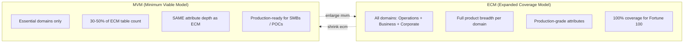
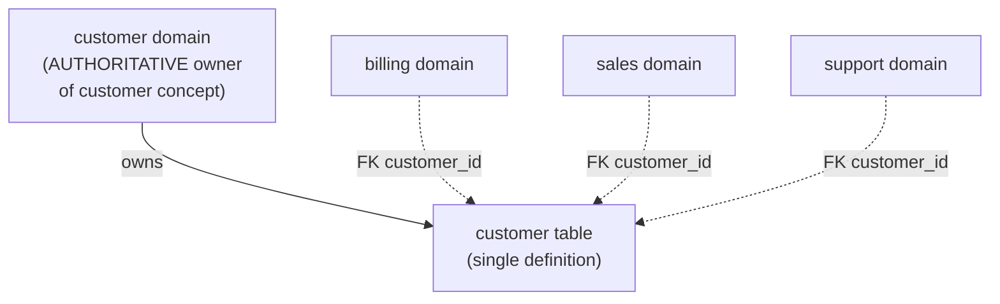

# Vibe Data Modeling — A White Paper

> Philosophy, methodology, and complete rules catalog for building industry-neutral data models with the Vibe Modelling Agent.

[← Back to project root](../readme.md) · [Design guide](design-guide.md) · [Integration guide](integration-guide.md)

> **NOTE:** All examples in this paper are illustrative and industry-neutral. When applying these concepts, always adapt terminology, domain names, product names, and entity names to the specific industry and business being modeled.

---

## Table of Contents

- [Introduction](#introduction)
- [Step 1 -- The Base Model](#step-1----the-base-model)
  - [1.1 -- Knowing the Business Before Modeling It](#11--knowing-the-business-before-modeling-it)
  - [1.2 -- Segmenting the Organization into Three Divisions](#12--segmenting-the-organization-into-three-divisions)
  - [1.3 -- Segmenting Divisions into Domains](#13--segmenting-divisions-into-domains)
  - [1.4 -- Filling Domains with Tables](#14--filling-domains-with-tables)
  - [1.4a -- Domain Architect Review (Per-Domain)](#14a--domain-architect-review-per-domain)
  - [1.4b -- Global Architect Review (Cross-Domain)](#14b--global-architect-review-cross-domain)
  - [1.5 -- Filling Tables with Attributes](#15--filling-tables-with-attributes)
  - [1.6 -- In-Domain Linking](#16--in-domain-linking)
  - [1.7 -- Cross-Domain Linking and Pairwise Comparison](#17--cross-domain-linking-and-pairwise-comparison)
  - [1.8 -- Quality Checks, Deployment, and Self-Assessment](#18--quality-checks-deployment-and-self-assessment)
- [Step 2 -- Vibe Modeling](#step-2----vibe-modeling)
  - [2.1 -- Understanding Intent: Surgical, Holistic, and Generative Modes](#21--understanding-intent-surgical-holistic-and-generative-modes)
  - [2.2 -- Model Evolution: The Progression Toward the Ideal](#22--model-evolution-the-progression-toward-the-ideal)
- [The Ontology and DAG-First Mindset](#the-ontology-and-dag-first-mindset)
- [Closing](#closing)
- [Appendix: Data Modeling Rules Catalog](#appendix-data-modeling-rules-catalog)
  - [G01 -- Naming Convention Rules](#g01--naming-convention-rules)
  - [G02 -- Semantic Deduplication Rules](#g02--semantic-deduplication-rules)
  - [G03 -- Foreign Key Rules](#g03--foreign-key-rules)
  - [G04 -- Primary Key Rules](#g04--primary-key-rules)
  - [G05 -- Normalization Rules](#g05--normalization-rules)
  - [G06 -- Domain and Division Rules](#g06--domain-and-division-rules)
  - [G07 -- Data Type Rules](#g07--data-type-rules)
  - [G08 -- Tag and Classification Rules](#g08--tag-and-classification-rules)
  - [G09 -- Relationship and Graph Rules](#g09--relationship-and-graph-rules)
  - [G11 -- Quality and Validation Rules](#g11--quality-and-validation-rules)
  - [G12 -- Product Design Rules](#g12--product-design-rules)
  - [Semantic Distinction Rules (Supplementary)](#semantic-distinction-rules-supplementary)
  - [SUB -- Subdomain Rules](#sub--subdomain-rules)

---

## Introduction

Data modeling is about organizing data. That is all it has ever been about.

Whether the result is called an industry data model, a business data model, a canonical model, or an enterprise schema, the underlying work is the same: decide what concepts the business cares about, decide how those concepts relate, and decide where each piece of data lives. Think of it like an image. A photograph of a tree looks the same whether it is stored as a JPEG, a PNG, or a TIFF. The format is the container; the tree is the content. In data modeling, the methodology is the format. The content -- the actual business, its processes, its relationships -- is what matters.

Vibe data modeling is a faster, more natural way to build that content.

It does not produce an industry data model -- a generic template that approximates a sector. It produces a business data model: a structure that is specific, authentic, and representative of how one particular organization actually works. It is built through natural language, refined through iteration, and governed by over two hundred enforceable rules that ensure consistency, accuracy, and production readiness.

The process has two distinct steps.

**Step one** is the base model -- version zero, the seed. The modeler describes their business, and the system generates a complete data model by following a single decomposition path:

```
Organization -> Divisions -> Domains -> Products -> Attributes
```

The organization is segmented into three divisions. Each division is broken into domains. Each domain is filled with products (tables). Each product is filled with attributes (columns). Then everything is linked together -- within domains, across domains -- and validated against every rule in the catalog. The output is the seed model: a fully linked, fully tagged, physically deployed starting point. It is not perfect -- no first draft ever is -- but it is comprehensive, consistent, and honest about where it falls short.

**Step two** is vibe modeling -- the iteration. The modeler looks at the seed and describes, in natural language, what they want to change:

- *"Add a loyalty domain."*
- *"Rename mobile_number to phone_number everywhere."*
- *"The billing domain needs a collections workflow."*

The system reads the modeler's intent, classifies the type of change, executes with precision, and validates with the same rigor as the original build. Each vibe creates a new version -- v1, v2, v3 -- each one closer to the ideal. No version is overwritten. The model evolves iteratively toward the true representation of the business -- not in months, but in minutes.

This paper walks through both steps. Each builds on the one before.

---

## Step 1 -- The Base Model

The base model is version zero -- the seed. It is the initial information gathering and generation pass that produces the first complete representation of the business. Everything that follows in step two will iterate on this seed, refining it version by version. But the seed itself must be solid.

The generation follows one decomposition path, and it never deviates:

```
Organization -> Divisions -> Domains -> Products -> Attributes
```

The modeler describes the organization. The system segments it into three divisions. It breaks each division into domains. It fills each domain with products (tables). It fills each product with attributes (columns). Then it links everything -- within domains, across domains -- validates the result, deploys it, and assesses where it falls short. The output is version zero: a complete, self-aware starting point that knows exactly what the next iteration should fix.

---

### 1.1 — Knowing the Business Before Modeling It

Every data model begins with a question: *what does this business do?*

The answer seems obvious to the people who work there. But obvious to a human is not obvious to a system. The system needs structure: not just the company name and a tagline, but a layered portrait that captures the business at multiple levels of detail.

The modeler provides this portrait through the **widget form configuration**. It captures three categories of input:

1. **Business information** -- the company's name, a rich description of what it does, the industry it operates in, the core business processes it runs every day, the organizational divisions it uses, the data domains it already knows about, the jargon its people speak, the operational systems that currently hold its data, and the governing body that regulates its industry. These are entered through the core widgets (Business Name, Description, Business Domains, Org Divisions).

   For a retail company, the business processes might be "merchandise planning, inventory replenishment, order fulfillment, customer loyalty management, and supply chain optimization." The jargon might include SKU, POS, GMROI, shrinkage. The governing body might be PCI DSS for payment security and local consumer protection authorities. For a healthcare organization, the processes would be "patient admissions, clinical documentation, claims processing, pharmacy dispensing, and quality reporting." The jargon would be ICD, CPT, DRG, HIPAA. The point is: every industry has its own language, and the system must speak it.

2. **Model conventions** -- the formatting rules that govern every name, type, and tag in the model: how dates are formatted, what type primary keys use, how booleans are represented, what classification levels apply to sensitive data, and any naming prefixes or suffixes the organization requires. These are configured through convention widgets (12–24).

3. **Vibe modeling instructions** -- a free-text widget where, in step two, the modeler will describe changes in natural language. For a new base model, this widget is left empty.

Once the modeler provides this widget configuration, the system does something a traditional tool cannot: it **enriches the input**. Acting as a seasoned business analyst with deep industry knowledge, the system expands every dimension. If the modeler wrote "retail" for industry alignment, the enrichment expands that into a precise characterization: omni-channel retailer, specialty retailer, or e-commerce-first brand. If the modeler listed three business processes, the enrichment expands them into specific, ordered workflows: "billing" becomes "order capture, payment processing, invoice generation, refund handling, and revenue recognition." Each expanded process implies specific data entities that the model will need.

This enrichment is not decoration. It is the foundation that every subsequent step will consult. A model that does not know what a SKU is will generate useless column names in retail. A model that cannot distinguish an ICD code from a CPT code will fail in healthcare. The enriched context ensures the model speaks the business's language from its very first table.

Before moving on, one thing must be clear: nothing that follows is random. Every step in the model's lifecycle is governed by a catalog of **over two hundred documented rules**, organized into thirteen groups covering naming conventions, semantic deduplication, foreign keys, primary keys, normalization, domain structure, data types, tags, graph topology, quality, product design, semantic distinction, vibe governance, surgical mode, scoring, and install/observability hardening. Each rule has an ID, a rationale, and an example. They are enforceable constraints, not suggestions. The modeler provides the soul; the rules provide the skeleton. The complete catalog appears in the [Appendix](#appendix-data-modeling-rules-catalog), and rules are referenced by ID throughout this paper.

And every step -- from this enrichment to the last foreign key constraint -- follows the same disciplined cycle: **generate, validate against the rules, and if validation fails, feed the errors back and retry**. This four-beat rhythm is the heartbeat of quality. Nothing moves forward until it passes scrutiny.

---

### 1.2 — Segmenting the Organization into Three Divisions

Before a single domain is named, the system establishes the organizational scaffolding. Every business, regardless of industry, operates in three concentric rings of activity. Understanding these rings is the first architectural decision.

The **innermost ring is Operations** -- what the business physically does to function. In retail: warehouse management, inventory control, order fulfillment, supply chain logistics. In healthcare: patient admissions, clinical procedures, pharmacy dispensing. In manufacturing: production scheduling, quality control, equipment maintenance. The test question is direct: *can the business operate for one day without this division's data?* If the answer is no, it belongs in Operations.

The **second ring is Business** -- who the business serves and how it earns revenue. Customer management, billing, product catalogs, sales and contracts. The test: *does this area directly generate revenue or directly serve customers?* If yes, it belongs in Business.

The **outermost ring is Corporate** -- the supporting scaffolding. Marketing campaigns, regulatory compliance, human resources, corporate finance. These enable the business but do not directly generate revenue. The test: *could the business survive without this division's data for a week?* If yes, it is probably Corporate.

This three-ring structure is not a suggestion. It is a constraint (**G06-R001**) that ensures the model is built from the inside out -- operations first, because they are the foundation; business second, because revenue depends on operations; corporate last, because it supports both. Every domain that will be created in the next step must be classified into exactly one of these three divisions. This prevents the common failure mode of building a model that is heavy on HR, finance, and legal domains while starving the operational core that actually runs the business.

---

### 1.3 — Segmenting Divisions into Domains

The three divisions are now established -- Operations, Business, Corporate. But a division is too broad to model directly. No one builds a database called "Operations." The next step is to break each division into domains -- the actual modeling units that will hold tables, columns, and relationships.

A domain is not a database. It is not a department. It is a **bounded context** -- a coherent region within a division that owns a distinct set of concepts and speaks its own dialect. Think of each division as a continent, and domains as the countries within it. Operations might contain "production," "logistics," and "maintenance." Business might contain "customer," "billing," and "product." Corporate might contain "finance," "compliance," and "workforce." Each domain belongs to exactly one division, and each inherits that division's character: Operations domains deal with what the business does, Business domains deal with who it serves, Corporate domains deal with how it runs.

#### What is a domain?

A domain answers the question: *"Within this division, what specific area of the business does this data belong to?"* In a retailer's Operations division, "inventory" is a domain -- it owns the concepts of stock levels, warehousing, and replenishment. In the same company's Business division, "billing" is a domain -- it owns the concepts of invoices, charges, and payments. Each domain owns a set of concepts that other domains may reference but do not own. The customer domain owns who the customer is. The billing domain owns what the customer owes. The operations domain owns what infrastructure or processes exist. The domain name should always use terminology natural to the specific industry being modeled.

#### The Org Chart Test

Every domain must pass a simple reality check (**G06-R016**): *would a real department or team with this name exist in the organization?* "Finance" passes -- there is a finance department. "Customer" passes. "Inventory" passes for a retailer. But "utilities" fails -- no one works in the "Utilities department." "Processing" fails -- it is too vague to be meaningful. If you cannot imagine a recruiter posting jobs in that department, it is not a real domain.

Generic catch-all names are forbidden (**G06-R014**): "services," "platform," "shared," "common," "core," "misc," and "admin" are not domains. They are buckets where unclear thinking goes to hide. And analytics-oriented names are equally forbidden (**G06-R015**): no "analytics," "reporting," "intelligence," "metrics," "kpi," or "datawarehouse" domain. The base model captures what happened -- raw operational and transactional facts at the Silver layer of the medallion architecture. Derived analytics belong in the Gold layer above.

#### Boundaries and rules

Because domains are children of divisions, the generation order follows the division hierarchy. Domain selection uses an interleaving algorithm (**G06-R005**): one from Operations, then one from Business, alternating to keep the model balanced. Only after both divisions have at least two domains does the model consider any Corporate domain (**G06-R004**). Corporate domains can never exceed twenty percent of the total (**G06-R002**). This ensures the model is weighted toward the operational and revenue-generating core, not the back-office.

Domain names must be exactly one word, lowercase, singular, and no longer than twenty characters (**G01-R002** and **G01-R003**). "customer" is valid. "customer_service" is not -- two words. "customers" is not -- plural.

Each domain receives a clear description of at least twenty characters explaining its business purpose. No two domains may have descriptions with more than seventy percent word overlap -- because if two descriptions sound the same, the domains probably are the same and should be merged.

The system does not rely on a single judgment. It solicits four independent domain proposals generated with different reasoning styles, then a fifth, senior judge reviews all four side by side. The judge looks for consensus, unique insights, and redundancy. If one proposal calls it "customer" and another calls it "client," the judge recognizes these as the same concept and picks one canonical name, enforcing the Single Source of Truth principle (**G06-R006**): each business concept can be owned by exactly one domain.

The result is a set of domains, each classified into one of the three divisions. The continents are divided into countries. The borders are set.

---

### 1.4 — Filling Domains with Tables

#### Diagram: ECM vs MVM Coverage



> MVM is NOT a skeleton. It is a production-ready subset where every delivered table is fully-featured — lightness comes from fewer domains and fewer tables, never from thinner attributes.

With domains established, the model enters its most prolific phase: filling each domain with data products -- the tables that will hold the business's data.

All domains are populated simultaneously. For each domain, the model generates tables that naturally belong there. In "customer": profile, account, address, contact, preference, segment. In "billing": invoice, payment, charge, credit_note, dispute. In "operations": equipment, work_order, schedule, inspection, facility.

#### Business first

Every table must represent a genuine business concept that a domain expert would recognize. Technical artifacts like `etl_job_log` or `batch_control` are plumbing -- they belong in operational schemas, not the business model (**G12-R001**). Analytics tables like `churn_prediction` or `revenue_analysis` are derived insights that belong in the Gold layer (**G12-R002**). Speculative content like `blockchain_hash` or `quantum_encryption_key` represents what the business might do someday, not what it does today (**G12-R004**). All three are turned away.

#### Single Source of Truth

##### Diagram: SSOT Principle



> One concept owns exactly one domain. Other domains reference via FK — never by duplicating the concept.

After all domains have their tables, the model runs **global semantic deduplication**. It scans every table across every domain, looking for duplicates -- tables that represent the same business concept under different names. "invoice" and "bill" are the same thing. "customer" and "client" are the same thing. The SSOT principle (**G02-R001**) demands that each concept has exactly one authoritative home.

But deduplication is conservative. Not everything that looks similar is the same. Different lifecycle stages are not duplicates (**G02-R006**): a "quote" and an "order" represent different stages. Different granularity levels are not duplicates (**G02-R007**): individual usage events and monthly summaries serve different purposes. Parent and child entities are not duplicates (**G02-R008**): "order" groups items, "order_item" details them. When genuine duplicates are found, merging is preferred over deletion (**G02-R009**), and a discriminator column preserves context.

#### Semantic first

Tables are classified by nature (**G07-R008**). Master data (customer, product) describes what entities are -- authoritative records that change slowly. Reference data (country, currency) provides static lookups. Transactional data (order, payment) captures what happened. Association data (enrollment) represents many-to-many relationships. Each table is also classified as "core" or "helper" (**G12-R007**). Core tables are essential, directly queried by stakeholders. Each domain should have one to three core tables maximum (**G12-R009**) -- because if everything is core, nothing is.

Table naming is strict: one to three words, lowercase, under thirty characters (**G01-R004**). Names never repeat the domain name as a prefix (**G01-R005**) -- in "customer," the table is "account," not "customer_account," because the full path `customer.account` already provides context.

Each table receives a primary key following a sacred convention (**G04-R001**, **G01-R007**): the table name followed by `_id`. The "customer" table gets `customer_id`. When you see `customer_id` in any table, in any domain, you immediately know it references the customer table. The model is self-documenting by design.

---

### 1.4a — Domain Architect Review (Per-Domain)

Before the model zooms out to the whole, it zooms in on each part. A first pass of tables has been drafted inside every domain, but "drafted" is not "reviewed." Each domain is now handed to a reviewer who has two voices at once.

The system adopts a **dual persona**: a Principal Data Architect, who knows the rules of sound modeling, and a Senior Business Subject-Matter Expert for that specific domain in the user's industry. The Principal Data Architect asks: *is the set of tables internally coherent, is the single source of truth respected inside the domain, is the granularity consistent, do the in-domain foreign keys tell the right story, are the names and descriptions correct?* The Senior SME asks: *does a real practitioner from this domain in this industry recognize what they see, and is anything obviously missing from a business point of view?*

All domains are reviewed in parallel -- one independent reasoning pass per domain, bounded by the same concurrency limit the model uses for in-domain linking. This is deliberate. Each reviewer focuses only on their assigned domain and nothing else; cross-domain concerns are explicitly out of scope and belong to the next step. If the domain is too large for a single LLM context, the reviewer internally batches the content rather than truncating.

Each reviewer produces two kinds of output. The first is **actionable and applied immediately**: products to add, products to rename, products to remove, description improvements, and in-domain foreign key links (which are queued into the architect's essential-links queue rather than created directly, so the downstream linker can honor them with full rule enforcement). The second is **deferred**: merges or splits that need attribute-aware reconciliation, and any blockers or required actions surfaced by failed production-readiness gates. These are stashed alongside the model so the next vibe iteration can address them.

Every reviewer -- one per domain -- runs the same four production-readiness gates, scoped to their domain: *would I trust this domain in production?* *would I support it in production?* *would I recommend it to industry peers?* *would I propose it for a global standard?* Each gate is a Yes/No with explicit blockers and required actions. A single "No" does not fail the pipeline; it feeds the next vibes.

The prompt that drives this review is industry-agnostic. It speaks only in placeholders -- `{domain_name}`, `{industry_alignment}`, `{business}` -- so the same logic works for any organization in any sector the user describes.

The outcome of step 1.4a is a set of domains that are, each one, internally sound: right products, right names, right in-domain relationships, right business voice. The next step takes those sound parts and looks at the whole.

---

### 1.4b — Global Architect Review (Cross-Domain)

With every domain now internally reviewed, a single **global architect** reviews the model as one organism. Its scope is everything the per-domain reviewers deliberately could not touch: cross-domain single source of truth, the overall shape and balance of the domain structure, essential cross-domain foreign keys, and higher-level structural changes such as adding, removing, or renaming a domain, or moving a product from one domain to another.

The division of labor is strict. The per-domain reviewer may add, rename, remove, merge, or split products within one domain. The global reviewer owns everything that crosses domain boundaries. This prevents a common failure mode, in which a global reviewer over-optimizes the shape of the model and accidentally loses a product that only made sense to the domain's own expert -- or, conversely, in which a domain reviewer invents a cross-cutting structural change that contradicts another domain.

The global reviewer runs the same four production-readiness gates, now scoped to the whole model. Failures at either level -- per-domain or global -- flow into the same stash of blockers and required actions, and ultimately into the next-vibes recommendations. The two reviews are complementary, not redundant: the per-domain reviewer catches what only a practitioner inside one bounded context can see; the global reviewer catches what only an observer of the whole can see.

---

### 1.5 — Filling Tables with Attributes

Every table now has a name, a classification, and a primary key. But a table without columns is just a label. This step gives each table its substance.

Attribute generation runs for every table in parallel. The model knows what each table type demands (**G12-R018**). A person entity without name and contact fields is a ghost. An account without type, status, and key dates is an empty shell. A transaction without a date or an amount is a record of nothing.

#### No trivial attributes

Every column must earn its place (**G12-R017**). The litmus test: *"What specific business question does this column answer?"* If the column `order_date` answers "When was this order placed?" it stays. If `notes_field_3` answers nothing specific, it goes. No filler. No padding. No speculative columns.

Pre-calculated metrics like `average_monthly_spend` or `churn_score` are refused (**G12-R003**). These are derived insights. The base model stores raw ingredients -- individual charges, individual transactions -- and lets the analytics layer compute the totals and scores.

#### No duplicates

Column names never repeat the table name as a prefix, except for the primary key (**G01-R006**). In "account," the column is "balance," not "account_balance." Column names prioritize clarity over brevity (**G01-R013**): always `mean_time_between_failures`, never `mtbf`. Industry jargon earns a place when universally recognized (**G01-R015**) -- `sku` in retail, `iban` in banking, `icd_code` in healthcare -- but lazy abbreviations like `cust_nm` for `customer_name` never do.

Data types are inferred from naming patterns (**G07-R011**): `_id` columns get integers, `_date` gets DATE, `_at` gets TIMESTAMP, monetary suffixes get DECIMAL. No complex types like ARRAY or MAP are allowed (**G07-R002**) -- nested data is modeled as separate, normalized tables.

Within each table, columns follow a strict seating arrangement (**G12-R021**): primary key first, then foreign keys, then business attributes, then housekeeping columns, and finally history-tracking columns. This ordering makes every table scannable and predictable.

---

### 1.6 — In-Domain Linking

Tables exist. Columns exist. But without relationships, they are a collection of isolated spreadsheets. The web of foreign key relationships is what transforms tables into a model.

In-domain linking is where that web begins, and it starts inside each domain because the relationships here are the most natural and the most obvious. Tables that belong to the same business area are almost certainly connected.

Consider the "customer" domain with tables for profile, account, address, preference, and segment. An account belongs to a profile. An address belongs to a profile. A preference belongs to a profile. These are not arbitrary connections -- they represent the real-world truth that a customer's account, address, and preferences all belong to that customer.

**Why in-domain first?** Because in the real organization, the people who work in billing mostly work with other billing tables. The people who manage the customer domain mostly join customer tables to other customer tables. In-domain relationships are the high-frequency joins -- the ones that analysts run hundreds of times a day. Getting them right is the foundation that cross-domain linking will build on.

The rules governing foreign keys serve one purpose: preventing relationships that would cause problems in production. Every foreign key must point to the actual primary key of its target (**G03-R001**), data types must match (**G03-R004**), and foreign keys always follow the child-to-parent direction (**G09-R005**): `order.customer_id` is correct; `customer.latest_order_id` is wrong. Bidirectional keys are forbidden (**G03-R003**) because they create cycles. Self-references are blocked unless hierarchical (**G03-R002**): `category.parent_category_id` is legitimate; a random self-reference is not.

When a foreign key is established, normalization follows automatically (**G03-R010**). If "order" gains `customer_id`, then redundant columns like `customer_name` and `customer_email` are removed -- because those values are now accessible through the join. The order is always: add the key first, remove the redundancy second.

Before linking even begins, the model runs a normalization integrity check on every table in parallel. It finds orphaned foreign key columns -- columns ending in `_id` with no formal link declared -- and either connects them to their obvious targets or flags them for resolution. It also finds denormalization violations: columns that copy data from another table, like `customer_name` appearing on "invoice" when `customer_id` already exists (**G05-R001**). Redundant columns are removed; the join path replaces them.

After the domain-level linking pass, a batch semantic resolution step sweeps the entire model, collecting every remaining unlinked `_id` column and resolving it in one comprehensive pass.

---

### 1.7 — Cross-Domain Linking and Pairwise Comparison

If in-domain linking connects the rooms of a house, cross-domain linking connects the houses into a city. This is where the model becomes a true enterprise data mesh.

The organization is one body. The billing department serves the customer department's customers. The operations department's infrastructure supports the product department's offerings. The support department resolves issues that originate in the operations domain. These connections must exist in the data model, or cross-domain analytics -- the entire reason an enterprise model exists -- becomes impossible.

The system examines every unique pair of domains. For a model with seven domains, that is twenty-one pairs. For twenty-one domains, that is two hundred and ten pairs. Each pair is examined in parallel: how does billing connect to customer? How does support connect to operations? How does logistics connect to procurement?

No domain may be an island (**G09-R004**). Every domain must connect to at least one other through foreign key relationships. An isolated domain is a data silo that cannot participate in cross-domain analytics. An analyst asking "which products generate the most billing disputes?" needs to traverse from product through billing to get the answer. If those domains are not connected, the question is unanswerable.

Before creating any cross-domain link, the model performs an identity check on each domain pair. Are these two domains actually the same domain accidentally split? If they share five or more products with the same names and their functional overlap exceeds seventy percent, they are flagged as identical and recommended for merger.

Cross-domain many-to-many relationships are treated with extreme conservatism (**G12-R013**). The model expects at most zero to one per model. The tests are stringent: is the relationship genuinely bidirectional? Does the business track at least two attributes about the relationship itself? Does the business have a name for this relationship? "Customers subscribe to products with terms, dates, and tiers" is a genuine many-to-many. "An order belongs to one customer" is a simple foreign key.

Throughout this phase, the model enforces its most important structural law (**G09-R001**): the data model must form a **Directed Acyclic Graph**. Follow foreign key relationships from any table, and you must never arrive back at the starting table. Cycles make it impossible to determine insertion order, break referential integrity, and create infinite loops. When cycles are detected, the model breaks the weakest link: convenience references like `latest_order_id` or `primary_invoice_id` are always broken first (**G09-R007**); core structural relationships like `order_item.order_id` are never broken (**G09-R008**).

---

### 1.8 — Quality Checks, Deployment, and Self-Assessment

Everything built so far -- domains, tables, columns, relationships -- has been constructed in stages, each following its own rules. But has the whole held together? A city built neighborhood by neighborhood can still have mismatched roads, dead ends, and buildings that violate the zoning code. This step holds the entire model up to the light.

The quality assurance suite is comprehensive. It begins at the edges: empty domains are removed (**G11-R023**), small tables are evaluated for merging (**G12-R026**), and every table is verified to have a primary key (**G04-R001**).

Then it turns inward to the structural backbone. The model identifies its core products -- the tables fundamental to the business -- and marks them as protected: they cannot be merged, removed, or relocated. A fresh semantic deduplication scan runs at the global level, because linking and normalization may have revealed new overlaps. Global product name conflicts across domains are investigated: `customer.device` (a phone) and `iot.device` (a sensor) share a name but represent different concepts -- they are kept. `billing.payment_record` and `finance.payment` with ninety percent overlap are genuine duplicates -- one is consolidated.

The most complex check is **graph topology**. Depth-first cycle detection traverses the entire relationship web. Any remaining cycles are broken following the established hierarchy: convenience references first, structural relationships never, and no break may create a disconnected table. Siloed tables -- tables with no incoming or outgoing relationships -- are detected (**G09-R003**) and either reconnected or removed.

The audit then zooms out to architecture. **Product-domain location fit** is examined: are tables in the right domain? Tables cannot cross division boundaries (**G06-R008**). Eponymous tables -- like "inventory" in the "inventory" domain -- can never be relocated (**G06-R010**). Child tables stay with their parent (**G06-R011**). Domain balance is validated: operations and business domains must make up at least eighty percent of all domains.

Throughout, semantic distinction rules prevent false-positive duplicates. "payment_method" and "payment_channel" are not the same thing (**G02-SD01**). "sla_target_time" and "sla_actual_time" answer different questions (**G02-SD03**). "created_at" and "shipped_at" mark different milestones (**G02-SD04**). A model that loses real business nuance in the name of tidiness is worse than one that tolerates a few extra columns.

After the quality checks, naming conventions are applied. Physical schema creation deploys the model to the Databricks Unity Catalog: databases in parallel, tables in parallel, foreign key constraints sequentially in dependency order. Data classification tags are applied to every column that needs them. And a static analysis examines the entire model, producing a **confidence score** and a set of forward-looking **recommendations** -- specific, actionable observations like "the billing domain has only four tables, consider adding charge_line_item" or "the operations domain has no connection to customer, consider adding customer_id on the work_order table."

Version zero -- the seed -- is complete. It is fully linked, fully tagged, physically deployed, and self-aware. It knows where it is strong, where it is weak, and what it recommends doing next.

These recommendations are the bridge to step two. The seed is planted. Now the modeler tends it.

---

## Step 2 -- Vibe Modeling

The seed model is version zero -- a solid, rule-compliant, fully deployed starting point. But it is still a starting point. It was built by a system that deeply understands the business, but has not yet heard from every stakeholder. The billing team has opinions. The operations team has requirements. The data governance committee has naming standards. None of them were in the room when version zero was born.

Vibe modeling is how their feedback reaches the model. The modeler writes natural language instructions -- plain English, not SQL, not JSON, not entity-relationship diagrams -- and the system translates those words into precise, validated changes. Each vibe creates a new version: v1, v2, v3, each one iterating on the seed, moving it closer to the ideal. No version is overwritten. The model evolves.

---

### 2.1 — Understanding Intent: Surgical, Holistic, and Generative Modes

Before executing anything, the system must understand what the modeler truly wants. It reads the entire instruction in context and performs a five-dimensional analysis of intent: preservation (keep the model intact or rebuild?), scope (specific entities or broad principle?), change philosophy (targeted fix or new content?), satisfaction (polishing or frustrated?), and the core desired outcome.

This analysis produces one of three modes.

#### Surgical mode

The modeler has identified specific problems with specific entities. Their implicit contract: *"Fix these things. Leave everything else alone."*

> "Remove the duplicate status column from the invoice table." "Fix the FK from order to warehouse." "Drop the marketing domain."

In surgical mode, the system modifies exactly what was asked. No content is regenerated. No tables are rewritten. If the modeler asked to remove three columns and rename one, exactly four changes occur. The rest of the model is untouched.

#### Holistic mode

The modeler wants a rule or pattern applied consistently across the entire model, without changing its structure. Their implicit contract: *"Apply this principle everywhere, but preserve the structure."*

> "Ensure all primary keys follow the naming convention." "Add created_at and updated_at to every table." "Make sure every _id column is linked."

In holistic mode, the system touches many tables -- potentially all of them -- but formulaically. No creative decisions. No new tables unless explicitly requested. Just consistent application of a rule across the entire model.

#### Generative mode

The modeler wants something fundamentally new. Their implicit contract: *"Create or rebuild this part to be better."*

> "Add a loyalty domain with program, tier, reward, and enrollment." "This model feels too generic -- make it more industry-specific." "Split billing into invoicing and collections."

In generative mode, the modeler's instructions are decomposed into twelve tailored briefings -- one for each downstream worker (domain generation, product generation, attribute generation, in-domain linking, cross-domain linking, many-to-many detection, semantic deduplication, global deduplication, product merge, attribute deduplication, normalization, and cycle breaking). Each worker receives not a generic copy of the vibe, but a custom briefing with specific requirements, enriched guidance, explicit do's and don'ts, cautions about potential mistakes, and quality criteria. The result is creative without being chaotic: twelve workers, each interpreting the same vision through the lens of their own expertise.

After all changes -- whether surgical, holistic, or generative -- the model re-enters the same quality pipeline from [section 1.8](#18--quality-checks-deployment-and-self-assessment). The same rules apply. The same checks run. A table born during a vibe receives the same scrutiny as a table born during the original creation. Vibe modeling does not shortcut quality.

---

### 2.2 — Model Evolution: The Progression Toward the Ideal

The real power of vibe modeling is not any single iteration. It is the progression.

Follow a model through four versions using a retail business as an example.

**Version zero** is the seed -- the base model from step one. Seven domains, forty-eight tables, five hundred columns, ninety-six foreign key relationships. The static analysis finds fifteen issues. Confidence score: seventy-two. The system's own recommendations say: fix three broken FK references in billing, link eight unlinked _id columns, connect the isolated workforce and procurement domains, and consider splitting the oversized product table.

**Version one** is the first vibe. The modeler takes the recommendations and adds their own twist: *"Fix the broken FKs. Link all unlinked _id columns -- if the parent table doesn't exist, create it. Connect workforce to operations. Split product into catalog and pricing. Use retail jargon everywhere: sku not product_number, pos not point_of_sale."* The system classifies this as generative, distributes the vibes to all twelve workers, and produces a refined model. Six issues remain. Confidence score: eighty-five.

**Version two** is the second vibe. The modeler writes: *"Merge service_request and work_order into service_order with a discriminator. Connect procurement to product through supplier_product. Add a loyalty domain. Don't touch billing or logistics."* Generative mode with explicit protection constraints. The merge executes, the loyalty domain is created and populated, procurement connects to product. Two minor issues remain. Confidence: ninety-three.

**Version three** is the third vibe. *"Link loyalty.enrollment to customer.profile. Fix the naming in workforce."* Surgical mode -- two targeted actions. Zero issues. Confidence: ninety-seven.

Four versions. Minutes, not months. Each built on the seed. Each was guided by the model's own self-assessment.

This progression is the key insight. The model is never "done" in the traditional sense. It is always moving toward the ideal -- the model that perfectly represents the business. Version one hundred is as valid as version two. Each version is a complete, self-contained snapshot. Each can be deployed independently. Each preserves the full history of what came before.

Every vibe creates a new version. No version is ever overwritten. The modeler never starts over. Every piece of work they have done is preserved. Every decision they have made is respected. The feedback loop is self-reinforcing: the static analysis produces recommendations, the modeler uses them (or ignores them), the next version improves, the next analysis refines further.

The cost of change is negligible. In a traditional model, renaming a domain is a week of work -- updating schemas, scripts, documentation, lineage. In vibe modeling, it is one sentence: *"Rename the logistics domain to fulfillment."* The cascade is automatic. The documentation regenerates. The physical schema updates. The foreign keys adjust. The tags reapply.

This is the philosophy of vibe modeling: plant the seed with step one, then tend it with step two. The seed is not a final answer -- it is a starting point. The first vibe is feedback from the billing team. The second is feedback from the operations team. The third is the naming standards review from governance. The fourth is the new requirement from the product team. Each iteration is fast, safe, guided, and precise. The result is a model that is not just technically correct, but organizationally owned.

---

## The Ontology and DAG-First Mindset

There is a design philosophy that runs beneath every step described in this paper, and it deserves to be made explicit. The model is not built as a flat collection of tables. It is built as a graph -- specifically, a Directed Acyclic Graph -- and as an ontology. This dual nature is what makes it useful far beyond traditional SQL analytics.

### The DAG-first mindset

Every foreign key relationship in the model has a direction: from child to parent. `order.customer_id` points from order (child) to customer (parent). This directionality is not an implementation detail -- it is a semantic statement about how the business works. An order belongs to a customer; a customer does not belong to an order.

By enforcing the DAG constraint (**G09-R001**) at every step -- during in-domain linking, during cross-domain linking, during quality checks, during vibe modeling -- the model guarantees three properties that matter in production:

1. **Insertion order is always deterministic.** Parent tables are loaded before children. Foreign key constraints can be applied without conflict. ETL pipelines can be built by simply following the graph from roots to leaves.

2. **The model can be traversed without loops.** Any query that follows foreign key paths will terminate. Any recursive traversal will converge. Any lineage trace will end at a root table. This is essential for data lineage tools, impact analysis, and automated documentation.

3. **The model is topologically sortable.** The foreign key statements themselves are sorted in dependency order using Kahn's algorithm before physical deployment. This means the physical schema creation is deterministic and repeatable -- databases are created in parallel, tables are created in parallel, and foreign key constraints are applied sequentially in the exact order that guarantees every referenced table already exists.

### The ontology mindset

Alongside the physical schema, the model generates an RDFS (Resource Description Framework Schema) representation. This expresses every domain as a class, every table as a subclass, every attribute as a property with a defined range, and every foreign key as a semantic relationship. The result is not just a database schema -- it is a knowledge graph.

This matters because the same model can now serve multiple use cases without modification. SQL analysts query the physical tables in Unity Catalog. Data scientists ingest the machine-readable model definition. Knowledge graph platforms consume the RDFS ontology. Data governance tools read the tags and classifications. Lineage tools traverse the DAG. Each consumer sees the same model through a different lens, and each gets exactly what they need.

The ontology also makes the model discoverable. Semantic search can find tables by meaning, not just by name. "Show me everything related to customer payments" can traverse the ontology from the customer class through the billing relationship to the payment class -- even if the analyst does not know the exact table names.

This dual nature -- a physically deployed, governanced, DAG-structured relational schema and a semantically rich, traversable, class-based ontology -- is what separates a vibe data model from a spreadsheet of table definitions. The model is not just a plan for data storage. It is a machine-readable representation of how the business thinks about itself.

---

## Closing

A data model is a claim. It claims: this is what this business is. These are its concepts. These are their relationships. This is where each piece of data belongs.

Vibe data modeling makes that claim in two steps. Step one plants the seed: it decomposes the organization into divisions, divisions into domains, domains into products, products into attributes -- then links, validates, deploys, and self-assesses. The output is version zero. Step two iterates on that seed through natural language -- understanding the modeler's intent, executing with precision, and validating with the same rigor as the original build. Each vibe produces a new version: v1, v2, v3, each closer to the ideal.

The result is a model that is not just technically correct, but organizationally owned. Every team has had their say. Every domain reflects the language its users actually speak. Every table exists because someone needed it.

The model is not a document filed away in a drawer. It is a living, versioned, evolvable structure -- deployed to a lakehouse, governed with classification tags, expressed as both a relational schema and a semantic ontology, and designed from birth to grow.

It is not perfect. No model ever is. But it is honest about its imperfections, and it tells its creator exactly where to look next.

---

## Appendix: Data Modeling Rules Catalog

| Property | Value |
|:---|:---|
| **Rule Format** | `GXX-RYYY` (G = Group, R = Rule within Group) |
| **Total Groups** | 12 documented here (plus subdomain rules). See [docs/quality-gates.md](quality-gates.md) for G10/G13/G14/G15 runtime gates. |
| **Documented Rules** | 170 (162 core + 8 subdomain). Additional runtime enforcement (G10 Sample Data, G13 Sample Data QA, G14 Vibe Governance, G15 Physical Deployment) brings the enforced rule set to 200+ total. |

---

### G01 — Naming Convention Rules

*How to name domains, tables, and columns consistently.*

| Rule ID | Rule | Applies To |
|:---|:---|:---|
| **G01-R001** | All names (domains, tables, columns) must use `snake_case` by default. | ALL |
| **G01-R002** | Domain names must be exactly one word, lowercase, and no longer than 20 characters. | Domains |
| **G01-R003** | Domain names must be singular, never plural. Exception: naturally singular terms ending in 's' like `logistics`, `sales`, or `operations`. | Domains |
| **G01-R004** | Table names must be 1 to 3 words, lowercase, and no longer than 30 characters. | Products |
| **G01-R005** | Table names must NOT repeat the domain name as a prefix. In domain `customer`, the table should be `account`, NOT `customer_account`. | Products |
| **G01-R006** | Column names must NOT repeat the table name as a prefix, except for the primary key. | Attributes |
| **G01-R007** | Primary key names follow the pattern: `table_name` + suffix (e.g., `customer_id`, `order_id`). | Attributes |
| **G01-R008** | Foreign key column names must END WITH the target table's primary key name. Descriptive prefixes are allowed (e.g., `billing_address_id` and `shipping_address_id` both reference `address.address_id`). | Attributes |
| **G01-R009** | Column names must not exceed 50 characters. | Attributes |
| **G01-R010** | All names must be lowercase, contain only letters, numbers, and underscores, and must not start with a digit. | ALL |
| **G01-R011** | Association (junction) table names must NOT repeat the domain name as a prefix. | Products |
| **G01-R012** | When two duplicate tables are merged into a shared location, use the most generic, domain-agnostic name (e.g., `shared.contact` instead of `customer.contact_info`). | Products |
| **G01-R013** | Column names must be clear, semantic, and human-readable. Prioritize clarity over brevity. | Attributes |
| **G01-R014** | Preserve important qualifiers in column names: units (kg, mwh, percent), rates (per_min, per_hour), and standard terms. | Attributes |
| **G01-R015** | Use industry jargon in names only when it is universally recognized in the industry. | ALL |
| **G01-R016** | Compound business terms are allowed as table names when removing the first word would make the name ambiguous (e.g., `order_item`, `payment_method`). | Products |
| **G01-R022** | When a table is moved to a different domain, keep its original name. Do not rename tables during relocation. | Products |
| **G01-R023** | Association (junction) table names must be semantically meaningful business terms. Generic names like `link`, `mapping`, `bridge`, `junction` are forbidden. | Products |
| **G01-R024** | Product (table) names must NOT end with analytics-oriented suffixes: `_analysis`, `_analytics`, `_report`, `_summary`, `_aggregate`, `_dashboard`, `_metrics`, `_kpi`, `_score`, `_model`, or `_prediction`. | Products |
| **G01-R025** | A domain prefix in a product name is justified ONLY when another domain already has a table with the same base name, requiring disambiguation. | Products |
| **G01-R026** | The physical table name must exactly match the product (logical) name in `snake_case`. No divergence between logical and physical names. | Products, Attributes |

---

### G02 — Semantic Deduplication Rules

*How to detect and resolve duplicate concepts to maintain a Single Source of Truth.*

| Rule ID | Rule | Applies To |
|:---|:---|:---|
| **G02-R001** | Each business concept must have ONE and ONLY ONE authoritative table across the entire model (SSOT). | Products |
| **G02-R002** | Duplicate detection must be conservative. Only flag tables as duplicates when confidence exceeds 80%. | Products |
| **G02-R003** | The same customer/person concept in multiple domains is a duplicate that must be resolved. | Products |
| **G02-R004** | Industry synonyms for the same concept are duplicates (e.g., `invoice` and `bill`, `customer` and `client`). | Products, Attributes |
| **G02-R005** | Master data and transactional data are NEVER duplicates, even if they share similar names. | Products |
| **G02-R006** | Different lifecycle stages are NOT duplicates (e.g., `quote` vs `order`). | Products |
| **G02-R007** | Different granularity levels are NOT duplicates (e.g., usage events vs monthly summaries). | Products |
| **G02-R008** | Parent and child entities are NOT duplicates (e.g., `order` and `order_item`). | Products |
| **G02-R009** | When two tables from different domains overlap significantly (60%+), prefer merging over deletion. | Products, Domains |
| **G02-R010** | When merging overlapping tables, add a discriminator column to preserve original domain context. | Products, Attributes |
| **G02-R011** | Only remove a table as a duplicate if the overlap is 85% or higher. | Products |
| **G02-R012** | Only merge two domains if their functional overlap exceeds 60%. | Domains |
| **G02-R013** | Core business tables must NEVER be merged into a shared domain or removed. | Products, Domains |
| **G02-R014** | If one table is generic and another is domain-specific, they are NOT duplicates. Keep both. | Products |
| **G02-R015** | Tables with the same name in different domains but representing different business concepts are NOT duplicates. | Products |
| **G02-R016** | When checking for duplicate columns, only flag them with 80%+ confidence. | Attributes |
| **G02-R017** | No two domains may have the same name. | Domains |
| **G02-R018** | No two tables within the same domain may have the same name. | Products |
| **G02-R019** | No two columns within the same table may have the same name. | Attributes |
| **G02-R020** | Primary key and foreign key attributes are protected from removal during attribute deduplication. | Attributes |
| **G02-R021** | When tables with the same name exist in different domains, consolidate if attribute overlap is 70%+; otherwise rename the secondary with a domain prefix. | Products, Domains |

---

### G03 — Foreign Key Rules

*How to create and maintain foreign key relationships.*

| Rule ID | Rule | Applies To |
|:---|:---|:---|
| **G03-R001** | A foreign key must always reference the actual primary key column of the target table. | Relations |
| **G03-R002** | NEVER create a self-referencing foreign key UNLESS the column name starts with a recognized hierarchical prefix (`parent_`, `manager_`, `reporting_`, `supervisor_`, etc.). | Relations |
| **G03-R003** | NEVER create bidirectional foreign keys between two tables. | Relations |
| **G03-R004** | The data type of a foreign key column must match the data type of the primary key it references. | Relations, Attributes |
| **G03-R005** | Every foreign key must point to a table that actually exists in the model. | Relations |
| **G03-R007** | System identifier columns (ending in `_reference`, `_ref`, `_code`, `_number`) are NOT foreign key candidates. | Attributes |
| **G03-R008** | When a foreign key column name could match tables in multiple domains, prefer the table in the `shared` domain. | Relations |
| **G03-R010** | When a new foreign key is added, identify and remove columns now redundant via the FK join. | Relations, Attributes |
| **G03-R014** | Role-qualified foreign keys are valid. Multiple FK columns can reference the same target table (e.g., `billing_address_id` and `shipping_address_id`). | Relations |
| **G03-R015** | Parent-child foreign keys must NEVER be removed during model optimization or cycle breaking. | Relations |
| **G03-R018** | If a table has two or more FK columns pointing to the same target without clear business roles, keep only one. | Relations |
| **G03-R020** | FK reference values must use the fully qualified path format: `domain.product.column`. | Relations |
| **G03-R021** | FK reference values containing placeholder or garbage text (`unknown`, `none`, `null`, `n/a`, `tbd`, angle brackets) are invalid and must be cleared. | Relations |

---

### G04 — Primary Key Rules

*How to define and manage primary keys.*

| Rule ID | Rule | Applies To |
|:---|:---|:---|
| **G04-R001** | Every table MUST have a primary key. No exceptions. | Products, Attributes |
| **G04-R002** | When no PK is explicitly defined, default to `table_name` + `_id`. | Attributes |
| **G04-R003** | Primary keys should use a numeric type (BIGINT by default) unless there is a specific business reason otherwise. | Attributes |
| **G04-R005** | A table's own primary key is never treated as an orphaned foreign key. | Attributes |
| **G04-R006** | When two tables are merged, only one primary key survives. | Products, Attributes |
| **G04-R007** | When a table is split, each new table gets its own primary key following the standard naming pattern. | Products, Attributes |
| **G04-R009** | Association (junction) tables follow the same PK naming convention: `association_table_name` + `_id`. | Attributes |
| **G04-R010** | A primary key name is invalid if it is: empty, the bare suffix alone, starts with an underscore, equals `id`, or does not end with the configured PK suffix. | Attributes |

---

### G05 — Normalization Rules

*How to enforce Third Normal Form (3NF) and handle denormalization.*

| Rule ID | Rule | Applies To |
|:---|:---|:---|
| **G05-R001** | Only flag a column as denormalized when confidence is 95%+ that it is a copy belonging in another table. | Attributes |
| **G05-R002** | Columns that describe properties of the table itself are NEVER denormalized. | Attributes |
| **G05-R003** | Measurement and property columns (depth, weight, volume, grade, rate, amount, cost, price, quantity) always belong to their entity. | Attributes |
| **G05-R004** | When in doubt about whether a column is denormalized, do NOT remove it. | Attributes |
| **G05-R005** | If a column has a legitimate business reason to exist despite violating 3NF (audit trail, performance), keep it. | Attributes |
| **G05-R006** | Columns ending with the PK suffix but with no FK relationship defined are orphaned FKs that should be linked. | Relations, Attributes |
| **G05-R007** | When fixing denormalization, always add the FK relationship FIRST, then remove redundant columns SECOND. | Relations, Attributes |
| **G05-R008** | Address columns are denormalized ONLY if the table is NOT an address table AND a separate address table exists. | Attributes |
| **G05-R009** | Geographic coordinates are denormalized ONLY on tables that are NOT physical or spatial entities. | Attributes |
| **G05-R010** | Columns like `customer_name` are denormalized ONLY when the customer table exists AND a `customer_id` FK already exists in the same table. | Attributes |
| **G05-R012** | Only columns ending with the standard PK suffix (like `_id`) should be considered as potential orphaned FKs. | Attributes |
| **G05-R013** | During attribute deduplication, only choose among existing attribute names. Never introduce a new name. | Attributes |
| **G05-R014** | When flagging denormalization violations, only flag when the column name prefix EXACTLY matches a table name. No synonym guessing. | Attributes |
| **G05-R015** | Attributes that reference non-existent products (orphan attributes with broken references) must be removed. | Attributes |

---

### G06 — Domain and Division Rules

*How to organize domains and classify them into divisions.*

| Rule ID | Rule | Applies To |
|:---|:---|:---|
| **G06-R001** | Each domain MUST be classified into exactly ONE division: operations, business, or corporate. | Domains, Divisions |
| **G06-R002** | Operations + Business domains must be >= 80% of all domains. Corporate must not exceed 20%. | Domains, Divisions |
| **G06-R004** | Do not add any corporate domain until the model has at least 2 operations AND 2 business domains. | Domains, Divisions |
| **G06-R005** | When selecting domains, alternate between operations and business first, then add corporate last. | Domains, Divisions |
| **G06-R006** | Each core business concept must be owned by exactly ONE domain (SSOT at domain level). | Domains |
| **G06-R007** | Every domain must have FK relationships connecting it to at least one other domain. | Domains, Relations |
| **G06-R008** | Tables cannot be relocated across divisions. | Products, Domains, Divisions |
| **G06-R010** | Eponymous tables (e.g., `inventory.inventory`) must NEVER be relocated to a different domain. | Products, Domains |
| **G06-R011** | Child tables stay with their parent. Never relocate a child away from its parent's domain. | Products, Relations |
| **G06-R012** | Tables referenced by 3+ other domains should not be relocated (hub tables). | Products, Relations |
| **G06-R013** | Tables in a `shared` domain should be moved to their natural owner unless they are cross-cutting reference data used by 3+ domains. | Products, Domains |
| **G06-R014** | Domain names must represent real business functions. Generic catch-all names (`utilities`, `infrastructure`, `services`, `platform`, `shared`, `common`, `core`, `misc`, `admin`) are forbidden. | Domains |
| **G06-R015** | No analytics, reporting, insights, intelligence, or data warehouse domains. | Domains |
| **G06-R016** | Every domain must pass the Org Chart Test: would a department with this name exist? | Domains |
| **G06-R017** | If two proposed domains would share 30%+ of the same tables, they should be merged. | Domains |
| **G06-R018** | Do not create a `shared` domain during initial model design. | Domains |
| **G06-R019** | Domains with fewer tables than the configured minimum may be merged. User-defined or protected domains are exempt. | Products, Domains |

---

### G07 — Data Type Rules

*What data types to use for columns.*

| Rule ID | Rule | Applies To |
|:---|:---|:---|
| **G07-R001** | Use standard SQL types: `STRING`, `BIGINT`, `INT`, `DECIMAL`, `TIMESTAMP`, `DATE`, `BOOLEAN`. | Attributes |
| **G07-R002** | Do not use complex types like `ARRAY`, `STRUCT`, or `MAP`. | Attributes |
| **G07-R008** | Every table must be classified: `master_data`, `reference_data`, `transactional_data`, or `association_data`. | Products |
| **G07-R010** | Boolean representation should be consistent across the model. | Attributes |
| **G07-R011** | Infer data type from attribute name patterns (`_id` -> BIGINT, `_date` -> DATE, `_at` -> TIMESTAMP, monetary -> DECIMAL, etc.). | Attributes |
| **G07-R012** | Categorical attributes must define allowed values using pipe-separated format in the `value_regex` field. | Attributes |

---

### G08 — Tag and Classification Rules

*How to classify data sensitivity and apply tags.*

| Rule ID | Rule | Applies To |
|:---|:---|:---|
| **G08-R001** | Data classification goes in tags only, NEVER in column names. | Attributes |
| **G08-R002** | Only add classification tags for CONFIDENTIAL or RESTRICTED data. Regular data gets empty tags. | Attributes |
| **G08-R003** | PII (names, emails, phones, SSNs, addresses) MUST be tagged as RESTRICTED with a specific PII tag. | Attributes |
| **G08-R004** | PHI and PCI data MUST be tagged as RESTRICTED. | Attributes |
| **G08-R005** | Do NOT include structural tags like `primary_key` or `foreign_key` in classification tags. | Attributes |
| **G08-R006** | Tags should be comma-separated (e.g., `restricted,pii_email`). | Attributes |
| **G08-R007** | Standard classification levels: `restricted` (highest), `confidential`, `internal`, `public` (lowest). | Attributes |
| **G08-R009** | Use the authoritative classification matrix for common data types. | Attributes |
| **G08-R010** | Individual tag values must not contain reserved characters (`.`, `,`, `-`, `=`, `/`, `:`, whitespace). Use underscores. | Attributes |

---

### G09 — Relationship and Graph Rules

*How the data model's relationships must be structured.*

| Rule ID | Rule | Applies To |
|:---|:---|:---|
| **G09-R001** | The data model must form a Directed Acyclic Graph (DAG). Cycles are forbidden. | Relations |
| **G09-R002** | Bidirectional links are the most dangerous cycles and the highest priority to detect and eliminate. | Relations |
| **G09-R003** | Every table must have at least one relationship (outgoing or incoming FK). No disconnected tables. | Products, Relations |
| **G09-R004** | Every domain must connect to at least one other domain through FK relationships. No isolated domains. | Domains, Relations |
| **G09-R005** | Foreign keys should follow the child-to-parent direction. The child table holds the FK column. | Relations |
| **G09-R006** | When breaking cycles, NEVER break the core ownership FK (child referencing parent). | Relations |
| **G09-R007** | When breaking cycles, prefer breaking FKs with patterns like `latest_`, `current_`, `default_`, `primary_`, `active_`. | Relations |
| **G09-R008** | NEVER break primary identity links, financial ownership links, or core transaction chains. | Relations |
| **G09-R009** | When multiple cycles share the same edge, breaking that one edge can resolve all of them. Minimize breaks. | Relations |
| **G09-R010** | Breaking a cycle must NEVER create a new disconnected (siloed) table or domain. | Relations |
| **G09-R012** | Classify each FK as: true FK (never break), business reference (safe to break if needed), or computed reference (always break first). | Relations |
| **G09-R013** | Lookup tables that only have incoming FKs are NOT siloed. They are valid reference tables. | Products, Relations |

---

### G11 — Quality and Validation Rules

*Quality standards the data model must meet.*

| Rule ID | Rule | Applies To |
|:---|:---|:---|
| **G11-R007** | The number of domains must fall within the configured minimum and maximum range. | Domains |
| **G11-R008** | The number of tables per domain must fall within the configured min/max range. | Products, Domains |
| **G11-R009** | The number of columns per table must fall within the configured min/max range. | Products, Attributes |
| **G11-R013** | Domain names representing technical infrastructure (`logging`, `etl`, `integration`, `audit_trail`, `batch_control`) are forbidden. | Domains |
| **G11-R019** | Every domain must have a description of at least 20 characters. No two domains may have descriptions with more than 70% word overlap. | Domains |
| **G11-R020** | Every table must have a description explaining its business purpose. | Products |
| **G11-R021** | Every column must have a description explaining what business data it captures. | Attributes |
| **G11-R022** | The model must contain at least 3 domains. | Domains |
| **G11-R023** | Domains with zero products must be removed (unless protected/user-defined). | Products, Domains |
| **G11-R024** | The total domain count must never exceed twice the configured maximum. | Domains |

---

### G12 — Product Design Rules

*How to design tables (data products) for the model.*

| Rule ID | Rule | Applies To |
|:---|:---|:---|
| **G12-R001** | Tables must represent business concepts ONLY. No technical artifacts (`etl_job_log`, `batch_control`, etc.). | Products |
| **G12-R002** | No analytics, reporting, aggregation, summary, or KPI tables. | Products |
| **G12-R003** | No pre-calculated metric columns (`average_monthly_spend`, `churn_score`, etc.). | Attributes |
| **G12-R004** | No speculative or futuristic columns. Only current capabilities. | Attributes |
| **G12-R006** | Every table must be assigned a division: operations, business, corporate, or supporting. | Products, Divisions |
| **G12-R007** | Every table must be classified as core or helper. | Products |
| **G12-R008** | Core tables are fundamental and cannot be merged or removed. | Products |
| **G12-R009** | Each domain should have 1 to 3 core tables maximum. | Products, Domains |
| **G12-R010** | Association (junction) tables should not exceed 15% of total business tables. | Products, Relations |
| **G12-R011** | Use M:N relationships ONLY when the business genuinely operates that way AND tracks data about the relationship. | Products, Relations |
| **G12-R012** | Use a simple one-to-many FK instead of M:N when a FK already exists, the relationship is ownership-based, either table is reference data, or there is no relationship-specific data. | Relations |
| **G12-R013** | Cross-domain M:N relationships are very rare. Expect at most 0 to 1 per model. | Relations |
| **G12-R014** | Simple properties (status, type, category, flag) should be embedded as columns. Only create separate tables for complex entities. | Products, Attributes |
| **G12-R015** | Tables representing fundamentally different business workflows should be separate entities. | Products |
| **G12-R016** | Distinguish between catalog/template entities and instance entities. | Products |
| **G12-R017** | Every column must have clear, direct business value. Remove filler columns. | Attributes |
| **G12-R018** | Certain table types must include fundamental columns (person -> name/contact; account -> type/status/dates; transaction -> date/status/amount). | Products, Attributes |
| **G12-R019** | The model must provide comprehensive customer coverage (B2C, B2B, or both as applicable). | Products |
| **G12-R020** | Small tables must be evaluated: MERGE into parent, KEEP if valid reference table, DROP only if exact duplicate. | Products |
| **G12-R021** | Column ordering: PK first, FKs second, business attributes third, housekeeping fourth, history-tracking last. | Attributes |
| **G12-R022** | Junction tables with only FK columns must include at minimum audit columns: `created_at` and `created_by`. | Products, Attributes |
| **G12-R023** | Housekeeping columns (`is_deleted`, `is_active`, `created_by`, `updated_by`, etc.) must be placed after business attributes. | Attributes |
| **G12-R024** | History-tracking columns (`created_at`, `updated_at`, `effective_from`, `valid_to`, etc.) must be placed last. | Attributes |
| **G12-R025** | Attribute semantic synonyms must be resolved to one canonical name per table. | Attributes |
| **G12-R026** | A table is "small" when it has fewer attributes than the configured minimum (default 5). Evaluate for merge, keep, or drop. | Products, Attributes |
| **G12-R027** | A new table should only be created to resolve unlinked FK references when at least 2 different existing tables reference the same missing concept. | Products, Relations |

---

### Semantic Distinction Rules (Supplementary)

*Rules that prevent false-positive duplicate detection across the model.*

| Rule ID | Rule | Applies To |
|:---|:---|:---|
| **G02-SD01** | Method vs Channel are NOT duplicates. `payment_method` (credit card, bank transfer) and `payment_channel` (web, mobile app, store) capture different dimensions. | Attributes |
| **G02-SD02** | ID vs Name are NOT duplicates. `customer_id` (system identifier) and `customer_name` (display value) serve different purposes. | Attributes |
| **G02-SD03** | Target vs Actual are NOT duplicates. `sla_target_time` (promised) and `sla_actual_time` (delivered) answer different questions. | Attributes |
| **G02-SD04** | Lifecycle timestamps are NOT duplicates. `created_timestamp`, `modified_timestamp`, `approved_timestamp`, and `completed_timestamp` each represent a distinct business event. | Attributes |
| **G02-SD05** | Different date granularities can coexist. A `scheduled_date` (DATE) and `scheduled_start_time` (TIMESTAMP) serve different precision needs. | Attributes |

---

### SUB — Subdomain Rules

*How to organize products into subdomains within a domain. These rules govern the allocation of products to semantic groupings that provide an additional organizational layer between domains and products.*

| Rule ID | Rule | Applies To |
|:---|:---|:---|
| **SUB-R001** | Min/max subdomains per domain are defined by the complexity tier. Never exactly 1 subdomain per domain -- a domain must have 0 or 2+ subdomains. | Domains, Products |
| **SUB-R002** | Subdomain names must be EXACTLY 2 words. 1 word is rejected. 3 or more words are rejected. | Domains |
| **SUB-R003** | Every subdomain must contain at least the minimum products per subdomain defined by the tier (tier_1--tier_2: 3, tier_3--tier_5: 2--3). | Products |
| **SUB-R004** | No two subdomains within the same domain may share any word in their names. | Domains |
| **SUB-R005** | Subdomain names must use business terminology, NOT technical terms. | Domains |
| **SUB-R006** | Products must be distributed as evenly as possible across subdomains within a domain. | Products |
| **SUB-R007** | Placeholder subdomain names are forbidden: "Sub Domain1", "Category 1", "Group A", "N/A", "Other", "General", "Miscellaneous", "Uncategorized". | Domains |
| **SUB-R008** | Each subdomain belongs to exactly one parent domain. No subdomain drift across domain boundaries. | Domains, Products |

---

**End of Rules Catalog**

| Group | Name | Rule Count |
|:---|:---|:---:|
| G01 | Naming Convention Rules | 21 |
| G02 | Semantic Deduplication Rules | 26 (including 5 semantic distinction supplements) |
| G03 | Foreign Key Rules | 13 |
| G04 | Primary Key Rules | 8 |
| G05 | Normalization Rules | 14 |
| G06 | Domain and Division Rules | 17 |
| G07 | Data Type Rules | 6 |
| G08 | Tag and Classification Rules | 9 |
| G09 | Relationship and Graph Rules | 12 |
| G11 | Quality and Validation Rules | 10 |
| G12 | Product Design Rules | 26 |
| SUB | Subdomain Rules | 8 |

---

[← Back to project root](../readme.md)
