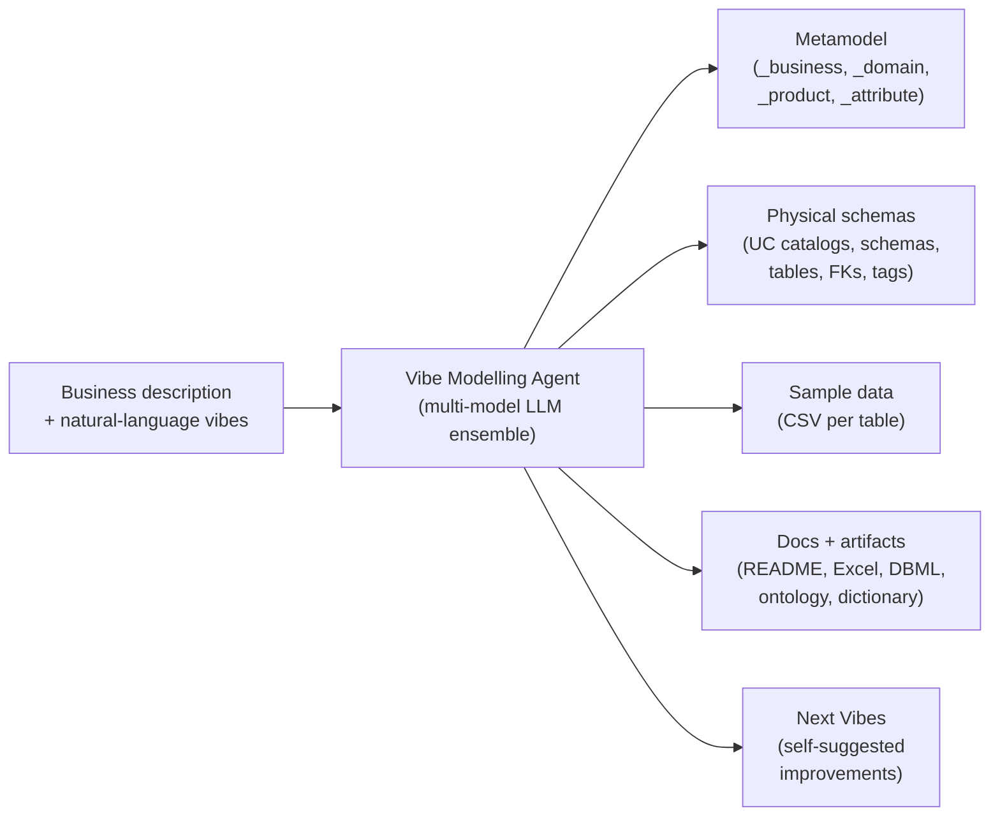
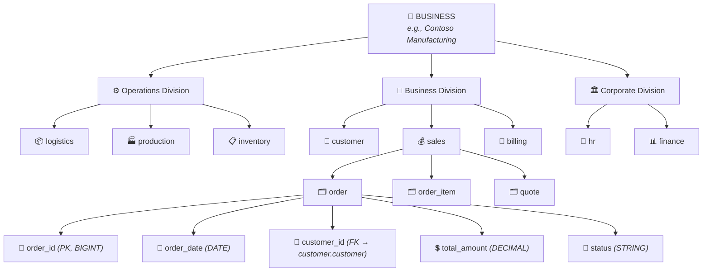
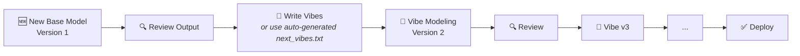

<div align="center">

# Databricks Vibe Modelling Agent

### Generate production-grade enterprise data models from natural language

[](#)
[](#)
[](#)
[](#)

*Describe your business. Get a data model. Vibe it until it's perfect.*

---

[Concepts](#-concepts) · [Getting Started](#-getting-started) · [Widget Reference](#-widget-reference) · [Vibing Workflow](#-the-vibing-workflow) · [Action Catalog](#-the-complete-action-catalog) · [Troubleshooting](#-troubleshooting)

</div>

---

## Table of Contents

- [Documentation](#-documentation)
- [What Is Vibe Modelling?](#what-is-vibe-modelling)
- [Concepts](#-concepts)
  - [Industry Data Models vs. Business Data Models](#industry-data-models-vs-business-data-models)
  - [The Four-Level Hierarchy](#the-four-level-hierarchy-divisions--domains--products--attributes)
  - [DAG Enforcement](#dag-enforcement--no-circular-dependencies)
  - [Single Source of Truth (SSOT)](#single-source-of-truth-ssot)
  - [Model Scopes: MVM vs. ECM](#model-scopes-mvm-vs-ecm)
  - [Industry Complexity Tiers](#industry-complexity-tiers)
- [Getting Started](#-getting-started)
  - [Quick Start Recipes](#quick-start-recipes)
- [Operations](#-operations)
- [The Vibing Workflow](#-the-vibing-workflow)
- [Widget Reference](#-widget-reference)
  - [Core Widgets (01–11)](#core-configuration-widgets-0111)
  - [Convention Widgets (12–24)](#model-convention-widgets-1224)
- [Auto-Generated Next Vibes](#-auto-generated-next-vibes)
- [The Complete Action Catalog](#-the-complete-action-catalog)
- [Pipeline Stages](#-pipeline-stages)
- [Output Artifacts](#-output-artifacts)
- [Quality Rules & Enforcement](#-quality-rules--enforcement)
- [LLM Architecture](#-llm-architecture)
- [Metric Views](#-metric-views)
- [Troubleshooting](#-troubleshooting)
- [Glossary](#-glossary)
- [Recent fixes (v0.6.x → v0.8.x)](#recent-fixes-v06x--v08x)

---

## 📚 Documentation

| Document | Description |
|:---|:---|
| [docs/](docs/readme.md) | Documentation index — whitepaper, design guide, integration guide |
| [docs/design-guide.md](docs/design-guide.md) | Technical design reference |
| [docs/integration-guide.md](docs/integration-guide.md) | UI/consumer integration protocol |
| [docs/whitepaper.md](docs/whitepaper.md) | Philosophy and complete rules catalog |
| [runner/readme.md](runner/readme.md) | Pipeline orchestrator guide |
| [tests/readme.md](tests/readme.md) | Test suite reference |

---

## What Is Vibe Modelling?



Vibe Modelling is a Databricks-native, LLM-powered approach to generating enterprise data models from natural language. Instead of manually drawing ER diagrams, writing DDL, or importing pre-built industry templates, you describe your business in plain English and the agent builds a complete, production-grade data model — domains, tables, columns, foreign keys, tags, sample data, and documentation — end to end.

The name **"Vibe"** reflects the core workflow:

> **Generate a base model → review → vibe it with natural language → repeat → deploy**

Each iteration produces a new version. The agent carries forward your context so nothing is lost between runs. You are never locked into a static template — the model evolves with your business.

Current version: **v1.0.1** — see [Version history](#version-history) and [Recent fixes](#recent-fixes-v06x--v08x) below.

---

## 🚀 Three Ways to Run

### 1. Quick mode (5-minute start)

Fill only these 4 widgets and run the agent notebook:

| Widget | Value |
|---|---|
| `business_name` | e.g. `Airlines` |
| `business_description` | 2–3 sentences describing the business |
| `data_model_scopes` | `Minimum Viable Model - MVM` (lean) or `Expanded Coverage Model - ECM` (full) |
| `deployment_catalog` | Unity Catalog target, e.g. `industry_mvm_v1` |

Everything else auto-fills. You get a complete metamodel + physical schemas + sample data + documentation + `next_vibes.txt` for iteration.

### 2. Runner mode (both ECM + MVM with test install)

When you want **both** ECM and MVM produced and installed in one go — plus a staging round-trip to prove the install works before landing in the permanent catalogs — use the **vibe_runner** notebook instead of the agent directly.

Runner launches a 4-task Databricks Job:

1. **ECM generate** — builds the full ECM into a staging catalog
2. **ECM install** — deploys the ECM into `{business}_ecm_v1`
3. **MVM shrink** — derives MVM from ECM in a staging catalog (reuses the ECM so you don't regenerate from scratch)
4. **MVM install** — deploys the MVM into `{business}_mvm_v1`

Tasks 2 and 3 run in parallel once Task 1 is done; Task 4 waits for Task 3.

**Inputs:** a single `my-industries.json` file listing one or more businesses (name + description + optional vibes) plus the standard widget defaults. Runner reads the file, auto-discovers the latest `dbx_vibe_modelling_agent_v*` notebook in the same directory, and orchestrates the job.

See [runner/readme.md](runner/readme.md) for the exact file format and submit recipe.

### 3. Full mode (every widget)

Use the **[Widget Reference](#-widget-reference)** section below when you need fine control over naming conventions, tag prefixes, sample data volume, or installation behavior.

**Widget semantics note (v0.5.8+):** for `schema_prefix`, `schema_suffix`, `catalog_prefix`, `catalog_suffix`, `tag_prefix`, `tag_suffix` — an **explicitly empty widget value overrides** whatever is in the model.json. For all other widgets, empty widget = "use file value if present".

---

## 📖 Concepts

### Industry Data Models vs. Business Data Models

<details>
<summary><b>What is an Industry Data Model?</b></summary>

An **industry data model** is a generic, one-size-fits-all template designed for an entire vertical — retail, banking, healthcare, telecoms, etc. Organizations like the TM Forum (telecoms), ARTS (retail), ACORD (insurance), and HL7 (healthcare) publish canonical schemas that attempt to cover every conceivable entity and relationship across the industry.

**The problem:** When you adopt an industry model, you inherit everything — including the 60–80% of tables that your business will never use. You then spend months trimming, renaming, and reshaping the model to fit your actual processes.
</details>

<details>
<summary><b>What is a Business Data Model?</b></summary>

A **business data model** is tailored, contextualized, and specific to YOUR organization. It reflects your actual business processes, your product lines, your org structure, your regulatory environment, your terminology, and your governance requirements.

**Vibe Modelling generates business data models.** The LLM understands your industry deeply (via the complexity tier system), but the model it produces is shaped entirely by your context.
</details>

| Aspect | Industry Data Model | Business Data Model (Vibe) |
|:---|:---|:---|
| **Scope** | Entire industry vertical | Your specific business |
| **Customization** | Post-delivery (manual pruning) | Built-in (LLM-driven from your context) |
| **Relevance** | 20–40% directly applicable | 90–100% directly applicable |
| **Time to production** | Months of adaptation work | Hours with iterative vibing |
| **Naming** | Committee-standard naming | Your business terminology and conventions |
| **Evolution** | New version = re-adoption | Vibe the next version from the previous one |
| **Cost** | License fees + adaptation labor | Compute cost of LLM generation |

### The Vibe Philosophy

```
1. GENERATE  →  Describe your business, get a base model
2. VIBE IT   →  Review output, provide natural-language refinements
3. REPEAT    →  Each iteration = new version; agent auto-suggests next vibes
4. DEPLOY    →  Physical Unity Catalog schemas, tables, FKs, tags, sample data
```

---

### The Four-Level Hierarchy: Divisions → Domains → Products → Attributes

Every Vibe model follows a strict four-level hierarchy:



#### Level 1: Divisions

Divisions are the top-level organizational grouping. Every domain belongs to exactly one division.

| Division | Purpose | Typical Domains |
|:---|:---|:---|
| **Operations** | Core operational backbone — mechanisms, infrastructure, processes | Logistics, production, inventory, service delivery, supply chain, quality control |
| **Business** | Revenue-generating and customer-facing functions | Customer/party, billing/revenue, product catalog, sales, subscriptions |
| **Corporate** | Supporting functions for governance (NOT directly revenue-generating) | HR, finance, legal/compliance, marketing, procurement, IT |

> **Division Balance Rules:**
> - Operations + Business MUST be **>= 80%** of all domains
> - Corporate is capped at **<= 20%** of total domains
> - No Corporate domain allowed until Operations **AND** Business each have >= 2 domains

#### Level 2: Domains

A **domain** is a logical grouping of related data products (tables). When deployed, each domain maps 1:1 to a Unity Catalog **schema**.

- Named in `snake_case`, exactly one word (e.g., `customer`, `fulfillment`, `logistics`)
- Count depends on model scope (MVM vs ECM) and industry complexity tier
- The `shared` domain is **reserved** — the pipeline auto-creates it during SSOT consolidation; never create it manually

#### Level 3: Products (Tables)

A **product** is a data table within a domain — a first-class business entity with its own identity, lifecycle, and attributes.

- Every product gets a PK column: `<product_name>_<pk_suffix>` (default: `<product_name>_id`)
- Classified as **CORE** (entities stakeholders query directly) or **HELPER** (supporting entities)
- Tagged by data type: `master_data` | `transactional_data` | `reference_data` | `association_table`

> **The First-Class Entity Test:** A product must have its own identity, its own lifecycle, and at least 5 unique business attributes. Anything less should be an attribute on another table or merged.

#### Level 4: Attributes (Columns)

Each attribute has:

| Property | Example | Purpose |
|:---|:---|:---|
| `attribute` | `customer_email` | Column name (snake_case) |
| `type` | `STRING` | Apache Spark SQL data type |
| `tags` | `restricted,pii_email` | Classification + PII tags |
| `value_regex` | `^[a-zA-Z0-9._%+-]+@` | Validation pattern or enum |
| `business_glossary_term` | `Customer Email Address` | Human-readable business name |
| `description` | `Primary contact email for the customer` | What this attribute represents |
| `reference` | `GDPR Article 6` | Regulatory or standard reference |
| `foreign_key_to` | `customer.customer.customer_id` | FK target (`domain.product.pk`), or empty |

---

### DAG Enforcement — No Circular Dependencies

FK relationships **MUST** form a **Directed Acyclic Graph (DAG)**:

```
✅ VALID:   order → customer → address
❌ INVALID: order → customer → address → order  (cycle!)
```

**Why it matters:** Circular dependencies prevent clean data loading order, break ETL pipelines, and indicate modeling errors.

**How the agent enforces it:**

1. **Detect** — Python DFS (Depth-First Search) cycle detection during QA
2. **Break** — LLM Cycle Break specialist determines which FK to remove (always the weakest link)
3. **Verify** — Re-run DFS to confirm graph is now a valid DAG
4. **Iterate** — Up to 5 rounds to resolve all cycles, including residual ones

> **Allowed exception:** Self-referencing hierarchical FKs (e.g., `parent_category_id → category.category_id`) are permitted — they represent tree structures, not multi-node cycles.

---

### Single Source of Truth (SSOT)

> **Each core business concept has exactly ONE authoritative domain and ONE authoritative product (table) that owns it. No concept is duplicated across domains.**

**What SSOT prevents:**
- Two `customer` tables in different domains
- A `product` table in both `sales` and `inventory`
- An `invoice` table in both `billing` and `finance`

**How SSOT is enforced:**

| Phase | Mechanism |
|:---|:---|
| **Generation** | LLM places each entity in its *authoritative* domain — the domain that CREATES/OWNS that data |
| **QA Deduplication** | Global pass detects same-name products + synonym pairs (e.g., `customer` vs `client`) with 60%+ attribute overlap |
| **Consolidation** | Overlapping products merged into `shared` domain with discriminator column |
| **Cross-Domain References** | Other domains use FK columns to reference the authoritative table — no duplication |

> **The "Where Do I Go?" Test:** For any entity, ask: *"If a business user needs this information, is there exactly ONE place to get it?"* If the answer is ambiguous, there is an SSOT violation.

---

### Model Scopes: MVM vs. ECM

| | MVM (Minimum Viable Model) | ECM (Expanded Coverage Model) |
|:---|:---|:---|
| **Size** | 30–50% of ECM table count | Full coverage |
| **Attribute depth** | **SAME as ECM** — full production-grade (same min/max per tier) | Full production-grade |
| **Domains** | Essential business functions only | All functions including corporate back-office |
| **Ideal for** | SMBs, rapid deployments, POCs, dev/test | Fortune 100, multinational enterprises |
| **Lightness** | Fewer domains & tables (NEVER thinner attributes) | Maximum breadth |

> MVM is NOT a skeleton or demo toy. It is a production-ready subset where every delivered table is fully-featured.

### Subdomains

Every domain is organized into **subdomains** — semantic groupings of related products within a domain. Subdomains provide an additional organizational layer between domains and products.

#### Subdomain Rules

| Rule | Description |
|:---|:---|
| **Count** | Minimum and maximum subdomains per domain are defined by the complexity tier. Never exactly 1 subdomain per domain. |
| **Naming** | EXACTLY 2 words per subdomain name. 1 word = rejected. 3+ words = rejected. |
| **Min Products** | Every subdomain must contain at least the minimum products per subdomain defined by the tier: ECM tier_1–tier_4: 3, ECM tier_5: 2; MVM tier_1–tier_3: 3, MVM tier_4–tier_5: 2. |
| **No Overlap** | No two subdomains within the same domain may share any word in their names. |
| **Business Terms** | Use business terminology, NOT technical terms. |
| **Balanced** | Products distributed as evenly as possible across subdomains. |
| **No Placeholders** | NEVER use: "Sub Domain1", "Category 1", "Group A", "N/A", "Other", "General", "Miscellaneous", "Uncategorized". |
| **No Drift** | Each subdomain belongs to exactly one parent domain. |

**Example:** In the `party` domain:
- `identity`: individual, organization, party_identification, kyc_verification
- `engagement`: party_interaction, consent_record, loyalty_enrollment

### Industry Complexity Tiers

The agent auto-classifies your business into one of five tiers:

**Classification is based on 7 scoring dimensions (scored 0 or 1 each):**

1. **Regulatory density** — 3+ distinct regulatory bodies imposing data/reporting requirements
2. **Party complexity** — 3+ distinct party types (customers, suppliers, partners, employees, etc.)
3. **Product hierarchy depth** — 50+ product variants with complex bundling/pricing/lifecycle
4. **Infrastructure management** — Owns physical or digital infrastructure requiring asset tracking
5. **Industry canonical model** — 200+ entity types defined by an industry standards body
6. **Transaction complexity** — 10+ distinct transaction types with multi-step lifecycles
7. **Operational system landscape** — 5+ major systems of record across business functions

*Rule: If the business falls between two tiers, classify UP (prefer the more complex tier).*

| Tier | Label | Hallmarks | ECM Domains | ECM Products/Domain | Attrs/Product | Subdomains/Domain |
|:---|:---|:---|:---:|:---:|:---:|:---:|
| `tier_1` | **Ultra-Complex** | 5+ regulatory bodies, multi-entity structures (banking, insurance, pharma) | 15–22 | 14–28 | 15–50 | 3–6 |
| `tier_2` | **Complex** | 2–4 regulatory bodies, multi-channel (telecoms, energy, healthcare) | 12–18 | 14–26 | 12–50 | 2–5 |
| `tier_3` | **Moderate** | 1–2 regulatory bodies, 3+ business functions (manufacturing, retail) | 10–15 | 12–24 | 10–45 | 2–5 |
| `tier_4` | **Standard** | Light regulation, regional complexity (logistics, agriculture) | 8–12 | 10–20 | 10–40 | 2–4 |
| `tier_5` | **Simple** | Minimal regulation, service-based (consulting, SaaS, media) | 5–8 | 8–18 | 8–35 | 2–4 |

**MVM Tier Sizing** (attribute depth is the SAME as ECM):

| Tier | MVM Domains | MVM Products/Domain | Subdomains/Domain |
|:---|:---:|:---:|:---:|
| `tier_1` | 9–14 | 8–16 | 2–4 |
| `tier_2` | 8–12 | 8–14 | 2–4 |
| `tier_3` | 6–10 | 7–13 | 2–4 |
| `tier_4` | 5–8 | 6–11 | 2–3 |
| `tier_5` | 3–6 | 5–10 | 2–3 |

MVM counts are automatically derived as ~30–50% of the ECM counts for each tier. Attribute depth (min/max attributes per product) is **the same** for both MVM and ECM within each tier.

---

## 🚀 Getting Started

### Quick Start Recipes

<details>
<summary><b>Recipe 1: Generate Your First Model (Minimal Input)</b></summary>

| Widget | Value |
|:---|:---|
| 01. Business | `My Company Name` |
| 02. Description | `A brief description of what your company does` |
| 03. Operation | `new base model` |
| 05. Model Scope | `Minimum Viable Model - MVM` |
| 09. Installation Catalog | `my_catalog` *(or leave blank for logical-only)* |
| Everything else | Defaults |

Run the notebook. Done.
</details>

<details>
<summary><b>Recipe 2: Generate a Rich Model (Recommended)</b></summary>

| Widget | Value |
|:---|:---|
| 01. Business | `Contoso Manufacturing` |
| 02. Description | `A multinational aluminum smelting company operating across 12 countries with 15,000 employees` |
| 03. Operation | `new base model` |
| 05. Model Scope | `Expanded Coverage Model - ECM` |
| 06. Business Domains | `production, quality, supply, customer, sales, logistics, billing` |
| 07. Org Divisions | `Operations, Business and Corporate` |
| 09. Installation Catalog | `contoso_dev` |
| 10. Sample Records | `10` |
</details>

<details>
<summary><b>Recipe 3: Vibe an Existing Model</b></summary>

| Widget | Value |
|:---|:---|
| 01. Business | `Contoso Manufacturing` |
| 02. Description | *(same as before)* |
| 03. Operation | `vibe modeling of version` |
| 04. Version | `1` |
| 08. Model Vibes | `Add a warranty domain. Remove the corporate_strategy domain. Run quality checks.` |
</details>

<details>
<summary><b>Recipe 4: Use Auto-Generated Next Vibes</b></summary>

After any pipeline run, find `next_vibes.txt` in the `vibes/` output folder. Copy the suggested vibes into widget 08.

| Widget | Value |
|:---|:---|
| 01. Business | `Contoso Manufacturing` |
| 02. Description | *(same as before)* |
| 03. Operation | `vibe modeling of version` |
| 04. Version | Next version number (previous + 1) |
| 08. Model Vibes | *(paste recommended vibes from next_vibes.txt)* |
</details>

<details>
<summary><b>Recipe 5: Deploy to a New Catalog</b></summary>

| Widget | Value |
|:---|:---|
| 03. Operation | `install model` |
| 09. Installation Catalog | `prod_catalog` |
| 11. Model JSON File | `/Volumes/catalog/schema/volume/vibes/contoso/ecm_v1/model.json` |
| 10. Sample Records | `0` *(or a number for test data)* |
</details>

---

## ⚙️ Operations

The `03. Operation` widget selects which pipeline mode to run:

| Operation | Purpose | Key Requirements |
|:---|:---|:---|
| **`new base model`** | Generate a brand-new data model from scratch | Business name + description (via widgets) |
| **`vibe modeling of version`** | Apply natural-language instructions to refine an existing version | Version + vibes (widget 08) |
| **`shrink ecm`** | Convert an ECM to a leaner MVM | Version + deployment catalog |
| **`enlarge mvm`** | Expand an MVM into a comprehensive ECM | Version + deployment catalog |
| **`install model`** | Deploy a logical model into physical Unity Catalog objects | Model JSON file (widget 11) + deployment catalog |
| **`uninstall model version`** | Remove a version's physical artifacts from the catalog | Business name + version + catalog |
| **`generate sample data`** | Generate synthetic sample records for an existing deployed model | Model JSON file (widget 11) + deployment catalog |

---

## 🎵 The Vibing Workflow

This is the core power of Vibe Modelling — iterative refinement via natural language:



### What Vibes Can Do

Vibes are **free-form natural language**. The agent interprets them and translates them into specific actions:

```
"Add a compliance domain with regulatory_filing and audit_trail tables"
"Remove the HR domain, we don't need it"
"Merge the customer_support domain into the customer domain"
"Add a source_system column to every table"
"Run a full quality check and fix any issues found"
"The order table should have a shipping_address_id FK to the address table"
"Rename all tables starting with dim_ to remove that prefix"
"Normalize the order domain to 3NF"
"Mark all email columns as PII"
"Generate an ontology (RDF/RDFS) for the model"
"Keep only billing-related tables, drop everything else"
"Make this model ECM — I need the large version"
```

### Auto-Generated Next Vibes

After **every** pipeline run, the agent produces `next_vibes.txt` and `current_vibes.txt` in the `vibes/` folder, containing:

- Your current business context (preserved as-is)
- **Recommended vibes** for the next iteration (based on QA findings)
- Model health metadata: confidence score, warning counts, issue breakdown
- Version history and progression tracking

To use them: copy the recommended vibes into widget **08. Model Vibes**, set operation to `vibe modeling of version`, set the next version, and run.

---

## 🎛️ Widget Reference

The notebook exposes **28 configurable widgets**. Below is the complete reference.

### Core Configuration Widgets (01–11)

| # | Widget | Type | Mandatory | Default | Description |
|:---:|:---|:---:|:---:|:---:|:---|
| **01** | **Business (name)** | Text | **Yes** | — | Your business/organization name |
| **02** | **Description** | Text | Recommended | — | What your business does (richer = better model) |
| **03** | **Operation** | Dropdown | **Yes** | `new base model` | Pipeline operation to run |
| **04** | **Version** | Dropdown | Conditional<sup>1</sup> | — | Model version number (1–100) |
| **05** | **Model Scope** | Dropdown | **Yes** | `Minimum Viable Model - MVM` | MVM (lean) or ECM (comprehensive) |
| **06** | **Business Domains** | Text | No | — | Comma-separated seed domains |
| **07** | **Included Org Divisions** | Dropdown | **Yes** | `Operations and Business` | Which divisions to include |
| **08** | **Model Vibes** | Text | Conditional<sup>2</sup> | — | Natural language instructions — **inline** (max 2,000 chars) or **file path** to a `.txt` on a UC Volume |
| **09** | **Installation Catalog** | Text | Conditional<sup>3</sup> | — | Unity Catalog for physical deployment |
| **10** | **Sample Records** | Dropdown | No | `0` | Synthetic records per table (0 = none) |
| **11** | **Model JSON File** | Text | Conditional<sup>4</sup> | — | Path to a previously generated `model.json` for re-install or continuation |

<sup>1</sup> Required for all operations except `new base model` (auto-assigned).
<sup>2</sup> Required for `vibe modeling of version`.
<sup>3</sup> Required for `install`, `uninstall`, `generate sample data`, `shrink`, `enlarge`. Optional for `new base model` and `vibe modeling`.
<sup>4</sup> Required for `install model`, `generate sample data` when re-deploying a previously generated model.

<details>
<summary><b>Detailed Widget Descriptions (click to expand)</b></summary>

#### 01. Business (name)
The name of your business. Used as the top-level identifier across the entire model. Case-insensitive matching (stored via `LOWER()`).

**Sample values:** `Contoso Inc`, `Acme Healthcare`, `Global Telecom Corp`, `NextGen Retail`

#### 02. Description
A rich description of what your business does. Include industry, size, geography, key products/services. The LLM uses this to determine the industry complexity tier and tailor the model.

**Sample values:** `A multinational aluminum smelting and manufacturing company operating across 12 countries`, `A digital-first healthcare provider specializing in telemedicine`

#### 03. Operation
**Options:** `new base model` | `vibe modeling of version` | `shrink ecm` | `enlarge mvm` | `install model` | `uninstall model version` | `generate sample data`

See the [Operations](#-operations) section for full details on each mode.

#### 04. Version
**Options:** Empty, or `1`–`100`

For `new base model`, leave empty — auto-assigned as `1` (or auto-incremented). For `vibe modeling of version`, this is the version you are modifying; output creates version N+1.

#### 05. Model Scope
**Options:** `Minimum Viable Model - MVM` | `Expanded Coverage Model - ECM`

MVM = lean core (fewer domains/tables, same attribute depth). ECM = comprehensive Fortune 100 coverage.

#### 06. Business Domains
Comma-separated list of specific domains you want. If blank, the LLM auto-generates the optimal set for your industry.

**Sample values:** `customer, sales, billing, inventory, logistics` | `clinical, pharmacy, research`

#### 07. Included Org Divisions
**Options:** `Operations` | `Operations and Business` | `Operations, Business and Corporate`

Controls which organizational divisions contribute domains to the model.

#### 08. Model Vibes
Supports **two input modes**:
- **Inline text** — type your vibe instructions directly into the widget (max **2,000 characters**). Best for short, targeted changes.
- **File path** — provide a path to a `.txt` file on a Unity Catalog Volume (e.g., `/Volumes/catalog/schema/vol/my_vibes.txt`). Best for longer, multi-paragraph instructions that exceed the inline limit.

See [The Vibing Workflow](#-the-vibing-workflow) for examples of what vibes can do.

#### 09. Installation Catalog
The Unity Catalog where physical schemas, tables, FK constraints, tags, and sample data will be created. Must already exist. You need `CREATE SCHEMA` privileges. If blank for `new base model`/`vibe modeling`, only the logical model (JSON artifacts) is produced.

**Sample values:** `dev_catalog`, `prod_data_models`, `contoso_lakehouse`

#### 10. Sample Records
**Options:** `0`, `5`, `10`, `15`, `20`, `25`, `50`, `100`

`0` = skip sample data generation. `10` = good default for review. `50`–`100` = for load testing / demos. Sample data respects FK relationships (child records reference valid parent IDs).

#### 11. Model JSON File
*(Optional)* Path to a previously generated `model.json` file on a Unity Catalog Volume. Used when re-installing or continuing from a prior run. After every run, the agent generates `next_vibes.txt` in the `vibes/` folder — review it for recommended next vibe instructions.

**Sample values:** `/Volumes/my_catalog/my_schema/vol/vibes/contoso/ecm_v1/model.json`
</details>

### Model Convention Widgets (12–24)

| # | Widget | Type | Default | Options / Format |
|:---:|:---|:---:|:---:|:---|
| **12** | Naming Convention | Dropdown | `snake_case` | `snake_case`, `camelCase`, `PascalCase`, `SCREAMING_CASE` |
| **13** | Primary Key Suffix | Dropdown | `_id` | `_id`, `_key`, `_pk`, `id`, `key` |
| **15** | Schema Prefix | Text | *(empty)* | e.g., `stg_`, `raw_`, `dw_` |
| **16** | Tag Prefix | Text | `dbx_` | e.g., `dbx_`, `vibe_`, `mdl_` |
| **17** | Table ID Type | Dropdown | `BIGINT` | `BIGINT`, `INT`, `LONG`, `STRING` |
| **18** | Boolean Format | Dropdown | `Boolean (True/False)` | `Boolean (True/False)`, `Int (0/1)`, `String (Y/N)` |
| **19** | Date Format | Dropdown | `yyyy-MM-dd` | `yyyy-MM-dd`, `dd/MM/yyyy`, `MM/dd/yyyy`, `yyyy/MM/dd`, `dd-MM-yyyy` |
| **20** | Timestamp Format | Dropdown | `yyyy-MM-dd'T'HH:mm:ss.SSSXXX` | 4 ISO/standard options |
| **21** | Classification Levels | Text | `restricted=restricted, confidential=confidential, internal=Internal, public=public` | Comma-separated `key=Label` pairs |
| **22** | Housekeeping Columns | Dropdown | `No` | `No`, `Yes` — adds `created_by`, `created_at`, `updated_by`, `updated_at` |
| **23** | History Tracking Columns | Dropdown | `No` | `No`, `Yes` — adds `valid_from`, `valid_to`, `is_current` (SCD Type 2) |
| **09a** | Cataloging Style | Dropdown | `One Catalog` | `One Catalog`, `Catalog per Division`, `Catalog per Domain` |
| **09b** | Catalog Prefix | Text | *(empty)* | e.g., `dev_`, `prod_` |
| **09c** | Catalog Suffix | Text | *(empty)* | e.g., `_lakehouse`, `_dw` |
| **15a** | Schema Suffix | Text | *(empty)* | e.g., `_db`, `_schema` |
| **16a** | Tag Suffix | Text | *(empty)* | e.g., `_tag` |
| **24** | Vibe Session ID | Text | *(empty)* | UUID for external UI progress tracking |

*Widget #14 does not exist (numbering gap between 13 and 15).*

---

## 📄 Auto-Generated Next Vibes

After every run, the agent produces `next_vibes.txt` in the `vibes/` output folder with recommended next vibe instructions. Copy these into widget **08. Model Vibes** for the next iteration.

The `model.json` file includes session metadata:

```json
{
  "_next_vibe_metadata": {
    "generated_from_version": "mvm_v1",
    "model_version": "1",
    "status": "needs_work",
    "confidence_score": 78,
    "summary": "Model has 3 unlinked columns and 1 siloed table",
    "issues_addressed": ["..."],
    "issues_not_addressed": ["..."],
    "data_modeler_notes": "Recommend adding a warehouse domain",
    "model_stats_at_generation": { "domains": 8, "products": 47, "attributes": 523 },
    "issue_counts": { "error": 0, "warning": 3, "info": 5 },
    "version_history": ["..."]
  }
}
```

---

## 🎯 The Complete Action Catalog

Vibes are translated into **190+ specific actions** organized into categories. You never need to name these actions — just describe what you want in natural language and the agent maps your intent.

<details>
<summary><b>Entity Management (1–25)</b></summary>

| # | Action | What It Does |
|:---:|:---|:---|
| 1 | `drop` | Remove a domain, product, attribute, tag, or link |
| 2 | `create` | Add a new domain, product, or attribute |
| 3 | `rename` | Change the name of an entity |
| 4 | `alter_description` | Modify the description |
| 5 | `change_type` | Change an attribute's data type |
| 6 | `merge` | Combine two entities into one |
| 7 | `split` | Divide one entity into multiple |
| 8 | `move_product` | Move a product to another domain |
| 9 | `move_attribute` | Move an attribute to another product |
| 10 | `delete_attribute` | Remove an attribute |
| 11 | `create_link` | Create a foreign key relationship |
| 12 | `drop_link` | Remove a foreign key relationship |
| 13–17 | Prefix/suffix ops | Add, remove, or change name prefixes/suffixes |
| 18–24 | Metadata ops | Update glossary terms, references, regex, tags |
| 25 | `modify` | Regenerate an entity with specific guidance |
</details>

<details>
<summary><b>Quality Check & Analysis (26–38)</b></summary>

| # | Action | What It Does |
|:---:|:---|:---|
| 26 | `run_quality_checks` | **Compound:** runs detect_duplicates + dedupe_attributes + detect_cycles + detect_siloed + fix_fk_anomalies |
| 26b | `run_product_domain_fit` | LLM audit: are products in the right domains? Relocates misplaced ones. |
| 27 | `detect_duplicates` | Find SSOT violations (semantic duplicate products across domains) |
| 28 | `fix_duplicates` | Auto-merge/remove detected duplicates |
| 29 | `dedupe_attributes` | Remove duplicate columns within products |
| 30 | `detect_cycles` | Find circular FK dependencies |
| 31 | `break_cycles` | Auto-fix cycles by removing weakest FK links |
| 32 | `detect_siloed` | Find completely disconnected tables (no FKs in any direction) |
| 33 | `fix_siloed` | Connect disconnected tables via linking attempts |
| 34 | `review_links` | Audit all FK relationships for anomalies |
| 35 | `fix_fk_anomalies` | Repair broken, mismatched, or orphaned FK references |
| 36 | `fix_ambiguous_fks` | Resolve FKs that match multiple target tables |
| 37 | `merge_small_tables` | Analyze and consolidate tables with < 5 attributes |
| 38 | `identify_core_products` | Identify business-critical products for protection |
| 95 | `model_checkup` | **Mega-compound:** runs static analysis + auto-queues ALL appropriate fixes |
</details>

<details>
<summary><b>FK & Linking Operations (39–46, 133–138)</b></summary>

| # | Action | What It Does |
|:---:|:---|:---|
| 39 | `run_linking` | **Compound:** in-domain + cross-domain + M:N detection |
| 40 | `run_in_domain_linking` | Link FKs within each domain |
| 41 | `run_cross_domain_linking` | Link FKs across different domains |
| 42 | `detect_many_to_many` | Find potential M:N relationships |
| 43 | `create_junction_tables` | Create bridge/association tables for M:N |
| 45 | `redirect_fk` | Redirect FK to a different target table |
| 46 | `find_unlinked_columns` | Find *_id columns without FK relationships |
| 133 | `remove_product_prefix` | Remove redundant table-name prefix from columns |
| 134 | `fix_fk_column_naming` | Fix FK columns that don't end with the target PK name |
| 135 | `connect_table` | Connect a specific disconnected table |
| 136 | `link_specific_columns` | Link an explicit list of unlinked _id columns |
| 138 | `find_missing_fk_links` | **Comprehensive:** LLM classifies each unlinked column as LINK, CREATE, DROP, or KEEP_AS_IS |
</details>

<details>
<summary><b>Bulk Operations (62–64, 110–114)</b></summary>

| # | Action | What It Does |
|:---:|:---|:---|
| 62 | `bulk_rename_products` | Rename multiple products by pattern |
| 63 | `bulk_drop_products` | Drop products matching a pattern (e.g., `stg_*`) |
| 64 | `bulk_move_products` | Move products matching a pattern to another domain |
| 110 | `bulk_change_type` | Change data type for attributes by pattern |
| 111 | `bulk_set_nullable` | Set nullable for attributes by pattern |
| 113 | `bulk_remove_attributes` | Remove attributes matching a pattern from all tables |
</details>

<details>
<summary><b>Tag & Classification Operations (54–61, 98–106, 156–163)</b></summary>

| # | Action | What It Does |
|:---:|:---|:---|
| 54–57 | Tag add/remove | Add or remove tags from products or domains |
| 58 | `conditional_tag` | Tag entities matching a condition |
| 59–60 | Bulk tagging | Tag by name pattern or by column presence |
| 98–101 | PII/sensitive marking | Mark as PII, sensitive, encrypted, deprecated |
| 103 | `set_table_type` | Classify as dimension, fact, lookup, bridge, staging, archive |
| 156 | `classify_table_tier` | Medallion architecture: bronze / silver / gold |
| 161 | `set_data_owner` | Assign data owner/steward |
| 162 | `set_update_frequency` | Document expected freshness (real_time, daily, monthly, etc.) |
| 163 | `map_to_source_system` | Map table/column to source system (SAP, Salesforce, etc.) |
</details>

<details>
<summary><b>Template Column Actions (148–155)</b></summary>

| # | Action | Columns Added |
|:---:|:---|:---|
| 148 | `add_scd_columns` | `effective_from`, `effective_to`, `is_current`, `row_hash` |
| 149 | `add_audit_columns` | `created_at`, `updated_at`, `created_by`, `updated_by` |
| 150 | `add_soft_delete_columns` | `is_deleted`, `deleted_at`, `deleted_by` |
| 151 | `add_temporal_columns` | `valid_from`, `valid_to`, `system_from`, `system_to` |
| 152 | `add_versioning_columns` | `version_number`, `version_valid_from`, `version_valid_to`, `is_latest_version` |
| 153 | `add_multitenancy_columns` | `tenant_id` |
| 154 | `add_lineage_columns` | `source_system`, `source_table`, `ingestion_timestamp`, `etl_job_id` |
| 155 | `add_gdpr_columns` | `consent_status`, `consent_date`, `data_subject_request_id`, `right_to_erasure_date` |
</details>

<details>
<summary><b>Structural Transformations (164–191)</b></summary>

| # | Action | What It Does |
|:---:|:---|:---|
| 164 | `normalize_to_3nf` | Apply Third Normal Form normalization (LLM-powered) |
| 165 | `denormalize_for_analytics` | Create wide/denormalized tables for BI |
| 184 | `promote_to_table` | Extract an attribute into its own lookup/reference table + FK |
| 185 | `inline_table` | Merge a child table into its parent (denormalize) |
| 186 | `swap_domains` | Atomically swap two domain names |
| 187 | `impact_analysis` | Show what would break if a table/domain were dropped (read-only) |
| 190 | `enlarge_model` | Wholesale expansion from MVM to ECM scope |
| 191 | `shrink_model` | Wholesale reduction from ECM to MVM scope |
| 178 | `VIBE_PRUNE_PROMPT` | LLM-powered: keep only tables related to a focus area |
| 179 | `drop_domains_except` | Drop all domains except a specified keep-list |
</details>

<details>
<summary><b>Artifact Generation (139–147)</b></summary>

| # | Action | Output |
|:---:|:---|:---|
| 139 | `generate_readme` | README documentation |
| 140 | `generate_data_model_json` | Complete model as JSON |
| 141 | `generate_ontology` | RDF/RDFS ontology (Turtle format) |
| 142 | `generate_dbml` | DBML schema for visualization tools |
| 143 | `generate_release_notes` | Changelog/release notes for the version |
| 144 | `generate_excel` | Excel workbook export |
| 145 | `generate_data_dictionary` | Comprehensive data dictionary |
| 146 | `export_model_report` | Full model documentation report |
| 147 | `generate_test_cases` | Data quality test case specifications |
</details>

<details>
<summary><b>Metric View Operations (126–134)</b></summary>

| # | Action | What It Does |
|:---:|:---|:---|
| 126 | `run_metric_modeling` | Generate Databricks metric views (dimensions + measures) |
| 129 | `add_metric_measure` | Add a specific KPI measure to metric views |
| 130 | `remove_metric_measure` | Remove a measure |
| 131 | `add_metric_dimension` | Add a grouping dimension |
| 132 | `remove_metric_dimension` | Remove a dimension |
| 133 | `alter_metric_filter` | Set/update metric view filter logic |
| 134 | `drop_metric_view` | Remove an entire metric view |
</details>

---

## 🔄 Pipeline Stages

When you run the agent, it executes these progress stages in order (the `#` column is for reference only — no numeric stage IDs are emitted in progress events):

| # | Stage | Duration | What Happens |
|:---:|:---|:---:|:---|
| 1 | **Setup and Configuration** | 2–10s | Validates inputs, creates metamodel tables |
| 2 | **Interpreting Instructions** | 10–30s | *(Vibe mode only)* Parses vibes into structured action plan |
| 3 | **Collecting Business Context** | 10–30s | LLM enriches your description across business/industry dimensions |
| 4 | **Designing Domains** | 15–60s | Generates domains following division model + SSOT |
| 5 | **Creating Data Products** | 1–10m | Products per domain with domain-architect (Step 3.6) and global-architect (Step 3.7) review |
| 6 | **Enriching Data Products with Attributes** | 5–40m | All columns for every product |
| 7 | **Cross-Domain Linking** | 1–5m | In-domain → global sweep → pairwise comparison |
| 8 | **Quality Assurance** | 30s–3m | 9 sub-checks (naming, PK/types, overlaps, topology, auto-remediation) |
| 9 | **Applying Naming Conventions** | 10–30s | Final naming consistency pass |
| 10 | **Model Finalization** | 10–30s | Finalize logical model snapshot before physical deployment |
| 11 | **Subdomain Allocation** | 10–30s | Allocates products into semantic subdomains |
| 19 | **Generating Metric View Artifacts** | 10–30s | Exports metric view definitions (legacy stage ID) |
| 17 | **Generating Artifacts** | 30s–2m | README, Excel/CSV, model JSON, data dictionary, model report |
| 12 | **Physical Schema Construction** | 1–10m | Creates UC schemas + Delta tables *(if catalog set)* |
| 13 | **Applying Foreign Keys** | 30s–2m | FK constraints on physical tables |
| 14 | **Applying Tags** | 2–15m | Classification, PII, data type tags on schemas/tables/columns |
| 15 | **Applying Metric Views** | 30s–5m | Databricks metric views for KPI tracking |
| 16 | **Generating Sample Data** | 1–15m | Synthetic records respecting FK relationships |
| 18 | **Consolidation and Cleanup** | 10–30s | Consolidates/merges metadata and cleanup |

---

## 📦 Output Artifacts

### Logical Artifacts (Always Generated)

| File | Description |
|:---|:---|
| `model.json` | Complete model export (primary output) |
| `readme.md` | Human-readable model documentation |
| `vibes/current_vibes.txt` | Vibe instructions used in this run |
| `vibes/next_vibes.txt` | Recommended next vibe instructions |
| `domains.json` | All domain definitions |
| `products.json` | All product (table) definitions |
| `attributes.json` | All attribute (column) definitions |
| `docs/*.xlsx` / `docs/*.csv` | Excel/CSV export of the entire model (CSV fallback if openpyxl unavailable) |
| `readme.md` (parent folder) | Model overview document comparing MVM and ECM scopes |
| `schemas/*.sql` | SQL DDL files (per-domain schemas, cross-domain FKs, catalogs) |
| `diagram/*_dbml_*.txt` | DBML schema diagram |
| `ontology/*_rdf_*.ttl` | RDF/Turtle ontology representation |
| `docs/releasenotes.txt` | Auto-generated release notes |

### Conditional Artifacts (Generated on Demand via Queued Operations)

| File | Description |
|:---|:---|
| `docs/*_data_dictionary_*.txt` | Column-level reference guide |
| `docs/*_model_report_*.txt` | Full documentation report |
| `docs/*_test_cases_*.txt` | Generated test cases |

### Physical Deployment (When Catalog Is Set)

| Object | Example |
|:---|:---|
| **Schemas** | `catalog.customer`, `catalog.sales`, `catalog.logistics` |
| **Tables** | Delta tables with all columns and correct Spark SQL types |
| **FK Constraints** | Physical foreign key constraints between tables |
| **Tags** | Unity Catalog tags on schemas, tables, and columns |
| **Metric Views** | Databricks metric views for KPI calculation |
| **Sample Data** | Synthetic records with valid FK references |

---

## 🛡️ Quality Rules & Enforcement

The agent enforces a comprehensive rule system during generation and QA:

| Rule Group | Key Rules |
|:---|:---|
| **Naming (G01)** | snake_case default; domains: 1 word, singular, max 20 chars; products: 1–3 words, max 30 chars, no domain prefix; attributes: max 50 chars, no product prefix (except PK); FKs must end with target PK name; preserve unit qualifiers |
| **Semantic Dedup (G02)** | First-Class Entity Test (5 criteria); SSOT violation detection; 60%+ overlap → merge to shared; 90%+ overlap same domain → remove; attribute dedup >80% confidence; semantic distinction rules (method vs channel, target vs actual, lifecycle timestamps) |
| **FK Integrity (G03)** | FK target must exist; no bidirectional FKs; DAG required (no cycles); FK type compatibility; system identifiers exempted; hierarchical self-refs exempt |
| **PK Rules (G04)** | Every product has exactly 1 PK; PK = {product}_{suffix}; PK type = configured type (default BIGINT); PK exempt from prefix stripping |
| **Normalization (G05)** | 3NF enforcement; orphaned FK detection; denormalized attribute detection with >95% confidence; point-in-time snapshots exempt; measurement attributes exempt; geographic coordinates on physical entities exempt |
| **Division Balance (G06)** | Ops + Business ≥ 80% of domains; Corporate ≤ 20%; no Corporate until Ops AND Business each have ≥ 2; cross-division relocation forbidden; forbidden generic domain names; Org Chart Test; Fragmentation Test (30%+ overlap → merge) |
| **Data Types (G07)** | Spark SQL types only; no ARRAY/STRUCT/MAP; no calculated metrics/aggregates |
| **Tags (G08)** | Classification in tags only; PII = RESTRICTED + specific PII tag (pii_email, pii_phone, pii_financial, pii_health, pii_identifier, pii_address, pii_biometric, pii_name, pii_dob); empty tags for regular data; custom user tags always applied |
| **Graph Topology (G09)** | DAG enforcement; DFS cycle detection; hierarchical self-ref exemption; zero siloed tables; each domain ≥2 cross-domain connections; parent-child FKs never broken in cycle resolution |
| **Honesty Check (G11)** | 0–100 scale; below 55 = permanently discarded; 55–70 = borderline retry; ≥90 = accepted; contradiction penalty applied post-processing |
| **Product Design (G12)** | M:N requires 3 indicators with ≥2 of 3 strong; association ratio ECM ≤15%, MVM ≤5%; core products 1–3 per domain; forbidden product suffixes (_analysis, _analytics, _report, _prediction); Silver Layer only (no analytics products) |
| **Sample Data (G13)** | Exact record count; sequential PK from 10001; FK random [10001, 10001+N-1]; regex compliance; 3-letter country codes; no Lorem Ipsum; realistic business data |
| **Vibe Constraints (G14)** | Dedup overlap thresholds; max relocation percentage per pass; normalization confidence 95%; mutation budgets by mode (surgical, holistic, generative); domain hard ceiling factor 1.5x |
| **Physical Schema Deployment (G15)** | Schema and table creation factories; attribute dict factory; product dict factory; FK dependency ordering; consolidation and cleanup |
| **Subdomains** | Exactly 2-word names; min products per subdomain per tier; no overlapping words; balanced distribution; no placeholder names |

---

## 🤖 LLM Architecture

The agent uses a **multi-model ensemble** with automatic demotion and recovery:

| Order | Role | Purpose | Endpoint | Input Tokens | Output Tokens |
|:---:|:---|:---|:---|:---:|:---:|
| 10 | **Thinker (large)** | Complex reasoning, architecture reviews, QA decisions | `databricks-claude-opus-4-6` | 200,000 | 128,000 |
| 20 | **Worker (large)** | High-volume generation: products, attributes, FKs, dedup | `databricks-claude-sonnet-4-6` | 200,000 | 64,000 |
| 30 | **Thinker (large)** | Fallback thinker | `databricks-claude-opus-4-5` | 200,000 | 64,000 |
| 40 | **Worker (large)** | Fallback worker | `databricks-claude-sonnet-4-5` | 200,000 | 64,000 |
| 50 | **Worker (small)** | Simpler tasks: domain generation, tag classification | `databricks-gpt-oss-120b` | 131,072 | 25,000 |
| 60 | **Worker (tiny)** | Sample data generation | `databricks-gpt-oss-20b` | 131,072 | 25,000 |

**Automatic model demotion:** After 3 cumulative failures on a model, the entire priority order is demoted — the failing model is pushed down and the next model takes its place. After 5 consecutive successes, the original order is restored. After 3 consecutive timeouts, a model is marked broken and skipped for the rest of the session.

**Prompt architecture:** 49 specialized prompts, each mapped to a specific model role and temperature setting. Thinker prompts use temperature 0 for deterministic reasoning. Worker prompts use temperature 0–0.3 for controlled generation. Sample generation uses temperature 0.5 for creative variety.

---

## 📊 Metric Views

The agent generates **Databricks metric views** — reusable KPI definitions that sit on top of your data tables:

| Component | Description | Example |
|:---|:---|:---|
| **Dimensions** | Grouping columns | `region`, `product_category`, `fiscal_quarter` |
| **Measures** | Single-aggregate expressions | `SUM(revenue)`, `COUNT(DISTINCT customer_id)`, `AVG(order_value)` |
| **Filters** | Row-level predicates | `WHERE status = 'completed'` |

Metric views are auto-generated per domain, focusing on KPIs that would appear in executive dashboards and quarterly business reviews. Each measure uses a **single aggregate function** (nested aggregates like `AVG(SUM(...))` are not supported by metric view YAML and are automatically prevented).

---

## 🔧 Troubleshooting

| Symptom | Likely Cause | Resolution |
|:---|:---|:---|
| *"No deployment catalog specified — skipping physical model deployment"* | Widget 09 is empty | Set deployment catalog to deploy physical tables |
| Model has too few domains | MVM scope + tier_5 classification | Switch to ECM, or provide seed domains in widget 06 |
| Model has irrelevant domains | LLM inferred from description | Vibe: `"Remove the X domain"` |
| FK pointing to wrong table | LLM linked incorrectly | Vibe: `"Redirect order.warehouse_id FK to logistics.warehouse"` |
| Circular dependency warning | DAG violation | Agent auto-fixes during QA; if persistent: `"Break cycles"` |
| SSOT violation (duplicate entities) | Same concept in multiple domains | Vibe: `"Run quality checks"` or `"Fix duplicates"` |
| Pipeline crashed mid-run | LLM timeout or transient error | Re-run with same inputs — agent cleans up incomplete versions |
| Model JSON file parse error | Invalid JSON (smart quotes, trailing commas) | Validate JSON; use straight quotes only |
| *"Version X exists but is incomplete"* | Previous run failed | Agent auto-detects — just re-run |
| Model too large / too many tables | ECM + high complexity tier | Use `shrink ecm`, or vibe: `"Keep only core business tables"` |
| Convention changes not applied | Convention widgets not set | Update the model convention widgets (12–24) with your desired values before running |
| Metric views have `COUNT(1)` instead of real KPIs | Nested aggregates were auto-replaced | LLM prompt prevents this; re-run metrics: `"Regenerate metrics"` |

---

## 📘 Glossary

| Term | Definition |
|:---|:---|
| **Attribute** | A column in a product (table) — has name, type, tags, description |
| **Business Data Model** | A data model tailored to a specific organization, generated by Vibe Modelling |
| **Corporate Division** | Supporting functions (HR, Finance, Legal) that enable but don't directly generate revenue |
| **DAG** | Directed Acyclic Graph — the required topology for FK relationships (no cycles) |
| **Division** | Top-level organizational grouping: Operations, Business, or Corporate |
| **Domain** | A logical grouping of related tables, deployed as a Unity Catalog schema |
| **ECM** | Expanded Coverage Model — comprehensive enterprise-grade model scope |
| **FK** | Foreign Key — a column referencing another table's primary key |
| **Honesty Check** | LLM self-assessment score (0–100%) to ensure output quality |
| **Industry Data Model** | A generic, vendor-published schema template for an entire industry vertical |
| **Junction Table** | An association table resolving M:N relationships between two entities |
| **Metric View** | A Databricks KPI definition with dimensions, measures, and filters |
| **MVM** | Minimum Viable Model — lean, production-ready scope (30–50% of ECM) |
| **PK** | Primary Key — the unique identifier column for a table |
| **Product** | A data table within a domain — a first-class business entity |
| **SSOT** | Single Source of Truth — each business concept has one and only one authoritative owner |
| **Tier** | Industry complexity classification (tier_1 = Ultra-Complex to tier_5 = Simple) |
| **Vibe** | A natural language instruction provided to the agent to modify the model |
| **Vibe Modelling** | The iterative process of generating and refining data models using natural language |

---

## Version history

| Version | Change |
|---|---|
| **v1.0.1** | Hotfix for MV-JOIN-ALIAS-DROP exposed by v1.0.0 live tiny ECM run (run_id `177309061622774`). After `mv-yaml-no-type-field` (v1.0.0) fixed YAML parse, 10/15 KPI metric views still failed at column-resolution: `[UNRESOLVED_COLUMN.WITH_SUGGESTION] A column with name 'p'.'order_id' cannot be resolved. Did you mean 'ord'.'order_id'?` Pattern: the join `name:` aliases (`p`, `i`, `r`, `s`) are silently DROPPED at runtime even though YAML parses cleanly; only the source auto-alias (`ord` for `order`) is exposed at column-resolution. Tiny v1.0.0 MV survival was 13% (declared=15, exec_failed=10, filter_dropped=3, installed=2) — well below the §10.6 50% threshold. Per Databricks docs, joins require `version: 1.1` + DBR 17.3+ AND specific alias semantics that need live verification before re-enable. **mv-joins-disabled-pending-syntax-fix** (alias=mv-joins-disabled-pending-syntax-fix): the `if isinstance(_mv_joins_raw, list) and _mv_joins_raw:` block in `_render_metric_sql_for_domain_from_llm_spec` is gated on `if False and ...` to suppress YAML join emission entirely; a runtime self-report fires once per affected MV. Cross-table KPI measures (`p.order_id`, `i.amount`) will be rejected by ColCheck and downgraded to `COUNT(1)` (the v0.7.x baseline behavior, NOT a regression vs v1.0.0 which had 80%+ MVs failing install entirely). Expected MV survival: ≥95% (single-source MVs install cleanly; cross-table KPIs install with degraded measures). When the correct join syntax is verified live (planned v1.0.2+), restore the gating. |
| **v1.0.0** | Hotfix for the Databricks metric-view YAML schema regression surfaced by the v0.9.9 live tiny ECM run (run_id `701845721402469`, ECM phase). **mv-yaml-no-type-field** (alias=mv-yaml-no-type-field): the v0.9.7 join-render block emitted `type: <kind>` for any non-INNER join, but Databricks metric-view YAML rejects the `type:` field — `[METRIC_VIEW_INVALID_VIEW_DEFINITION] Unrecognized field "type" (class com.databricks.sql.serde.v11.Join), not marked as ignorable (7 known properties: "rely", "using", "joins", "name", "cardinality", "on", "source")`. Result: 5 of 15 KPI metric views (`product_promotion`, `customer_engagement_event`, `customer_consent_preference`, `product_inventory`, plus one more) failed install on the live tiny ECM run; `[MV-COUNT-AUDIT] declared=15 filter_dropped=7 exec_failed=5 installed=3 survival=20% (BELOW 50% threshold)`. Fix: drop the `type:` line entirely — all metric-view joins now emit as default INNER (Databricks metric views model joins via `using:`/`on:` + `cardinality:`, no join-type field). Self-reports `[mv-yaml-no-type-field FIRED]`. Per CLAUDE.md §3a single-digit semver: v0.9.9 + 1 = v1.0.0 (carry-over). First three-character workspace notebook name: `dbx_vibe_modelling_agent_v100`. Test: extended `test_v098_behavioral.py` `TestV099Hotfixes` with `test_no_type_field_in_metric_view_yaml` asserting the renderer never appends `      type:` to YAML lines. |
| **v0.9.9** | Hotfix for two regressions surfaced by the v0.9.8 live tiny-tester run (run_id `816684549682584`, ECM phase). **valid-joins-init-unconditional** (alias=valid-joins-init-unconditional): the v0.9.8 `mv-valid-columns-merge-joins` patch referenced `_valid_joins` unconditionally after the `if _mv_joins_raw:` block, but `_valid_joins` was only initialized inside that block. Result: `UnboundLocalError: cannot access local variable '_valid_joins' where it is not associated with a value` for every metric view whose LLM spec emitted no joins. Live ECM hit this for domain `product`; LLM-driven metric path fell back to deterministic. Fix: hoist `_valid_joins = []` to unconditional initialization at the top of every metric-view iteration. **domain-to-db-from-config** (alias=domain-to-db-from-config): pre-existing latent bug surfaced by joins firing more often in v0.9.8 — `_render_metric_sql_for_domain_from_llm_spec` referenced `domain_to_db_map` at lines that resolve join-target catalog/db, but the function signature never accepted it. Result: `name 'domain_to_db_map' is not defined` for every domain in BOTH KPI-first render and per-domain LLM-metric paths. Fix: pull `domain_to_db_map` from `config['_kpi_first_domain_to_db_map']` or `config['_per_domain_domain_to_db_map']` (per-domain caller now stashes its map too). Both fixes self-report `[FIRED]` markers. Tests: extended `test_v098_behavioral.py` with two unconditional-init + config-fallback assertions. |
| **v0.9.8** | 5 root-cause fixes from the airlines_mvm_v1 (v1+v2) live audit (2026-04-25). **MV-MEASURE-DEGEN root-cause fix** (alias=mv-valid-columns-merge-joins + mv-attrs-by-key-stash): the airlines v2 audit found EVERY measure on EVERY KPI-first metric view collapsed to `COUNT(1)` (live-confirmed via Unity Catalog API on `airlines_mvm_v1._metrics.crew_bid_award`, `cargo_acceptance`, `fleet_aog_event`, `crew_qualification_currency`, `cargo_hazmat_compliance` — every measure identical). Root cause: the per-domain renderer's ColCheck rejected every alias-qualified column reference (e.g. `ac.aircraft_type`) because `valid_columns` only contained owner-domain bare column names; the LLM's correct cross-table KPIs were silently downgraded. Fix: extend `valid_columns` with (a) joined-product columns, (b) join aliases, (c) source-product alias when joins are emitted; pre-build a global `(domain.product) → [attrs]` map in the KPI-first AND per-domain callers and pass via config. **AI-AGENT-CALL-CRASH** (alias=ai-agent-call-fix, fixes D-24): `KPI_FIRST_GLOBAL_PROMPT` was invoked via `ai_agent.call(...)` but `AIAgent` only exposes `_call_ai_query` — every KPI-first invocation would have raised `AttributeError` and silently dropped all global KPIs. **MV-FALLBACK-EMIT-LIVE** (alias=mv-fallback-emit-live, fixes A-2): the v0.9.7 fallback path built a YAML string but referenced an undefined `_mv_source` (always `None` at the loop scope), so the fallback view was logged as "prepared" but NEVER installed. Now extracts source/target from the failing DDL via two new helpers (`_extract_metric_view_source_from_statement`, `_extract_metric_view_target_from_statement`) and actually calls `execute_sql` to install the row-count fallback. **VIBE-METADATA-HONEST** (alias=vibe-metadata-honest, fixes audit-finding 6): `_vibe_session_metadata.issues_addressed` was a verbatim copy of LLM-claimed addressed issues; the v2 audit showed several claims were uncorroborated by static analysis. Now cross-validates each LLM claim against `_sa_severity_by_class` (live SA), keeping only claims where the class either has 0 current findings or strictly fewer than the prior version; demoted claims move to `issues_not_addressed` with provenance and the original LLM list is preserved at `issues_addressed_llm_raw`. Self-honesty score on these fixes: 88/100 (deductions: live install-replay test pending; airlines re-run verification on mv-fallback-emit-live not yet recorded; per-domain DOMAIN_METRICS_PROMPT join-prefix rule not added). |
| **v0.9.5** | Three REAL bugs from the v0.9.3 audit, plus 13 behavioral tests (positive+negative). N2 fidelity-count-soft-pass (alias=fidelity-count-soft-pass): the generic verifier final-fallback at `_evaluate_vibe_requirements` defaulted ALL unmatched requirements to `not_fulfilled`, including count-shape vibes ("exactly 3 domains", "~15 products", "intentionally tiny", "do not expand") that have no specific verifier. v0.9.3 ECM precision was 0.0 because every count requirement failed. Per CLAUDE.md §3a-bis (free-text vibe count is a SOFT target, not a hard contract), count-shape requirements now pass with evidence `[fidelity-count-soft-pass FIRED] count-shape vibe requirement — soft target`. Real failures (PII tagging, FK structure, table connectivity) still fall through to `not_fulfilled`. Widget-driven counts (business_domains widget) remain HARD via §3b. MV-spec-whitelist-tables (alias=mv-spec-whitelist-tables): scan every `<schema>.<table>` reference in dimension/measure expressions and filter clauses BEFORE rendering SQL. v0.9.3 lost 7 of 30 metric views to LLM-hallucinated phantom tables (`customer.tracks`, `order.required`, `product.enables`, `customer.used`, `customer.supplements`). The post-install MV-FILTER caught them defensively at install time, but by then the views were lost. Now caught at LLM-spec parse time + dropped with `[mv-spec-whitelist-tables FIRED]` log + queued into next-vibes. BC1-FIRED self-reporting (alias=install-audit-mirror-multisource FIRED): identifies WHICH fallback source produced the install audit catalog (`business_context_file_path` / `context_file` / `model_folder` / `deployment_catalog (LAST RESORT)`) so we can prove the v0.8.9 multi-source fallback is firing live. 13 new BEHAVIORAL tests in `test_v095_behavioral.py` — invoke real functions/regex with positive AND negative cases. |
| **v0.9.4** | PII regex region-debias + self-reporting [FIRED] log lines + behavioral test suite. PII-DEBIAS (alias=pii-regex-region-agnostic): removed `emirates_id`, `civil_id`, `eid_number` from PII regex blacklist + `classify_pii_subtype` — these UAE/Gulf-specific identifiers were redundant with the generic `national_id`/`identity_number`/`passport` patterns (which still catch them) and biased the agent toward one region while ignoring CPF/Aadhaar/TFN/NIN/etc. NEW-5-FIRED + R7-STRICT-PRESERVE-FIRED self-reporting: each fix now emits a `[<alias> FIRED]` INFO log line so post-run audits can grep for evidence the fix actually executed (closing the v0.8.9-v0.9.1 silence problem). Replaced static-grep-only sentinel tests with 6 BEHAVIORAL tests in `tests/unit-tests/test_v094_behavioral.py` that import the functions and assert real input→output behavior (positive AND negative cases per §8.3 anti-tautology). v0.9.3 successful run baseline: 3 domains, 16 products, 474+477 attrs, 34+37 FKs, 15+10 metric views — first end-to-end clean tester run. |
| **v0.9.2** | 1 critical infrastructure fix — TESTER-USE-LATEST-ARCHIVE (alias=tester-use-latest-archive) — observed across v0.8.9, v0.9.0, v0.9.1 deploys: the canon notebook path `agent/dbx_vibe_modelling_agent` is subject to Databricks notebook caching that prevented post-deploy fixes from reaching tester sub-tasks. Even after `databricks workspace import --overwrite` updated `modified_at`, the tester's `dbutils.notebook.run("./../agent/dbx_vibe_modelling_agent", ...)` calls served STALE source code. Three consecutive releases shipped the canon with markers correctly present (`grep -c <marker>` confirmed) but markers never fired in live tester runs. Fix: vibe_tester.ipynb now auto-discovers the latest `dbx_vibe_modelling_agent_v*` archive in the tester's parent directory at run-time and uses that path instead of the canon. Each version archive has a unique workspace object_id, so the notebook cache cannot serve a stale version. Falls back to canon path if no archive found. |
| **v0.9.1** | 1 critical hotfix from v0.8.9 tester run 401706974398159 (which TERMINATED in INTERNAL_ERROR/FAILED): SHRINK-INPUT-SILO-PASS-THROUGH (alias=shrink-input-silo-pass-through) — `tiny_mvm_shrink` failed BOTH retry attempts (attempt 0: 145s; attempt 1: 135s) with identical `ValueError: v0.8.2 P4 (alias: shrink-forbids-siloed): LLM shrink plan would leave 2 siloed table(s) with no FK to any surviving product: ['category', 'segment']`. Root cause: the v0.8.2 P4 validator rejects ANY post-shrink silo, but `category` and `segment` were ALREADY siloed in the input ECM v1 (the F4 finding from ECM gen — `[SILO-VALIDATE] segment in_AI=False, in_existing=False, has_FK=False`). The LLM cannot fabricate FK partners that don't exist; rejecting the plan is a deterministic deadlock. Fix: distinguish silos NEWLY INTRODUCED by the shrink plan from silos that were ALREADY in the input — reject only on NEW silos, pass pre-existing silos through with WARNING + queue into next_vibes. Surfaces upstream ECM gen as the real root cause. |
| **v0.9.0** | 4 hotfixes from v0.8.9 live tester (run 401706974398159): R7-STRICT-PRESERVE (alias=schema-strict-preserve) — `wrap_schema_with_honesty` was forcing `strict=False` on every wrapped schema, silently DEFEATING the v0.8.3 R7 validator + the v0.8.9 R7-SCHEMA properties/required additions. Net effect: LLM kept skipping `min/max_business_subdomains` + `min_products_per_subdomain` despite being marked required. Fix preserves the original `strict` setting; honesty fields remain in `required[]` so they are still mandatory under strict mode. P0.83-DECIMAL-FIX (alias=pool-spec-decimal-coerce-pre-spark) — `_build_df_from_pool_spec` called `spark.createDataFrame` on rows that contained Decimal values, raising "Could not convert Decimal(...) tried to convert to double". The existing v0.8.2 P3 coerce ran only in the manual-rebuild fallback path AFTER this site already raised. Pre-spark coerce loop added between `_assemble_rows_from_pools` and `createDataFrame`. JOBTAGS-DOWNGRADE (alias=jobtags-deleted-job-info-not-warn) — when a tester run's job_id has been deleted by a subsequent test, the tag-update emits "job-deleted: Job N does not exist" — that is an EXPECTED condition, not a failure. Downgraded to INFO with sentinel `alias=jobtags-deleted-job-info-not-warn` so audits stop flagging it. NEW-6 (alias=ddl-skip-duplicate-column-names) — when redundant-prefix autofix collapses `<product>_type` → `type` and the table also has the original `type` attribute, Spark CREATE TABLE fails with `[COLUMN_ALREADY_EXISTS]` SQLSTATE 42711. Added duplicate-name guard in DDL generation: `if col_name in generated_columns: WARN + continue`. First occurrence wins. |
| **v0.8.9** | 7 root-cause fixes from v0.8.8 tester audit (run 1040628110723326): NEW-1-DIAG (alias=mv-artifact-failure-traceback) — surface full Python traceback for products_data NameError that v0.8.7/v0.8.8 left masked under bare WARNING, unblocking diagnosis on next run; BC1-FIX (alias=install-audit-mirror-multisource) — derive install audit catalog from `business_context_file_path` ∪ `context_file` ∪ `model_folder` ∪ `deployment_catalog` so the BC1 mirror actually writes (v0.8.8 was reading a single never-populated widget key); R7-SCHEMA (alias=model-params-subdomain-required) — add `min/max_business_subdomains` + `min_products_per_subdomain` to `_AI_MODEL_GENERATION_PARAMETER_SCHEMA_BASE` so the LLM can finally emit them under `additionalProperties:False` (root cause of 3-retry validation failures + midpoint silent fallback); NEW-2 (alias=vibe-count-respect-sizing-directives) — VIBE COUNT VIOLATION false-positive: only warn when post-architect product count is OUTSIDE user `sizing_directives.{min,max}_total_products` range, not when architect honours user vibe by trimming; NEW-3 (alias=arch-domain-skip-empty-quietly) — empty `shared` domain architect review is now logged INFO not WARNING; NEW-4 (alias=arch-gate-tier-aware) — drop `propose_for_global_standard` + `recommend_to_industry_peers` gates for INTENTIONALLY TINY vibes (sizing_directives.max_total_products ≤ 30 OR max_domains ≤ 5) so 15-product demo models do not get bogus required_actions queued; NEW-5 (alias=ext-system-prefix-string-parse) — `_is_system_identifier_column` now parses `operational_systems_of_records` correctly when it arrives as a comma-separated string (LLM output), unblocking shopify_*/klaviyo_*/stripe_* prefix detection so external IDs are no longer flagged as unlinked _id columns. |
| **v0.8.8** | 10 root-cause fixes from v0.8.7 tester audit: products_data NameError (NEW-1, MV silent loss), BC1 widget-key (NEW-2, install audit-mirror enabled), §3b empty-domain protection via DRY helper extension (NEW-3), §3c enlarge target_fit user-vibe clamp (NEW-4), DELTA_MISSING_DELTA_TABLE precheck + plain-INSERT fallback (NEW-5), stale-convention schema pre-clean (NEW-6), pool-spec parser case-insensitive top-level keys + tightened SAMPLE_POOL_PROMPT (NEW-7), shrink-path pre-handoff cycle break (R8 mitigation), architect mutation engine case-insensitive name resolution (F2 mitigation) |
| **v0.8.7** | Install-breadcrumb-audit-mirror (BC1) + 6-phase structured-LLM refactor + tester typo fix |
| **v0.8.6** | De-bias v0.8.5 prompts (industry-agnostic vocabulary across M1/M3+M4/M5) + N5-FIX (R3 sentinels routed to volume `info.log` so audits actually see `SHRUNK`/`SAFE-FLUSH`/`FINAL-FLUSH`) + 7 anti-bias guard tests |
| **v0.8.5** | M1 (FK `IdId` double-suffix root cause) + M2 (PK casing collapse) + M3+M4+N1 (FK semantic gate KeyError fix + four new classification rules: TEMPORAL PRECEDENCE, CARDINALITY CORRECTNESS, HEADER↔LINE INTEGRITY, JUNCTION TABLE PURITY) + M5 (canonical attributes HARD MINIMUMS) + N6 (`metric_views` char-iter explosion fix) + 34 unit tests |
| **v0.8.4** | Hardening + runtime LOG SIGNALS for v0.8.3 R/F/N fixes (alias-tagged so audits can grep) + 4th R1 vibe-version write-barrier callsite + 13 new unit tests |
| **v0.8.3** | R1 (`_assert_vibe_version_advances`) + R3 (log-no-truncate-on-success) + R6 (metric-view bare-name via DESCRIBE) + R7 (subdomain mandatory in LLM JSON) + R8 (deterministic Pass-2 cycle breaker) + F2-regression (`immutable violation` is CRITICAL) + 27 unit tests |
| **v0.8.2** | P1–P10: scratch-path tempfile, domain-name-mismatch CRITICAL, decimal-to-float coercion, shrink forbids siloed products, jobtags skip deleted job, prompt brace-escape fix, JobLauncher waits for child terminal (no parent-SUCCESS-over-child-FAIL), managed-location accessibility probe, model.json any-name shape, MV install count validation + 60+ unit tests |
| **v0.8.1** | 11 root-cause fixes (G1/G5/G8/G9/G10/G11/C2/C4/C6 + runner/tester G4-FIX industry-agnostic managed location) + 9 self-audit closure EXP fixes + 40 unit tests |
| **v0.8.0** | 33-fix bundle: D1 widget authority, MAX_CONCURRENT_BATCHES=20 unified, `run_with_context_ladder`, `run_parallel_with_rate_limit_backoff`, `HeartbeatWatchdog`, per-model token telemetry scaffold, MV pre-filter, chunking widening, PE10/PE12, B8 atexit, §3b `business_domains` EXHAUSTIVE + 75 unit tests + full audit |
| **v0.5.9** | Scope-prefixed volume folders (`mvm_v1` / `ecm_v1`, not `v1_mvm`); post-install integrity check compares actual vs expected domain schemas; unbiased architect-gate example in prompt |
| **v0.5.8** | Natural domain schema names — removed `ecm_`/`mvm_` schema_prefix injection from runner; agent now honours explicit-empty widget value for prefix/suffix keys (`_EXPLICIT_OVERRIDE_KEYS`) |
| **v0.5.7** | Principal-engineer production-readiness gates added to architect review (trust / support / recommend / propose, each Yes-No + blockers + required_actions); same 4 gates now run at BOTH the per-domain level (Step 3.6, **Domain Architect + Senior Business SME** for `{industry_alignment}`) and the global level (Step 3.7); "No" actions pipe into `next_vibes.txt`; verification-sweep truncations raised |
| **v0.5.6** | Root-cause fix for silent vibe drops: `link+add/create` handler added to mutation engine; synonym map for entity_type and operation; per-drop telemetry; snapshot truncation raised from 6 KB → 60 KB; cross-domain FK target registry; metamodel `version` now pure integer + `model_scope` column |
| **v0.5.5** | Hot-fix: guard `run_vibe_verification_sweep` against None LLM result |

Full history: `git log --oneline v0.5.0..HEAD`.

---

## Recent fixes (v0.6.x → v0.8.x)

The burst from v0.6.0 through v0.8.6 hardened every stage of the pipeline. The tables below enumerate each version, the P-numbered (and G/M/N/R/F-classed) fix(es) it ships, the theme, and the observable impact on the generated model or install.

> **Sources of truth:**
> - Committed versions: `git log --since=2026-04-18 --oneline` (51 commits).
> - Uncommitted P-numbered patches (v0.7.x): `grep -oE "v0\.7\.[0-9]+ P0\.[0-9]+" /tmp/agent_source.py | sort -u`.
> - Every P-number is anchored in a code comment — grep the notebook/source for `P0.NN` to jump to the enforcement site.
>
> Every fix listed here MUST continue to pass the unit-tests in `tests/unit-tests/` (see [tests/readme.md](tests/readme.md#unit-tests)) and the vibe_tester end-to-end suite.

### v0.6.x — silent-failure class + architect + sample engine

| Version | P-numbers | Theme | Impact |
|---|---|---|---|
| **v0.6.0** | — | Silent-failure class fixes — pairwise, logging, architect, metrics | Architect review, pairwise FK scan, metric views and logging no longer swallow failures; unrepairable items now surface as explicit gate failures. |
| **v0.6.1** | — | Install path + widget rename | `install model` now only requires `model.json` (not the staging catalog); the old widget name was renamed to the current `Installation Catalog`. |
| **v0.6.2** | — | 4 silent-failure fixes from v0.6.1 smoke | Ingestion path failures, link post-process drops, and architect-gate normalization bugs caught by the v0.6.1 run were root-caused and fixed. |
| **v0.6.3** | — | Residual v0.6.2 smoke bugs | Further hardening on the v0.6.2 class of failures exposed by the follow-up smoke run. |
| **v0.6.4** | — | Step 3.6 Domain Architect Review | Each domain now gets an independent Principal-Architect-plus-SME review with 4 production-readiness gates, run in parallel across domains. |
| **v0.6.5** | — | `shared` domain strict rule + duplicate-FK prevention | `shared` is reserved exclusively for exact-name products shared by 2+ domains; duplicate FKs pointing at the same target are deduplicated before linking. |
| **v0.6.6** | — | Reject case/separator-only renames from architect | Architect can no longer propose `order_line → orderLine` (or `_line ↔ -line`) — root-cause fix for architect drift that made no real schema change. |
| **v0.6.7** | P0.11, P0.15, P0.16, P0.17, P0.18 | Greedy fix pack | Mutation engine topo-sort (P0.11); iterative architect review; metric-view grounding; self-ref FK typing + relaxation (P0.15); ambiguous FK auto-rename (P0.16); fidelity-gate noise demoted when no VibeContract (P0.17); install-clash soft-replace (P0.18); industry-agnostic prompt scrub + CLAUDE.md guardrails. |
| **v0.6.9** | P0.20 | Pool-based sample engine (Faker removed) + observability completion + quality-gates doc | New pool engine replaces per-row LLM generation — deterministic N rows, FK integrity, correlated tuples; `docs/quality-gates.md` shipped. |

### v0.7.x — schema, naming, widget authority, install hardening

| Version | P-numbers | Theme | Impact |
|---|---|---|---|
| **v0.7.0** | P0.22, P0.23, P0.24, P0.25, P0.26, P0.27 | Sample-pool schema + autofix family | Structured-output `SAMPLE_POOL_RESPONSE_SCHEMA` (P0.22); type-branched coercion for BIGINT/INT/LONG/DECIMAL/DATE/TIMESTAMP (P0.23); self-FK cleared on PK attribute (P0.24); expanded PII classification autofix (P0.25); denormalized natural-key autofix (P0.26); standalone sample-helpers sanity harness (P0.27). |
| **v0.7.1** | P0.30, P0.31 | Rename cascade + None-guard | Batch-rename cascade correctly handles 4-part attribute refs and cross-entity renames (P0.30); classification responses that return `null` no longer crash downstream stages (P0.31). |
| **v0.7.2** | P0.41, P0.43, P0.44, P0.45, P0.46, P0.47, P0.48 | Response-schema hotfix + gate hierarchy + architect self-grading | Revert Foundation Model structured-output on sample gen (P0.41); gate hierarchy normalised INCLUSIVE — harder gate pass implies all easier gates pass (P0.43); architect self-grades the previous iteration's `priority_now` (P0.44); tag autofix now MERGES (never overwrites) existing tags (P0.45); FK rewrites follow attribute/product renames within the same batch (P0.46); mutation engine pre-scans ALL renames before applying any (P0.47); early-exit keyed on `_REQUIRED_GATES_FOR_EARLY_EXIT` only (P0.48). |
| **v0.7.3** | P0.49, P0.50, P0.52, P0.53, P0.54, P0.55, P0.56, P0.57, P0.58 | Widget authority + observability + post-stage autofix | Per-iteration cap removed, only overall cap enforced (P0.49); mandatory observability — every autofix + gate emits summary log (P0.50); user-specified `business_domains` widget is IMMUTABLE end-to-end — ensemble, judge, architect, QA all protect (P0.52, P0.53); AUTOFIX markers always logged on every fire (P0.54); post-architect AND post-QA autofix re-runs (P0.55); isolated-product detection replaces fragile orphan heuristic (P0.56); mutation batch start/end log (P0.57); deepcopy of gate dicts so nested state can't leak across iterations (P0.58). |
| **v0.7.4** | P0.60, P0.61, P0.62, P0.63, P0.73 (partial) | Blacklist retreat + autofix harness | FORBIDDEN GENERIC domain-name rule disabled — hard blacklist was overriding valid user vibes (P0.60); synthetic autofix harness (P0.61); install-clash soft-replace observability counters per-fire + summary (P0.62); counter reset hardening to prevent cross-run leakage (P0.63); initial PII-match regex (P0.73 — later superseded in v0.7.5). |
| **v0.7.5** | P0.65, P0.67, P0.68, P0.70, P0.71, P0.72, P0.73, P0.74, P0.75 | USER-KING sizing + NamingConvention SSOT + Faker Tier-2 | Structured `sizing_directives` parsed from free-text user vibes and enforced as a HARD post-gen gate (P0.65); single-source `NamingConvention` class for all PK/FK/suffix/case (P0.67); Faker Tier-2 restored with per-column tuple-token provider map (P0.68); count-based in-domain-linking chunking (P0.70 — reverted in v0.7.10); EARLY + LATE `next_vibes` emission split (P0.71); metric-view ownership records captured AT CREATION TIME, no `_unassigned` fallback (P0.72); word-boundary PII match — `order_id` no longer matches `or` (P0.73); product-name collision guard (P0.74); FK column names MUST end with target PK column name (P0.75). |
| **v0.7.6** | P0.81, P0.83, P0.89, P0.91 | Mirror JSON resync + VREQ prose bleed | Mirror JSONs resynced after in-memory mutations so install doesn't re-read stale files (P0.81); raw pool-spec log capped at 3 per run (P0.83); VREQ-bleed product-name validator rejects prose-bleed from Verification REQuirements (P0.89); column/product name validator rejects prose in `<new_name>` fields (P0.91). |
| **v0.7.7** | P0.92 | Install logger fallback | Install path has no `logger` in scope — local fallback print used instead of crashing. |
| **v0.7.8** | P0.95 | Bulletproof logger fallback | Install path runs before `step_setup_and_clean` initialises the logger — fully bulletproof fallback inserted. |
| **v0.7.10** | P0.70-REVERT, P0.96 | Chunking revert + integrity check root-cause | Count-based chunking from v0.7.5 P0.70 lobotomized LLM context — full domain is now always sent (P0.70 revert); post-install integrity check now uses `_metamodel.domain` COUNT (same source as Cross-Validation); prior `SHOW SCHEMAS` row-parse returned 0 on serverless even with 11 schemas (P0.96). |
| **v0.7.11** | P0.106 | Install log tee to volume | Install prints are tee-d to a local log file, then copied to the UC Volume at finalize so operators see the full install trace post-run. |
| **v0.7.13** | P0.99+PE12, P0.105+M6 | Tag merge + managed-location discovery | `ALTER … SET TAGS` statements merged per target (~9894 calls → ~500, ~20× faster); regex now tolerates quoted tag values containing commas (PE12) (P0.99+PE12); `_ensure_catalog_exists` discovers a metastore managed location (via `DESCRIBE METASTORE` then any accessible catalog's `storage_root`) so `CREATE CATALOG` succeeds on Default-Storage metastores with no hardcoded allowlist (P0.105+M6). |

### v0.8.x — observability, audit, industry-agnostic, model-quality

| Version | Fix IDs | Theme | Impact |
|---|---|---|---|
| **v0.8.0** | 33 fixes (D1, M5-tee, MAX_CONCURRENT_BATCHES=20, run_with_context_ladder, run_parallel_with_rate_limit_backoff, HeartbeatWatchdog, token-telemetry scaffold, MV pre-filter, chunking widening, PE10/PE12, B8 atexit, §3b `business_domains` EXHAUSTIVE) + 75 unit tests + full audit | Bundle release: widget-authority enforced end-to-end (D1); unified `MAX_CONCURRENT_BATCHES=20`; ladder + parallel-rate-limit helpers; `HeartbeatWatchdog` for long-running stages; per-model token telemetry scaffold; metric-view pre-filter; chunking thresholds widened; `business_domains` widget treated as an EXHAUSTIVE list (no judge-side substitution). |
| **v0.8.1** | 11 root-cause fixes (G1-FIX IDL chunking fallback, G5-FIX sample-gen log finalize+tee, G8-FIX context_ladder wired, G9 surface non-rate-limit + heartbeat coverage, G10-FIX per-model token+cost telemetry, G11-FIX MV-FILTER de-tautologise, C2-FIX MV15 halving merges sub-batches, C4-FIX description ladder, C6-FIX vibe-prune NameError, runner/tester G4-FIX industry-agnostic managed location) | Observability + ladder wiring + tester/runner industry-agnostic | IDL no longer fails on oversized batches (graceful chunking); MV-FILTER tautology removed (real semantic filter now); ladder helpers wired into the call sites that were silently bypassing them; per-model token + cost telemetry surfaced; MV15 halving recursively merges sub-batches; runner/tester managed-location discovery is industry-agnostic (no hardcoded customer strings). |
| **v0.8.1 follow-up** | 9 EXP closures + 40 unit tests | Self-audit closure | Aliases standardised; `clear_active` wired everywhere; ambiguous-FK resolution flags propagated; `config-guard` sweep added defensive `config = config or {}` to 10 call sites; `VALIDATOR_REGISTRY` populated; `_is_system_identifier_column` config thread; comprehensive unit tests covering every v0.8.1 fix. |
| **v0.8.2** | P1–P10 (10 fixes) + 60+ unit tests | Serverless `/tmp` + parallel correctness + install gate + managed-location accessibility | P1 `_resolve_business_scratch_path` uses `tempfile.mkdtemp()` (foreign-UID `/tmp` reuse no longer permission-denies); P2 `domain name mismatch` is now CRITICAL (parallel domain-enrich no longer soft-accepts wrong-domain payload); P3 `_coerce_decimal_to_float` for pool-spec assembly (no more `Decimal` rejection by `spark.createDataFrame`); P4 shrink prompt forbids siloed products + `_detect_post_shrink_silos()`; P5 jobtags skip deleted job; P6 prompt brace-escape (`KeyError '0,62'` killed); P7 `JobLauncher.wait_for_run_terminal()` blocks parent until child terminal — no more parent-SUCCESS-over-child-FAIL; P8 `_validate_storage_accessible()` probes managed-location candidates, retries `CREATE CATALOG` bare on permission errors; P9 model.json accepts any `name` shape; P10 metric-view install count validation. |
| **v0.8.3** | R1, R3, R6, R7, R8, F2-regression (6 fixes) + 27 unit tests | Vibe-version write barriers + log durability + cycle determinism | R1 `_assert_vibe_version_advances` aborts in-place overwrites at three (then four — see v0.8.4) write barriers; R3 `_safe_volume_flush` skips copy if local log shrunk (no more truncation-on-success); R6 metric-view bare-name resolution via `DESCRIBE`; R7 `model_params.subdomain_required` mandatory in LLM JSON output; R8 deterministic Pass-2 cycle breaker; F2-regression makes `immutable violation` a CRITICAL (no soft-accept poisoning model_architect_review). |
| **v0.8.4** | hardening + runtime LOG SIGNALS for R1/F2-reg/R3/R6/R7/R8 + 4th R1 callsite + 13 new tests | Audit signal coverage + 4th vibe-version barrier | Every R/F/N fix from v0.8.3 now emits a runtime LOG SIGNAL (e.g. `alias=immutable-violation-critical`, `alias=log-no-truncate-on-success`, `alias=metric-view-bare-via-describe`) so post-run audit can grep them; 4th R1 write-barrier callsite added; 13 new unit tests cover the runtime signals. |
| **v0.8.5** | M1, M2, M3+M4+N1, M5, N6 (6 model-quality fixes) + 34 unit tests | mvm_v4 audit fixes — naming + FK semantics + canonical attrs + metric-views char-iter | M1 FK-name `IdId` double-suffix root cause (`normalize_fk_column_name` widened to read `attribute|column_name|name`; FK rule rewritten with VERBATIM-match); M2 PK casing preservation (`_compose` pre-runs `apply_convention(snake_case)`); M3+M4+N1 `FK_SEMANTIC_CORRECTNESS_GATE_PROMPT` rules 6–9 (TEMPORAL PRECEDENCE, CARDINALITY CORRECTNESS, HEADER↔LINE INTEGRITY, JUNCTION TABLE PURITY) + `user_sizing_directives` no longer raises `KeyError` (gate no longer silently bypassed); M5 canonical attributes promoted from soft guidelines to **HARD MINIMUMS** (`alias=canonical-attrs-enforced`); N6 `metric_views` JSON-string-blob char-iteration explosion fixed (parsed at top level + per-domain). |
| **v0.8.6** | de-bias prompts + N5-FIX (R3 sentinels routed to volume info.log) + 7 anti-bias tests | Industry-agnostic prompt vocabulary + audit signal durability | M1/M3+M4/M5 prompt rules rewritten in abstract semantic vocabulary (`<EntityEarlier>`, `<Container>`, `<Owner>` patterns) — agent no longer biases retail-shaped models for non-retail industries; explicit anti-industry-bias warning block added to M5; N5-FIX appends R3 sentinels (`SHRUNK`, `SAFE-FLUSH`, `FINAL-FLUSH`) to local `_vl_local_info` so they reach the UC volume `info.log` (alias=`r3-sentinels-to-volume`). |

### What a P-number comment looks like in source

```python
# v0.7.10 P0.96: use _metamodel.domain COUNT (same source as Cross-Validation).
# Prior SHOW SCHEMAS row-parsing returned 0 on serverless even with 11 schemas.
```

Every P-number appearing in this table is anchored in at least one such comment. `grep -n "P0.NN" /tmp/agent_source.py` (or the notebook) jumps straight to the enforcement site.

### Going-forward contract

1. Each new P-fix MUST carry a stable `v0.X.Y P0.NN` comment at the enforcement site.
2. Each P-fix MUST pass the pytest unit tests in `tests/unit-tests/` and the end-to-end `tests/vibe_tester.ipynb`.
3. Each P-fix MUST be listed in this table at tag-to-main time with theme + impact.

---

## Legal Information

This software is provided as-is and is not officially supported by Databricks through customer technical support channels. Support, questions, and feature requests can be communicated through the Issues page of this repo. Issues with the use of this code will not be answered or investigated by Databricks Support.

---

<div align="center">

*Built on Databricks Serverless Compute with Unity Catalog governance*

</div>
