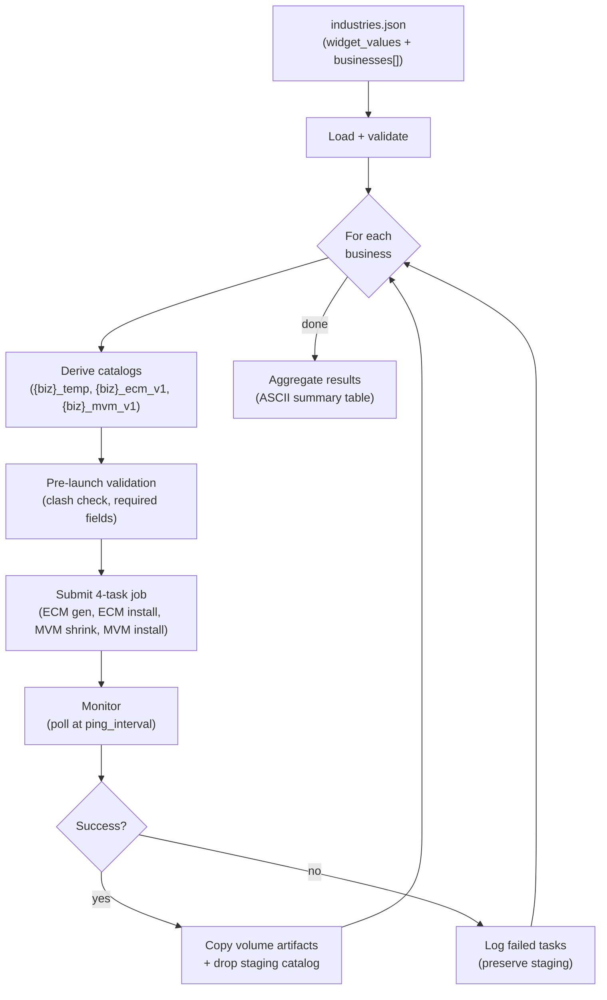

# Vibe Runner — Pipeline Orchestrator

> Multi-industry data model pipeline orchestrator implemented as a Databricks notebook. Reads a batch input JSON and, for each business, runs a 4-task job that generates the ECM, installs it, shrinks to MVM, and installs the MVM.

[← Back to project root](../readme.md) · [Tester guide](../tests/readme.md) · [Design guide](../docs/design-guide.md) · [Integration guide](../docs/integration-guide.md)

---

## Table of Contents

- [Overview](#overview)
- [Widgets](#widgets)
- [Batch Input JSON Format](#batch-input-json-format)
  - [`widget_values` Section](#widget_values-section)
  - [`businesses` Array](#businesses-array)
- [Task DAG](#task-dag)
- [How the Runner Works (Internals)](#how-the-runner-works-internals)
  - [Name Sanitization](#name-sanitization)
  - [Pre-Launch Validation](#pre-launch-validation)
  - [Job Lifecycle](#job-lifecycle)
  - [Artifact Handling](#artifact-handling)
- [Execution Flow](#execution-flow)
- [Pipeline Flow per Business](#pipeline-flow-per-business)
- [Catalog Naming](#catalog-naming)
  - [Naming Conventions](#naming-conventions)
  - [Clash Detection Exclusions](#clash-detection-exclusions)
- [Job Tags](#job-tags)
- [Dry-Run Mode](#dry-run-mode)
- [Output Artifacts](#output-artifacts)
  - [Summary Report](#summary-report)
  - [Model Artifacts](#model-artifacts)
  - [Unity Catalog Catalogs](#unity-catalog-catalogs)
- [Error Handling](#error-handling)
- [Constants](#constants)
- [Dependencies](#dependencies)

---

## Overview

The Vibe Runner is a multi-industry data model pipeline orchestrator implemented as a Databricks notebook. It reads a batch input JSON containing the notebook widget values and one or more business/industry definitions, then for each industry orchestrates a 4-task Databricks job pipeline:

1. **Generate an ECM** (Expanded Coverage Model)
2. **Install the ECM** into a dedicated Unity Catalog catalog
3. **Shrink the ECM** into an MVM (Minimum Viable Model)
4. **Install the MVM** into a dedicated Unity Catalog catalog

After all tasks succeed, the runner copies volume artifacts to a local folder and drops the staging catalog. The runner supports both production mode and dry-run mode.

---

## Widgets

The notebook exposes three configurable widgets:

| Widget | Type | Default | Purpose |
|---|---|---|---|
| `business_context` | text | `/Workspace/Users/<your-user>/vibe-modelling/industries.json` | Path to the batch input JSON containing widget values and business definitions to process |
| `dry_run` | dropdown | `yes` | Whether to use dry-run mode (`yes` / `no`) |
| `ping_interval` | dropdown | `1m` | Status logging frequency during job polling: `10s`, `20s`, `30s`, `1m`, `2m`, `5m`, `10m`, `15m` |

**Auto-discovered settings:**

| Setting | Value | Behavior |
|---|---|---|
| Agent notebook path | Auto-discovered relative to runner | Resolved via `posixpath.join(runner_dir, "./../agent/dbx_vibe_modelling_agent")`. Falls back to `./../agent/dbx_vibe_modelling_agent` if auto-discovery fails. |
| Output folder path | `./../models` | Hardcoded relative path where model artifacts are copied after successful pipeline runs. |

---

## Batch Input JSON Format

The batch input JSON defines the notebook widget values to use and a list of businesses to process. It is simply a programmatic way to pass widget values for multiple businesses in one run. The file must contain two top-level sections: `widget_values` and `businesses`.

### `widget_values` Section

Contains 19 required keys that mirror the notebook convention widgets:

| Key | Description |
|---|---|
| `business_domains` | Comma-separated list of business domains to model |
| `org_divisions` | Organizational divisions to include |
| `cataloging_style` | Strategy for organizing catalogs |
| `catalog_prefix` | Prefix applied to catalog names |
| `catalog_suffix` | Suffix applied to catalog names |
| `generate_samples` | Whether to generate sample data |
| `naming_convention` | Naming convention for database objects (e.g., `snake_case`) |
| `primary_key_suffix` | Suffix for primary key columns |
| `schema_prefix` | Prefix applied to schema names |
| `schema_suffix` | Suffix applied to schema names |
| `tag_prefix` | Prefix for tags |
| `tag_suffix` | Suffix for tags |
| `table_id_type` | Data type for table identity columns |
| `boolean_format` | Format for boolean columns |
| `date_format` | Format for date columns |
| `timestamp_format` | Format for timestamp columns |
| `classification_levels` | Data classification levels to apply |
| `housekeeping_columns` | Standard housekeeping/audit columns to include |
| `history_tracking_columns` | Columns used for history/SCD tracking |

### `businesses` Array

An array of objects, each representing one industry/business to process:

| Key | Required | Description |
|---|---|---|
| `name` | Yes | Business/industry name |
| `description` | Yes | Detailed description of the business |
| `model_vibes` | No | Natural-language refinement instructions — inline text (max 2,000 chars) or file path to `.txt` on a UC Volume. Defaults to empty string if omitted. |
| `widget_values` | No | Object of widget_value overrides for this specific business (any of the 19 keys above) |

```json
{
  "widget_values": {
    "business_domains": "",
    "org_divisions": "Operations, Business and Corporate",
    "cataloging_style": "One Catalog",
    "catalog_prefix": "",
    "catalog_suffix": "",
    "generate_samples": "0",
    "naming_convention": "snake_case",
    "primary_key_suffix": "_id",
    "schema_prefix": "",
    "schema_suffix": "",
    "tag_prefix": "dbx_",
    "tag_suffix": "",
    "table_id_type": "BIGINT",
    "boolean_format": "Boolean (True/False)",
    "date_format": "yyyy-MM-dd",
    "timestamp_format": "yyyy-MM-dd'T'HH:mm:ss.SSSXXX",
    "classification_levels": "restricted=restricted, confidential=confidential, internal=Internal, public=public",
    "housekeeping_columns": "No",
    "history_tracking_columns": "No"
  },
  "businesses": [
    {
      "name": "Acme Retail",
      "description": "A mid-size retail chain specializing in home goods and electronics.",
      "model_vibes": "retail-focused, inventory-heavy"
    },
    {
      "name": "Global Logistics Corp",
      "description": "International freight and supply chain management company."
    }
  ]
}
```

Each business object requires `name` and `description`. The `model_vibes` field is set per-business (not in `widget_values`). Any of the 19 `widget_values` keys can be overridden at the business level via a nested `widget_values` object.

---

## Task DAG

The runner creates a multi-task Databricks job with four tasks arranged in the following dependency graph:

```
ECM Generate (task 1)
|-- ECM Install (task 2)   [depends on task 1]
+-- MVM Shrink (task 3)    [depends on task 1]
    +-- MVM Install (task 4)   [depends on task 3]
```

**Parallelism:** Tasks 2 (ECM Install) and 3 (MVM Shrink) run in parallel after Task 1 (ECM Generate) completes. Task 4 (MVM Install) runs only after Task 3 finishes.

---

## How the Runner Works (Internals)

The runner handles several responsibilities under the hood. You do not need to understand the code, but knowing what happens at each stage helps troubleshoot failures.

### Name Sanitization

Business names are automatically converted into safe identifiers for catalogs, job names, and file paths. Special characters are replaced with underscores, stop words are stripped, and consecutive underscores are collapsed. For example, `"Global Logistics Corp"` becomes `global_logistics_corp`.

### Pre-Launch Validation

Before any job is submitted, the runner runs pre-flight checks:
- All required input fields are present and valid
- The staging catalog can be created (existing one is dropped and recreated for a clean slate)
- ECM and MVM install catalogs are checked for clashes — if they already contain user schemas (excluding `default`, `information_schema`, `_metamodel`, `_metrics`), a warning is raised

### Job Lifecycle

The runner creates a multi-task Databricks job with the 4-task DAG (see [Task DAG](#task-dag)), triggers it, and polls for completion. During polling:
- Per-task status is reported at the configured `ping_interval`
- When tasks succeed, the notebook exit JSON is parsed for status and warnings
- The job run URL is logged for direct monitoring in the Databricks UI

### Artifact Handling

After successful completion:
1. Volume artifacts are copied from the staging catalog to the local output folder
2. The copy is verified to ensure files (especially `model.json`) arrived intact
3. The staging catalog is dropped to clean up temporary resources

If copying fails via one method, a fallback copy mechanism is attempted automatically.

---

## Execution Flow

### Diagram: Runner Orchestration



The notebook executes in the following order:

1. Prints an ASCII art banner.
2. Creates and reads widget values. Auto-discovers the agent notebook path relative to the runner notebook location.
3. Loads and validates the batch input JSON.
4. Initializes the Databricks workspace client and Spark session.
5. If `dry_run` is set to `yes`: uploads a simulated agent notebook that mimics the real agent without performing actual model generation.
6. Creates the local output folder.
7. For each business in the `businesses` array (processed sequentially): runs the full pipeline lifecycle (see [Pipeline Flow per Business](#pipeline-flow-per-business)).
8. Displays an ASCII summary table with per-industry results including status, duration, and warning counts.
9. Returns the results list.

---

## Pipeline Flow per Business

For each industry, the runner executes the following steps:

### 1. Derive Catalog Names

Three catalogs are derived from the sanitized business name:

| Catalog | Naming Pattern | Purpose |
|---|---|---|
| Staging | `{sanitized_name}_temp` | Temporary workspace for model generation |
| ECM Install | `{sanitized_name}_ecm_v1` | Permanent home for the Expanded Coverage Model |
| MVM Install | `{sanitized_name}_mvm_v1` | Permanent home for the Minimum Viable Model |

### 2. Pre-Launch Validation

Confirms all prerequisites are met (see [Pre-Launch Validation](#pre-launch-validation) above).

### 3. Build Parameters for All Four Tasks

Each task receives a tailored parameter dictionary:

| Task | Operation | Schema Prefix | Target Catalog |
|---|---|---|---|
| ECM Generate | `new base model` | `ecm_` | Staging catalog |
| ECM Install | `install model` | `""` (empty) | ECM install catalog |
| MVM Shrink | `shrink ecm` | `mvm_` | Staging catalog |
| MVM Install | `install model` | `""` (empty) | MVM install catalog |

### 4. Create Multi-Task Job

Creates (or reuses) a Databricks job with the four-task DAG and triggers a run.

### 5. Monitor Execution

Polls the job to completion, reporting per-task progress at the configured interval.

### 6. On Success

- Copies volume artifacts from the staging catalog to the local output folder.
- Verifies the copied artifacts (checks for files, especially `model.json`).
- Drops the staging catalog to clean up temporary resources.

### 7. On Failure

- Logs which specific tasks failed.
- Skips artifact copying and staging catalog cleanup (preserves state for debugging).

---

## Catalog Naming

### Naming Conventions

| Catalog Type | Pattern | Example |
|---|---|---|
| Staging | `{sanitized_name}_temp` | `acme_retail_temp` |
| ECM Install | `{sanitized_name}_ecm_v1` | `acme_retail_ecm_v1` |
| MVM Install | `{sanitized_name}_mvm_v1` | `acme_retail_mvm_v1` |

### Clash Detection Exclusions

The following internal schemas are excluded from clash detection when checking existing install catalogs:

- `default`
- `information_schema`
- `_metamodel`
- `_metrics`

### Install-Catalog Creation on Default-Storage Metastores (v0.7.13 P0.105+M6)

When the runner asks the agent to install into a catalog that does not yet exist, the agent's `_ensure_catalog_exists` helper creates it. On Unity Catalog metastores configured with **Default Storage** (no account-level managed location), a bare `CREATE CATALOG <name>` is rejected by Databricks with `MANAGED_LOCATION_NOT_SPECIFIED`.

The v0.7.13 patch (also tracked as the "v0.7.12" managed-location patch in intermediate commit messages — the single-digit semver rolled it forward to v0.7.13) teaches the helper to discover a managed location automatically, with NO hardcoded catalog-name allowlist:

1. **Metastore-level storage root** — calls `SELECT current_metastore()` then `DESCRIBE METASTORE` and reads the `storage_root` column. If it starts with `abfss://`, `s3://`, or `gs://`, use it verbatim.
2. **Borrowed storage root** — if the metastore itself doesn't expose one (Default Storage case), iterate every accessible catalog (excluding `_*`, `system`, `samples`, `main`, `hive_metastore`), call `DESCRIBE CATALOG EXTENDED`, and lift the `storage_root` of the first match. The trailing `/__unitystorage/<catalog-id>` segment is stripped so the location is reusable for a new catalog.
3. **Bare create fallback** — if neither discovery step succeeded, issue `CREATE CATALOG` without a managed location. On Default-Storage metastores this will fail fast with a clear error message pointing the operator at UI catalog creation or an explicit MANAGED LOCATION.

Consequence for runner users: **on Default-Storage metastores you no longer need to pre-create the install catalogs manually.** The runner's 4-task job will create them using a storage location borrowed from another catalog in the same metastore. On classic managed-location metastores nothing changes — step (1) fires and succeeds.

Idempotency: if the catalog already exists (either directly or via a CATALOG_ALREADY_EXISTS race), the helper logs and proceeds without failing.

### Managed-Location Accessibility Probe (v0.8.2 P8)

v0.8.2 added a hardening step on top of the v0.7.13 P0.105+M6 discovery: every candidate `storage_root` returned by step 1 or step 2 is now probed with `dbutils.fs.ls(<candidate>)` via `_validate_storage_accessible()` BEFORE it is used in `CREATE CATALOG ... MANAGED LOCATION '<candidate>'`. If the probe fails (e.g. the cluster's run-as identity has no `READ FILES` on the borrowed catalog's storage root), the candidate is discarded and the next discovery step runs. As a final defence-in-depth, when `CREATE CATALOG ... MANAGED LOCATION '<x>'` returns `PERMISSION_DENIED`, the helper retries with bare `CREATE CATALOG <name>` (no managed location) so a metastore-default fallback can still kick in. Net effect: the runner no longer fails install with `PERMISSION_DENIED` on a "discovered" path the agent could not actually read.

### Industry-Agnostic Managed-Location Discovery (v0.8.1 G4-FIX)

The original v0.7.13 implementation was scrubbed in v0.8.1 to ensure the borrowed-catalog scan does NOT favour any specific catalog name (no `airlines`, `retail`, `healthcare` substrings, no customer/workspace identifiers). The exclusion list (`_*`, `system`, `samples`, `main`, `hive_metastore`) is the ONLY hardcoded list — every other catalog is probed in the order returned by `SHOW CATALOGS`. This is a §3c (industry-agnostic) hard requirement enforced by `tests/unit-tests/test_v081_fixes.py::test_managed_location_no_industry_strings`.

### Job Launch Gate Awaits Child Terminal State (v0.8.2 P7)

The runner orchestrates a 4-task DAG in which task 2 (ECM Install) and task 4 (MVM Install) launch the agent notebook with `operation = install model`. v0.8.2 changed the launch gate so it now blocks the parent task until the child run reaches a terminal state and propagates `FAILED`/`TIMEDOUT` to the parent. Prior to v0.8.2 the parent could report `SUCCESS` while the child silently failed. The behaviour is implemented by `JobLauncher.wait_for_run_terminal()` and verified by `tests/unit-tests/test_v082_p7_job_launch_gate.py`.

---

## Job Tags

All job tags are prefixed with `dbx_vibe_modelling_` and include the following:

| Tag | Description |
|---|---|
| `dbx_vibe_modelling_launcher_source` | Source that launched the job: `Vibe_Modelling_Notebook` (notebook) or `Vibe_Modelling_App` (external app/UI) |
| `dbx_vibe_modelling_business` | Business/industry name |
| `dbx_vibe_modelling_model` | Model scope and version (e.g., `ecm_v1`, `mvm_v1`) |
| `dbx_vibe_modelling_operation` | Current operation (e.g., `new base model`, `install model`) |
| `dbx_vibe_modelling_notebook` | Path to the agent notebook |
| `dbx_vibe_modelling_session_id` | Unique session identifier for the run |
| `dbx_vibe_modelling_domains` | Business domains being modeled |
| `dbx_vibe_modelling_products` | Products/offerings included |
| `dbx_vibe_modelling_attributes` | Model attributes |
| `dbx_vibe_modelling_foreign_keys` | Foreign key configuration |
| `dbx_vibe_modelling_tags` | Applied tags |
| `dbx_vibe_modelling_metrics` | Metrics configuration |

---

## Dry-Run Mode

When `dry_run` is set to `yes`, the runner creates and uploads a simulated agent notebook that mimics the real agent without performing actual model generation. The simulated notebook:

- Creates fake metamodel tables in the staging catalog.
- Creates physical schemas to simulate the install process.
- Generates volume artifacts that mirror the real agent output:
  - `model.json` -- Model definition file
  - SQL schema files (`schemas/*.sql`)
  - Metrics SQL files (`metrics/*.sql`)
  - DBML diagram files
  - README documentation
  - Vibes configuration files
  - RDF ontology files
  - Release notes
  - CSV documentation files
  - Sample data files

Dry-run mode is useful for testing the pipeline orchestration, validating the batch input JSON, and verifying infrastructure without consuming compute resources for actual model generation.

---

## Output Artifacts

### Summary Report

A summary report feature is planned but not yet implemented. When available, it will write a report to the output folder with per-industry results, status, duration, and error details.

### Model Artifacts

For each successfully processed business, artifacts are copied to:

```
{folder_path}/{sanitized_name}/v{version}_{scope}/
```

The artifact directory structure:

```
{sanitized_name}/v{version}_{scope}/
|-- model.json
|-- readme.md
|-- schemas/
|   +-- *.sql
|-- metrics/
|   +-- *.sql
|-- docs/
|   +-- *.csv
|-- vibes/
|-- ontology/
|   +-- *.rdf
|-- diagram/
|   +-- *.dbml
|-- samples/
+-- release_notes/
```

### Unity Catalog Catalogs

Two permanent catalogs are created for each business:

- `{sanitized_name}_ecm_v1` -- Contains the Expanded Coverage Model
- `{sanitized_name}_mvm_v1` -- Contains the Minimum Viable Model

The staging catalog (`{sanitized_name}_temp`) is dropped after successful completion.

---

## Error Handling

The runner implements multiple layers of error handling:

| Error Scenario | Handling Strategy |
|---|---|
| JSON parse errors | Rich diagnostics with surrounding lines around the error location |
| Missing widget keys | Explicit validation that enumerates all missing keys in the error message |
| Pre-launch validation failures | Seven or more pre-flight checks run before any job is submitted |
| Catalog clash detection | Warns if install catalogs contain existing schemas (excluding internal schemas) |
| Per-industry isolation | An exception in one industry does not stop processing of subsequent industries |
| Job submission/monitoring failures | Caught and logged with details; the pipeline continues to the next business |
| Copy failures | Attempts `shutil.copytree` first, then falls back to `dbutils.fs.cp` |
| Notebook auto-discovery failure | Raises `ValueError` with instructions on how to set the path manually |

---

## Constants

| Constant | Value | Purpose |
|---|---|---|
| `POLL_INTERVAL_SECONDS` | `30` | Default interval (in seconds) between job status polls |
| `JOB_TIMEOUT_SECONDS` | `43200` (12 hours) | Maximum allowed runtime per task before timeout |
| `MAX_SIGNED_INT64` | `9223372036854775807` | Upper bound for random session ID generation |

---

## Dependencies

### Required

| Package | Purpose |
|---|---|
| `databricks-sdk` | Workspace client, job management, file operations |
| `pyspark` | SparkSession for catalog/schema DDL operations |
| `dbutils` | Databricks utilities for file system operations and widgets |
| `json` | Batch input JSON parsing |
| `os` | File system path operations |
| `re` | Regular expressions for name sanitization |
| `time` | Sleep/polling intervals |
| `uuid` | Session ID generation |
| `shutil` | Local file copy operations |
| `datetime` | Timestamps for reports and artifact naming |
| `base64` | Encoding notebook content for upload |

### Optional

| Package | Purpose |
|---|---|
| `pandas` | Enhanced display of results tables |

---

[← Back to project root](../readme.md)
